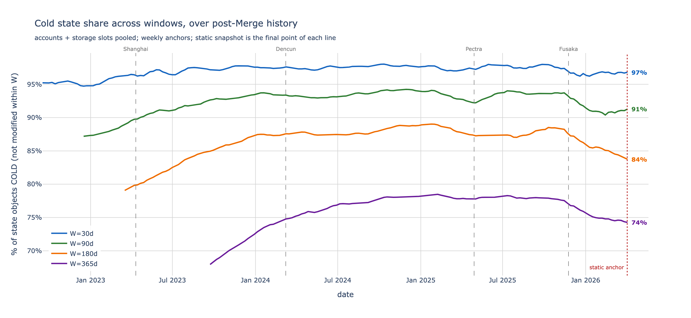
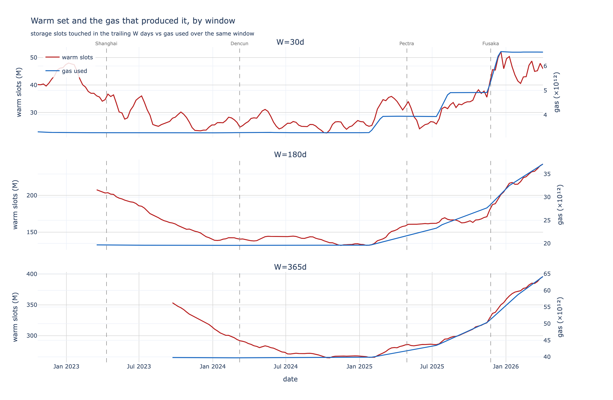
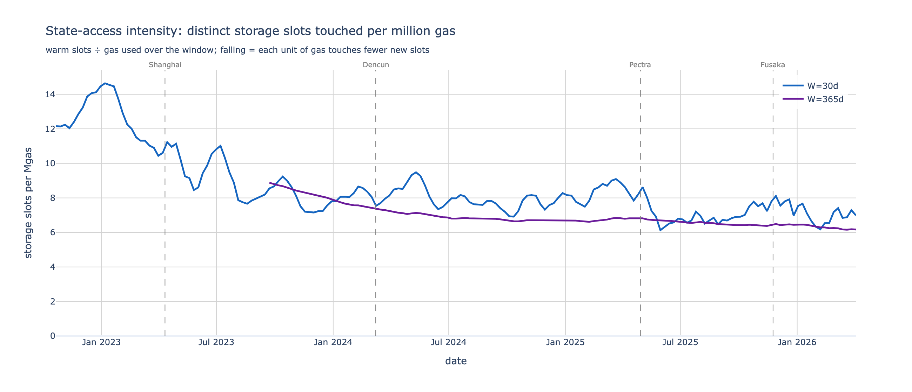

# Hot vs cold state and warm-tier gas concentration on Ethereum mainnet

A replication and temporal extension of Toni Wahrstätter's `state_access` analysis, measuring
how much of Ethereum state is touched over rolling time windows and how that maps onto an
EIP-8188-style state-tiering scheme. Static snapshot anchored at block **24,870,000** (mainnet);
historical sweep over the post-Merge range at fixed windows of 30, 90, 180, and 365 days.

## 1. Summary

State-tiering proposals (EIP-8188, building on EIP-8037) price storage access by recency: a slot
modified within the last `W` days is **Active** (cheap to write); one that hasn't is **Inactive**
(expensive). The design question is where to put `W`.

Three findings, consistent from a single snapshot through ~3.5 years of post-Merge history:

- **Write traffic is heavily concentrated in a small, recently-touched slot set.** At `W = 30d`,
  the **2.96%** of storage slots that are warm absorb **84.8%** of SSTORE *update* gas — a **29×**
  concentration over their share of the slot population.
- **Coverage saturates early; widening `W` buys little.** Update-gas coverage rises from 72% at
  `W = 1d` to 85% at `W = 30d`, then only to ~88% at `W = 365d`. The marginal benefit of a wider
  window collapses well before 90 days.
- **The effect is stable over time.** Across every week from the Merge to April 2026, the warm
  tier captures ~80–88% of update gas; concentration matured from a post-Merge low to a steady
  regime by 2024 and held.

Together these say a **~30-day Active window** is the efficient operating point: it keeps the
Active state small (<3% of slots) while leaving the dominant majority of real write traffic in the
cheap tier. Pushing `W` higher inflates the Active set that nodes must maintain for negligible
additional coverage.

## 2. Background

Under state tiering, every storage slot is Active or Inactive depending on whether it was modified
within the active window `W`. Writing to an Active slot is cheap; writing to an Inactive slot pays
a premium. `W` is the knob the proposal sets.

SSTORE gas splits into two cases set by the value transition, independent of `W`:

| transition | meaning | nominal gas | tier |
| --- | --- | --- | --- |
| `0 → nonzero` | slot creation | ~22,100 | always **Inactive** (a new slot can't have been recently active) |
| `nonzero → nonzero` | slot update | ~5,000 | depends on `W` |

Because creations are always Inactive-priced, the window only governs the **update** portion of
SSTORE gas. The gas-concentration analysis is therefore restricted to updates.

## 3. Data and method

**Source.** Xatu `canonical_execution_balance_diffs`, `canonical_execution_nonce_diffs`, and
`canonical_execution_storage_diffs` (mainnet) on a self-hosted node, ~8.9B storage-diff rows.
Live-state totals (the denominators) come from `execution_state_size` on the ethPandaOps Xatu
cluster, which carries per-block snapshots; the self-hosted copy is empty. A two-profile ClickHouse
layer (`lib/clickhouse.py`) reads bulk diffs from the node and totals from ethPandaOps.

**Definitions.**

- *Modified / hot* — an account whose balance, nonce, or any storage slot changed at least once in
  the window; a storage slot counts if `(address, slot)` appears in the storage diffs over the
  window. *Cold* is the complement against the live-state total.
- *Warm set* — the distinct `(address, slot)` pairs modified in the `W` days before "today".
- *Update gas* — gas from `nonzero → nonzero` SSTOREs only. Each costs a near-constant ~5,000 gas,
  so the count-weighted warm fraction equals the gas-weighted fraction (the `pct_update_gas_warm`
  column).
- *Concentration* — `(% of update gas hitting warm) ÷ (% of slots that are warm)`, i.e. `Y / X`.
  A value of `1×` is no concentration (writes spread evenly); higher means the warm slots pull
  above their weight.

**Counting.** Cardinalities use `uniq` (HyperLogLog, ~1% error) rather than exact dedup; the node
has no proxy timeout forcing the original's chunked-sketch workaround. Warm-set membership hashes
the key with `cityHash64` and tests it with `GLOBAL IN`, so the past-window set is built once and
broadcast across the distributed tables instead of materialising a multi-million-row set.

**Windowing.** All windows use 7,200 blocks/day (12s post-Merge cadence). The historical sweep is
restricted to post-Merge anchors, with a per-window floor `start_block(W) = merge_block + (W+1)·7200`
so a window's entire lookback stays in the 12s-cadence regime.

## 4. Static snapshot — block 24,870,000

Live-state totals at the anchor: **379,632,901 accounts** and **1,552,604,459 storage slots**.

### Hot vs cold state by window

The cold tail dominates at every horizon tested. Even a 180-day "hot" lookback leaves ~84% of
storage slots cold.

| window | storage slots hot | storage cold |
| ---: | ---: | ---: |
| 1d | 0.10% | 99.90% |
| 30d | 2.96% | 97.04% |
| 90d | 8.03% | 91.97% |
| 180d | 15.62% | 84.38% |


### The tiering tradeoff

Widening `W` shrinks the cold bucket (an architectural cost — more state to keep Active) while
fewer of today's writes land in the cold tier (a user benefit). The benefit per step drops off
fast: going from a 1-day to a 7-day window moves storage writes-to-cold down ~8 points, but each
later step moves it by ~1 point or less.

| window | state cold | account writes → cold | storage writes → cold |
| ---: | ---: | ---: | ---: |
| 1d | 99.90% | 16.50% | 40.17% |
| 7d | 99.36% | 12.23% | 32.06% |
| 14d | 98.57% | 11.21% | 30.43% |
| 30d | 97.04% | 10.20% | 28.86% |
| 60d | 94.19% | 9.58% | 27.93% |
| 90d | 91.97% | 9.19% | 27.45% |
| 180d | 84.38% | 8.79% | 26.39% |
| 365d | 74.50% | 8.45% | 25.47% |

(The 90d/180d/365d rows are the same anchor block evaluated at those windows — the final point of
each historical sweep.)


### Gas concentration

A tiny warm slice captures most update gas, and the concentration is extreme at short windows.

| window | warm slots | update-gas warm | concentration |
| ---: | ---: | ---: | ---: |
| 1d | 0.10% | 72.47% | 726× |
| 7d | 0.64% | 81.40% | 127× |
| 14d | 1.44% | 83.11% | 58× |
| **30d** | **2.96%** | **84.79%** | **29×** |
| 60d | 5.81% | 85.74% | 15× |
| 90d | 8.03% | 86.24% | 11× |
| 180d | 15.62% | 87.45% | 6× |
| 365d | 25.50% | 88.52% | 3× |

(The 90d/180d/365d rows are the same anchor block evaluated at those windows — the final point of
each historical sweep.)

The pattern is unmistakable across the full range. From 30d to 365d the warm-state cost grows ~8×
(2.96% → 25.50% of slots) while update-gas coverage rises under 4 points (84.79% → 88.52%) and
concentration collapses from 29× to 3×. That is the diminishing-returns elbow: the heavy-hitting
slots (stablecoin balances, DEX reserves, busy router storage) are already warm at 30 days, and a
wider window only sweeps in low-traffic slots.


## 5. Historical sweep — post-Merge, weekly anchors

The static numbers are one snapshot. To test stability, the same metrics were recomputed at weekly
anchors across the post-Merge range, at fixed windows of 30, 90, 180, and 365 days.

| window | anchors | span |
| ---: | ---: | --- |
| 30d | 186 | 2022-09 → 2026-04 |
| 90d | 173 | 2022-12 → 2026-04 |
| 180d | 160 | 2023-03 → 2026-04 |
| 365d | 133 | 2023-09 → 2026-04 |

### Across windows (2025 mean)

The relationships are monotonic in `W`: a wider window touches more state (cold% falls), captures a
little more update gas, and is far less concentrated (the warm tier is bigger but only marginally
more gas-laden).

| window | storage cold | update-gas warm | concentration |
| ---: | ---: | ---: | ---: |
| 30d | 97.5% | 82.5% | 34× |
| 90d | 93.4% | 84.2% | 13× |
| 180d | 88.0% | 85.7% | 7× |
| 365d | 78.0% | 87.1% | 4× |

The jump from 30d to 365d in update-gas coverage is only ~5 points (82.5% → 87.1%), while the warm
state and the maintenance cost it implies grow several-fold. This is the same elbow the static
snapshot shows, now confirmed against years of data.

### Over time

Concentration was lowest right after the Merge and matured to a steady regime by ~2024, as the set
of heavy-hitting slots established itself. It is stable thereafter at every window.

| window | 2022 | 2023 | 2024 | 2025 | 2026 |
| ---: | ---: | ---: | ---: | ---: | ---: |
| 30d | 15× | 23× | 35× | 34× | 28× |
| 90d | 6× | 8× | 13× | 13× | 10× |
| 180d | — | 5× | 7× | 7× | 6× |
| 365d | — | 3× | 3× | 4× | 4× |

**Update-gas coverage and concentration** (dual-axis: warm-gas % and the Y/X ratio):


**Cold-state share** — flat within each window; the level steps down as `W` widens (more state is
touched over a longer lookback):


### Is the anchor a quiet-market artifact?

A fair worry: the static snapshot is one block, and if it fell in a low-activity stretch its cold
shares would be inflated. The consolidated view rules this out — every window's combined cold share
(accounts and storage slots pooled into one population) on one timeline, with the static anchor as
the final point of each line.



Two things stand out. The window ordering (W=30 highest, W=365 lowest) holds at every point in
history — the relationship is structural, not a property of the anchor. And the anchor is not a
quiet outlier: its cold share sits *below* each window's long-run mean, in the lower third of the
historical distribution.

| window | min | mean | max | anchor | anchor percentile |
| ---: | ---: | ---: | ---: | ---: | ---: |
| 30d | 94.72% | 97.04% | 98.03% | 96.82% | 31st |
| 90d | 87.19% | 92.38% | 94.24% | 91.27% | 25th |
| 180d | 79.06% | 86.42% | 89.03% | 83.74% | 13th |
| 365d | 67.95% | 76.09% | 78.48% | 74.26% | 17th |

If anything the anchor is a slightly busier-than-average moment (the longer windows peaked in early
2025 and have eased since), so the static cold shares understate the long-run average rather than
overstating it. The 30-day window is the most stable of all — within a ~3.3-point band (94.7–98.0%)
across three and a half years.

**Writes hitting the cold tier** — the share of today's account and storage writes that land cold,
also stable over time and falling as `W` widens:


## 6. Gas: the capacity behind the warm set

The warm set is just the volume of state-touching work, and that work is bounded by gas. Over
the post-Merge period the block gas limit **doubled** — 30M through 2024, ~42M in 2025, 60M in
2026 — while utilization stayed pinned near 50%, so gas *used* roughly doubled with it. That
capacity expansion is the lever behind the recent cold-state decline.

### The warm set tracks gas (Q1)

Plotting the warm set (storage slots touched in the trailing W days) against the gas used over the
same window, at W = 30, 180, and 365 days, the warm set rises as the gas limit unlocks more room —
clearest in the 2025–2026 ramp, where gas steps up at the limit hikes and the warm set climbs with
it. The longer windows are U-shaped: through the flat-30M-limit era (2023–2024) the warm set
*shrank* as activity concentrated, then turned up once the limit started rising.



### But intensity per gas is falling (Q2)

The warm set grows with gas, but **sub-proportionally**. Distinct storage slots touched per
million gas has fallen steadily — roughly halving since 2023:

| year | W=30 | W=90 | W=180 | W=365 |
| ---: | ---: | ---: | ---: | ---: |
| 2022 | 13.05 | 11.81 | — | — |
| 2023 | 9.74 | 9.40 | 8.91 | 8.39 |
| 2024 | 7.99 | 7.40 | 7.13 | 7.01 |
| 2025 | 7.51 | 7.03 | 6.80 | 6.60 |
| 2026 | 6.94 | 6.66 | 6.51 | 6.29 |



Each unit of gas touches fewer *distinct* slots than it used to. Plausible causes: concentration
(the heavy slots are already warm, so marginal gas re-hits them rather than reaching new ones),
more gas going to compute and calldata, and Dencun's transient storage (EIP-1153), which spends
gas without persisting state.

### Implication for state tiering (Q3)

Putting the gas-limit regime next to the warm set at fixed W=30:

| year | gas limit | gas used/block | warm slots | slots per Mgas |
| ---: | ---: | ---: | ---: | ---: |
| 2022 | 30.0M | 15.2M | 42.9M | 13.05 |
| 2023 | 30.0M | 15.1M | 31.8M | 9.74 |
| 2024 | 30.0M | 15.1M | 26.1M | 7.99 |
| 2025 | 41.6M | 21.1M | 33.0M | 7.51 |
| 2026 | 60.0M | 30.3M | 45.6M | 6.94 |

A gas-limit increase inflates the Active-tier (warm) set that a tiering scheme must keep cheap —
the 2026 warm set is back near its 2022 level, but produced by twice the gas. Crucially the
inflation is sub-linear: gas roughly doubled while the warm set grew less than that, because
intensity fell. So the gas limit and the active-window `W` are coupled knobs — raising the limit
raises the Active footprint at a fixed `W`, but each increment buys diminishing extra warm state.

**Caveat:** gas used covers compute, calldata, and transient storage, not just permanent-state
access, so "slots per gas" is an intensity *proxy*, not a clean causal ratio. The trend is robust
across all four windows; the absolute level is not a unit conversion.

## 7. Appendix

### Queries (`state_access/queries.py`)

Five builders, parameterised by anchor block `bn_now` and window `W` days; `7200` blocks = 1 day
(post-Merge). Mainnet only.

**1. `state_touched`** — unique accounts (3-way diff union) and unique storage slots in the window:

```sql
WITH {bn_now} AS bn_now, {bn_now - W*7200} AS bn_lo
SELECT
    (
        SELECT uniq(address) FROM (
            SELECT address FROM canonical_execution_balance_diffs
              WHERE meta_network_name='mainnet' AND block_number BETWEEN bn_lo AND bn_now
            UNION ALL
            SELECT address FROM canonical_execution_nonce_diffs
              WHERE meta_network_name='mainnet' AND block_number BETWEEN bn_lo AND bn_now
            UNION ALL
            SELECT address FROM canonical_execution_storage_diffs
              WHERE meta_network_name='mainnet' AND block_number BETWEEN bn_lo AND bn_now
        )
    ) AS unique_accounts,
    (
        SELECT uniq((address, slot)) FROM canonical_execution_storage_diffs
          WHERE meta_network_name='mainnet' AND block_number BETWEEN bn_lo AND bn_now
    ) AS unique_storage_slots
```

**2–4. writes-to-warm** — of *today's* writes (`[bn_now − 7200, bn_now]`), how many hit a key seen
in the prior `W` days. The prior-window set is never filtered: a slot is warm if it was touched at
all, created or updated. Shown for storage; `account_writes_warm` uses
`canonical_execution_balance_diffs` keyed on `cityHash64(address)`, and `update_writes_warm` adds
the `from_value` filter (commented below) to count updates only:

```sql
WITH {bn_now} AS bn_now, {bn_now - 7200} AS bn_today_start
SELECT
    count() AS today,
    countIf(cityHash64(address, slot) GLOBAL IN (
        SELECT cityHash64(address, slot)
        FROM canonical_execution_storage_diffs
        WHERE meta_network_name='mainnet'
          AND block_number BETWEEN {bn_today_start - W*7200} AND bn_today_start - 1
    )) AS warm,
    round(100 * warm / today, 4) AS pct_warm
FROM canonical_execution_storage_diffs
WHERE meta_network_name='mainnet'
  AND block_number BETWEEN bn_today_start AND bn_now
  -- update_writes_warm only: AND from_value != '0x0000…0000'  (32-byte zero; excludes creations)
```

**5. `totals`** — latest live-state snapshot at or before the anchor (ethPandaOps cluster):

```sql
SELECT block_number AS snapshot_block, accounts, storages
FROM execution_state_size
WHERE meta_network_name='mainnet' AND block_number <= {bn_now}
ORDER BY block_number DESC
LIMIT 1
```

### Data files (`state_access/data/`)

- Static: `hot_cold_state.parquet`, `tradeoff.parquet`, `gas_concentration.parquet`, `totals.json`,
  and the four `*_vs_window.png` / `*.png` charts.
- Historical: `history_w{30,90,180,365}.parquet` and `history_w{30,90,180,365}_{state_cold,writes_cold,gas_concentration}.png`.
- Consolidated: `history_windows_cold.png` (cold share, all windows on one timeline; from `analysis_windows.py`).
- Gas: `gas_daily.parquet` (daily gas used + limit; from `collect_gas.py`) and
  `gas_warm_set.png` / `gas_intensity.png` (from `analysis_gas.py`).
