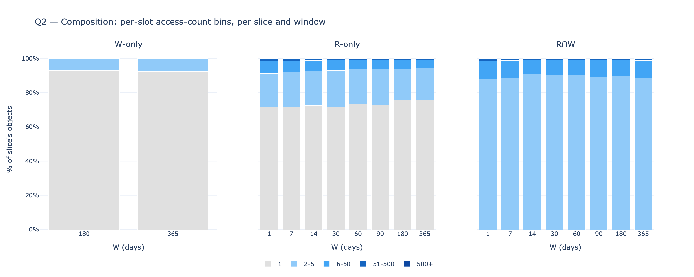
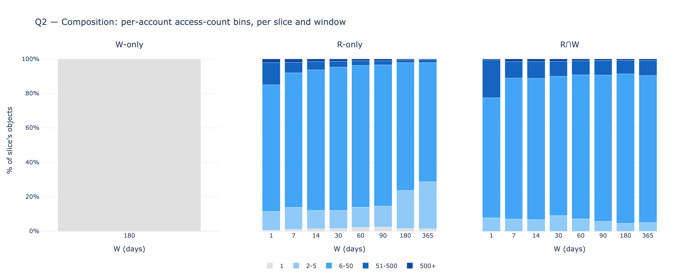

# Hot vs cold state, with reads — additive W / R / R∪W view

A reads-aware companion to the original `state_access` analysis. The existing report
classifies state by **writes alone** (the `_diffs` tables); this one adds the **reads**
dimension (the `_reads` tables and `address_appearances`) and reports two disjoint sets
per window — **W (writes)** and **R (pure reads, deduped against W)** — plus their union
**R∪W = W + R** (the full warm set). Three questions: how big each set is (warmth), how
the per-object access counts distribute within each (composition), and how much access
volume lands on a small head (concentration).

Static snapshot, anchored at block **24,870,000** (mainnet) — the largest round block
where all four source families (writes, slot reads, account reads, `address_appearances`)
overlap on the local cluster. Windows: `W ∈ {1, 7, 14, 30, 60, 90, 180, 365}` days. Object
types: **storage slots** `(contract, slot)` and **accounts** `(address)`.

## 1. Summary

- **W matches the original analysis exactly.** `|W|` at W=30d is 2.93% of live slots and
  4.07% of live accounts — within HLL tolerance of the original's "2.96% / 4.10%".
- **R is the genuinely new dimension.** At W=30d, **1.25% of slots and 0.46% of accounts**
  are read-but-not-written in window. At W=365d these grow to **10.6% / 4.5%**. By
  construction R never overlaps W.
- **The full warm set R∪W is 30–40% larger than W alone** at every W. At W=30d the
  combined-state warm set is **4.25%** (vs 3.16% for writes alone); at W=365d it's
  **35.2%** (vs 25.8%). The fraction of the warm set you'd miss with a writes-only
  definition is consistently **~30%**.
- **R is much more concentrated than W.** At W=30d the top 1% of objects captures **84%
  of read events** (slots) or **96%** (accounts), versus **62% / 61%** for writes. R-only
  objects are a long tail dominated by one-shot view-call targets — but the head of that
  tail is extremely heavy.
- **W composition is more even-tailed than R for accounts.** Account writes spread across
  the 2–5 and 6–50 bins; account R-only is dominated by the 6–50 bin (popular contracts
  called repeatedly but never modified). For slots both sets are dominated by the
  singly-touched bin.

## 2. What changed vs the original analysis

| | original | v2 |
|---|---|---|
| sources | `_diffs` only | `_diffs` + `_reads` + `address_appearances` |
| access sets | W only | **W**, **R** (reads-not-written), **R∪W** (additive) |
| object types | accounts, slots | accounts, slots, combined |
| windows | 1–180d | 1–365d |
| denominator | absolute counts + state-size shares | state-size shares (the tier framing) |
| cardinality | `uniq` (HLL ~1%) | exact, from per-key GROUP BY |

The reads data unlocks the **R** slice — objects that are read but never written in the
same window. This is the part of the warm set an existing-implementation snapshot from
`_diffs` alone can't see. The window list widens to 365d because per-key GROUP BY scales
better than HLL did over `_diffs` alone: even a 365d slot window over 560M unique keys
and 7.7B accesses runs in ~5 min.

### Why the additive 2-set view rather than a 3-way partition

An earlier version of this analysis used a `(W-only, R-only, R∩W)` partition. Empirically
**W-only ≈ 0** at every window — every written object is also read in the same window.
Two reasons:

- **Slots:** Solidity codegen for `x = f(x)` emits `SLOAD; ...; SSTORE`. The pre-SSTORE
  `SLOAD` lands in `storage_reads`. So almost every modified slot is also read in window.
- **Accounts:** every transaction's `tx_from` appears in `address_appearances` (the
  sender's nonce is read for validation), and the same transaction emits balance / nonce
  diffs. So every written EOA / contract is also read in window.

With W-only essentially empty, the partition collapses to a 2-set additive view:
**W ∪ (R \ W) = R∪W**. That's what this report uses throughout.

## 3. Data and method

### Source tables

| set | source |
|---|---|
| writes (accounts) | `canonical_execution_balance_diffs`, `canonical_execution_nonce_diffs`, `canonical_execution_contracts` (account creation, keyed on `contract_address`) |
| writes (slots) | `canonical_execution_storage_diffs` |
| reads (slots) | `canonical_execution_storage_reads` |
| reads (accounts, direct) | `canonical_execution_balance_reads`, `canonical_execution_nonce_reads` |
| reads (accounts, derived) | `canonical_execution_address_appearances`, filtered to relationships `{call_from, call_to, tx_from, tx_to, miner_fee, factory, create, suicide_refund, suicide}` |

`address_appearances` relationships `erc20_*` and `erc721_*` are excluded — they're token
log-emission artifacts, not state-access events.

### Set definitions

For each `(window_days, object_type)`:

- **W** — objects that appear in the writes-source tables in window (raw, no dedup).
  This is the same definition as the original analysis's "warm".
- **R** — objects that appear in the reads-source tables AND not in the writes sources
  in the same window. Deduped against W by construction, so R ∩ W = ∅.
- **R∪W = W + R** — additive union, the full warm set.

### Query mechanism

One ClickHouse query per `(W, object_type)` returns a histogram with rows
`(slice, n_w, n_r, n_keys)` where the inner slices are
`{w_only, r_only, rw}` (`n_w` / `n_r` are write / read event counts per key, summed
within window). The new W / R / R∪W view is derived in Python by combining slices:

- W = `w_only ∪ rw`; per-key access count = `n_w` (writes only)
- R = `r_only`; per-key access count = `n_r` (reads only)
- R∪W = all three slices

Live-state denominators come from `execution_state_size` at the anchor
(1,552,604,459 slots, 379,632,901 accounts, 1,932,237,360 combined).

Code: `state_access/queries_v2.py`, `collect_v2.py`, `analysis_v2.py`.

## 4. Q1 — Warmth (set sizes as % of live state)

**Slots** (% of 1.55B live slots):

| W (days) | W | R | R∪W |
|---:|---:|---:|---:|
| 1   |  0.10% |  0.07% |  0.17% |
| 7   |  0.64% |  0.36% |  0.99% |
| 14  |  1.42% |  0.64% |  2.07% |
| 30  |  2.93% |  1.25% |  4.18% |
| 60  |  5.77% |  2.34% |  8.11% |
| 90  |  7.98% |  3.28% | 11.26% |
| 180 | 15.49% |  5.91% | 21.40% |
| 365 | 25.43% | 10.61% | 36.05% |

**Accounts** (% of 380M live accounts):

| W (days) | W | R | R∪W |
|---:|---:|---:|---:|
| 1   |  0.19% |  0.04% |  0.23% |
| 7   |  1.13% |  0.15% |  1.29% |
| 14  |  1.93% |  0.28% |  2.21% |
| 30  |  4.07% |  0.46% |  4.53% |
| 60  |  7.60% |  0.69% |  8.29% |
| 90  | 11.46% |  0.88% | 12.34% |
| 180 | 19.04% |  2.12% | 21.16% |
| 365 | 27.35% |  4.49% | 31.84% |

**Combined** — pooling slots + accounts against the combined denominator (1.93B):

| W (days) | W | R | R∪W |
|---:|---:|---:|---:|
| 1   |  0.12% |  0.06% |  0.18% |
| 7   |  0.74% |  0.32% |  1.05% |
| 14  |  1.52% |  0.57% |  2.10% |
| 30  |  3.16% |  1.10% |  4.25% |
| 60  |  6.13% |  2.02% |  8.15% |
| 90  |  8.66% |  2.81% | 11.47% |
| 180 | 16.19% |  5.17% | 21.35% |
| 365 | 25.81% |  9.41% | 35.22% |


Three observations:

1. **The W line matches the original report's "warm slots / accounts" curve.**
   At W=30d slots: original 2.96%, v2 2.93%. Within HLL tolerance plus a small
   methodological shift (v2 excludes `storage_diffs.address` from the account-write set,
   which the original conflated; EIP-8188 treats SSTORE as a slot write, not an account
   write).
2. **R for slots is much larger than R for accounts at all windows.** At W=365d,
   R-slots = 10.6% vs R-accounts = 4.5%. Slot-level reads have a deeper unread tail
   (every contract storage has view-only parameters); account-level reads cluster on a
   smaller universe of popular contracts.
3. **R grows faster than W as W increases.** For slots, R/W is 0.67× at W=1d but 0.42×
   at W=365d — R adds more relative to W at small W. For accounts, R/W is 0.19× at W=1d
   and 0.16× at W=365d — the read-only account tail grows much slower than writes.
   Both ratios are bounded above zero, so reads always add something.

## 5. Q2 — Composition (access-frequency tail)

For each set (W and R), the distribution of per-object access counts inside the window,
binned `{1, 2-5, 6-50, 51-500, 500+}`. Access count for W counts only write events
(`n_w`); access count for R counts only read events (`n_r`).




**Slots — W set (writes per object):**

| W (days) | 1 | 2-5 | 6-50 | 51-500 | 500+ |
|---:|---:|---:|---:|---:|---:|
| 1   | 74.3% | 20.8% | 4.3% | 0.6% | 0.0% |
| 30  | 78.1% | 18.2% | 3.3% | 0.4% | 0.1% |
| 365 | 72.1% | 23.9% | 3.6% | 0.4% | 0.1% |

**Slots — R set (reads per object, not in W):**

| W (days) | 1 | 2-5 | 6-50 | 51-500 | 500+ |
|---:|---:|---:|---:|---:|---:|
| 1   | 71.8% | 19.4% | 7.5% | 1.2% | 0.1% |
| 30  | 71.9% | 21.1% | 6.0% | 0.9% | 0.2% |
| 365 | 75.8% | 18.8% | 4.7% | 0.6% | 0.1% |

Slot W and slot R have similar shape — both heavily singly-touched (~72–78% of objects),
with mid-range bins (2–5, 6–50) absorbing most of the rest. Slot reads have a slightly
heavier 6-50 tail than slot writes.

**Caveat on the singleton bin's composition.** The W set counts every row in
`storage_diffs` as a write event, regardless of value transition. At W=30d, the
178M storage_diff rows split into:

| transition | share of all rows | share of singleton-bin slots |
|---|---:|---:|
| `0 → nonzero` (creation, ~20k gas) | 22.5% | **76.3%** |
| `X → Y` (update, ~5k gas) | 70.0% | 16.6% |
| `nonzero → 0` (deletion, refund) | 7.5% | 7.1% |

So the "78% of slot W is singleton" finding is really "76% of those singletons are
newly-created slots that haven't been touched again in 30 days". State growth, not
state churn. EIP-8188-relevant repricing only affects updates (creations are always
Inactive-priced by construction); for a policy-focused view, W should be filtered to
`from_value != 0` — that filter is a one-line addition to `queries_v2.py` (it would
change the headline |W| numbers downward by ~22%).

**Accounts — W set (writes per object):**

| W (days) | 1 | 2-5 | 6-50 | 51-500 | 500+ |
|---:|---:|---:|---:|---:|---:|
| 1   | 14.4% | 53.0% | 26.7% | 5.7% | 0.1% |
| 30  | 15.0% | 62.1% | 18.8% | 4.0% | 0.1% |
| 365 |  7.8% | 68.1% | 21.6% | 2.4% | 0.1% |

**Accounts — R set (reads per object, not in W):**

| W (days) | 1 | 2-5 | 6-50 | 51-500 | 500+ |
|---:|---:|---:|---:|---:|---:|
| 1   |  0.6% | 10.9% | 73.5% | 12.7% | 2.3% |
| 30  |  1.5% | 10.6% | 83.1% |  3.4% | 1.4% |
| 365 |  1.3% | 27.3% | 69.1% |  1.8% | 0.4% |

Accounts behave very differently from slots. **Account writes** cluster in the **2–5 and
6–50** bins — a tx is the natural unit, and most active accounts participate in a handful
of txs per window. **Account R-only**, in contrast, lives almost entirely in the **6–50**
bin: these are popular contracts being called many times by other contracts but never
modified themselves (proxies, routers, factories, oracles). The singly-touched bin for
R-only accounts is <2% — almost nothing is read just once.

## 6. Q3 — Concentration (top-N share of accesses)

For each `(access_set, W, object_type)`, the share of access events captured by the
top-1% and top-10% of objects (denominator: objects in the access set).


**Slots, top-1% share of accesses:**

| W (days) | W | R | R∪W |
|---:|---:|---:|---:|
| 1   | 48.0% | 65.7% | 56.4% |
| 30  | 62.3% | 83.8% | 72.3% |
| 90  | 66.1% | 87.1% | 76.1% |
| 365 | 68.2% | 87.7% | 77.9% |

**Accounts, top-1% share of accesses:**

| W (days) | W | R | R∪W |
|---:|---:|---:|---:|
| 1   | 40.8% | 78.9% | 57.5% |
| 30  | 60.5% | 96.0% | 77.7% |
| 90  | 64.0% | 98.0% | 82.0% |
| 365 | 68.4% | 97.7% | 86.6% |

Three readings:

1. **R is more concentrated than W at every W and every object type.** R-only sees
   ~88% of slot accesses on the top 1% at W=365d; for accounts the figure is ~98%. A
   handful of popular contracts absorb essentially all the read pressure on accounts.
2. **Concentration grows with W.** Wider windows pull in more tail keys that themselves
   get few accesses, so the head's relative weight rises monotonically. The effect is
   sharpest going from W=1d to W=30d (~14pp for slot R; ~17pp for account R); past
   W=30d the gain flattens.
3. **Accounts concentrate far more tightly than slots.** Account R-only at W=30d:
   top-1% captures 96% of accesses. Slot R-only at W=30d: 84%. Read traffic on accounts
   is dominated by an extraordinarily small set of popular contracts (likely DEX routers,
   multicall, weth9, common implementation contracts behind proxies); slot reads are
   spread more broadly because they're reads against many contracts' storage.

## 7. What this opens up

The clearest threads worth pulling next:

- **W ⊂ R operationally, even though sets are disjoint by construction.** Almost every
  W object also appears in `_reads`. The structural reason (SLOAD-then-SSTORE codegen,
  tx_from nonce reads) is interesting on its own. A `_reads` signal is informative for
  near-term tiering decisions — it captures both views and writes.
- **R-only is the new lens.** The asymmetric slice — read but not written — is where
  the most distinctive structure lives: 30% extra warm-set mass over writes alone,
  heavy concentration (~98% top-1% for accounts), and a different composition shape
  (long-tail for slots, mid-range for accounts). Worth a dedicated drill-down: which
  contracts dominate R-only? What's the contract-class breakdown of the R-only head?
- **Historical sweep.** Snapshot is one anchor (24,870,000, late-Apr 2026). Sweeping
  weekly over the post-Merge range would tell us whether the R/W ratio is stable,
  whether R's share grew after Dencun (blob / calldata changes), and whether the
  R-only-account concentration spike is recent.
- **Per-tx all-hot fraction.** A natural follow-on: what share of transactions touch
  *only* warm state (under chosen `W`)? Per-tx framing gives a user-impact answer rather
  than a population-level one.

## Appendix A — SQL queries

The full SQL builders live in `state_access/queries_v2.py`. One query per
`(W, object_type)` runs the per-key GROUP BY on a `cityHash64` key, then collapses to a
`(slice, n_w, n_r, n_keys)` histogram. The slice partition (`w_only` / `r_only` / `rw`)
is what gets re-mapped in Python to the W / R sets used throughout this report.

### Slot histogram

Storage-slot key is `(contract_address, slot)`. Writes come from `storage_diffs`; reads
from `storage_reads`. The inner UNION ALL tags each row with `is_w` / `is_r`; the outer
GROUP BY on `cityHash64(address, slot)` sums them per key; the final GROUP BY collapses
to `(slice, n_w, n_r, n_keys)`.

```sql
WITH per_key AS (
    SELECT
        h,
        sum(is_w) AS n_w,
        sum(is_r) AS n_r
    FROM (
        SELECT cityHash64(address, slot) AS h, 1 AS is_w, 0 AS is_r
        FROM canonical_execution_storage_diffs
        WHERE meta_network_name = 'mainnet'
          AND block_number BETWEEN {bn_lo} AND {bn_hi}
        UNION ALL
        SELECT cityHash64(contract_address, slot) AS h, 0 AS is_w, 1 AS is_r
        FROM canonical_execution_storage_reads
        WHERE meta_network_name = 'mainnet'
          AND block_number BETWEEN {bn_lo} AND {bn_hi}
    )
    GROUP BY h
)
SELECT
    multiIf(n_w > 0 AND n_r > 0, 'rw',
            n_w > 0,             'w_only',
                                 'r_only') AS slice,
    n_w,
    n_r,
    count() AS n_keys
FROM per_key
GROUP BY slice, n_w, n_r
ORDER BY slice, n_w, n_r
```

### Account histogram

Account key is `cityHash64(address)`. Writes come from `balance_diffs`, `nonce_diffs`,
and `contracts` (`contract_address` is the newly-materialized account). Reads come from
`balance_reads`, `nonce_reads`, and `address_appearances` filtered to non-ERC*
relationships. Same outer aggregation as the slot query.

```sql
WITH per_key AS (
    SELECT
        h,
        sum(is_w) AS n_w,
        sum(is_r) AS n_r
    FROM (
        SELECT cityHash64(address) AS h, 1 AS is_w, 0 AS is_r
        FROM canonical_execution_balance_diffs
        WHERE meta_network_name = 'mainnet'
          AND block_number BETWEEN {bn_lo} AND {bn_hi}
        UNION ALL
        SELECT cityHash64(address) AS h, 1 AS is_w, 0 AS is_r
        FROM canonical_execution_nonce_diffs
        WHERE meta_network_name = 'mainnet'
          AND block_number BETWEEN {bn_lo} AND {bn_hi}
        UNION ALL
        SELECT cityHash64(contract_address) AS h, 1 AS is_w, 0 AS is_r
        FROM canonical_execution_contracts
        WHERE meta_network_name = 'mainnet'
          AND block_number BETWEEN {bn_lo} AND {bn_hi}
        UNION ALL
        SELECT cityHash64(address) AS h, 0 AS is_w, 1 AS is_r
        FROM canonical_execution_balance_reads
        WHERE meta_network_name = 'mainnet'
          AND block_number BETWEEN {bn_lo} AND {bn_hi}
        UNION ALL
        SELECT cityHash64(address) AS h, 0 AS is_w, 1 AS is_r
        FROM canonical_execution_nonce_reads
        WHERE meta_network_name = 'mainnet'
          AND block_number BETWEEN {bn_lo} AND {bn_hi}
        UNION ALL
        SELECT cityHash64(address) AS h, 0 AS is_w, 1 AS is_r
        FROM canonical_execution_address_appearances
        WHERE meta_network_name = 'mainnet'
          AND block_number BETWEEN {bn_lo} AND {bn_hi}
          AND relationship IN ('call_from', 'call_to', 'tx_from', 'tx_to',
                               'miner_fee', 'factory', 'create',
                               'suicide_refund', 'suicide')
    )
    GROUP BY h
)
SELECT
    multiIf(n_w > 0 AND n_r > 0, 'rw',
            n_w > 0,             'w_only',
                                 'r_only') AS slice,
    n_w,
    n_r,
    count() AS n_keys
FROM per_key
GROUP BY slice, n_w, n_r
ORDER BY slice, n_w, n_r
```

### Window block range

For each `window_days = W`, the trailing block range is
`bn_lo = anchor − W·7200`, `bn_hi = anchor`, using the post-Merge 7,200-blocks-per-day
cadence. Anchor is `24,870,000`. The eight window values are
`W ∈ {1, 7, 14, 30, 60, 90, 180, 365}`.

### Live-state totals

Live-state denominators for the % framing come from `execution_state_size` at the anchor:

```sql
SELECT block_number, accounts, storages
FROM execution_state_size
WHERE meta_network_name = 'mainnet' AND block_number <= 24870000
ORDER BY block_number DESC
LIMIT 1
```

At the anchor: 1,552,604,459 slots, 379,632,901 accounts, 1,932,237,360 combined.

## Appendix B — outputs

```
state_access/data/v2/
  slot_histogram.parquet         # raw (slice, n_w, n_r, n_keys) per W (input)
  account_histogram.parquet
  q1_warmth_{slot,account,combined}.parquet   # set sizes + pct of live state
  q2_composition_{slot,account}.parquet
  q3_concentration_{slot,account}.parquet
  q1_warmth_{slot,account,combined}.png
  q2_composition_{slot,account}.png
  q3_concentration_{top1,top10}_{slot,account}.png
```

Reproduce: `uv run python -m state_access.collect_v2 && uv run python -m state_access.analysis_v2`.
`collect_v2` is resumable per `(W, object_type)` cell; delete a histogram parquet to
force a re-pull. Verification checks (additivity `|R∪W|=|W|+|R|`, partition sum,
monotonicity) live in `analysis_v2.run_one`.
