# Ethereum state access: reads, writes, and the active set

## 1. Introduction

Every Ethereum transaction reads and writes pieces of the chain's **state**: account
balances and nonces, and the storage slots inside contracts. As the chain grows, more of
that state goes untouched for long stretches, which is why several proposals look at
separating an active set from dormant state. This report sets out to answer:

- What does state access and creation look like over Ethereum's history?
- How much state is touched over a given period?
- Are writes mostly creations, updates, or deletions?
- Are reads fetching real data, or just probing for existence?
- How concentrated is the activity?
- How effective would an in-protocol state-tiering scheme be?

## 2. Summary

- **Writes are a small slice of live state.** `|W|` at T=30d is **2.93% of live slots**
  and **4.07% of live accounts**. At T=365d, 25.4% / 27.4%.
- **R is the read-only dimension a writes-only view misses.** At T=30d, **1.25% of slots
  and 0.46% of accounts** are read but not written in window, growing to **10.6% / 4.5%**
  at T=365d. By construction R never overlaps W.
- **The full warm set R∪W is 32–52% larger than W alone.** The gap is widest at small T
  (+52% at T=1d) and settles to **+32–37% for T ≥ 30d**. At T=30d the combined warm set is
  **4.25%** of state (vs 3.16% for writes alone), at T=365d **35.2%** (vs 25.8%). A
  writes-only definition misses roughly a third of the warm set.
- **R is far more concentrated than W.** At T=30d the top 1% of objects captures **84% of
  read accesses** (slots) or **96%** (accounts), versus **62% / 61%** for writes. R is a
  long tail of one-shot view-call targets with an extremely heavy head.
- **Written slots are mostly created, not updated.** At T=365d, **88% of W slots see a
  creation** and only **21% see an update**. **62% are create-only**: written once as a
  `0→nonzero` initialization and never touched again. Most warm slots are warm because
  they are being born, not modified, which is state growth rather than churn. Tiering only
  reprices updates, so the policy-relevant write set is **5.4% of state** at T=365d, not
  25%.
- **Read slots are mostly empty-slot probes.** At T=365d, **93% of R slots returned
  `value=0`** on at least one read ("does this slot exist?" checks). Only **7%** returned
  populated data. Slots that return both zero and nonzero are near-zero in count (under
  0.2% of |R|), an artifact of net-per-transaction accounting and rolled-back writes (§3).
- **Tiering covers update gas well at the policy-relevant window.** Counting each update
  event and crediting intra-window promotion, **94% of update SSTOREs at T=30d keep the
  Active price**, 97% at T=90d. The Inactive premium hits only ~3–6% of updates.
- **The active fraction of state is shrinking over time.** As the chain ages, a
  fixed-length window touches a steadily smaller share of total state. The 365-day warm
  set fell from ~45% in 2023 to ~35% by 2026, so the case for tiering strengthens over
  time.
- **The heavy concentration of account reads is recent.** The top 1% of read-only accounts
  captured ~85% of read accesses in 2022–2023 and ~96–98% by 2025–2026, not a structural
  constant.
- **The policy conclusions hold across 3.5 years and every fork.** Warm-update coverage
  stays flat and high at each window, and no series steps at Shanghai, Dencun, Pectra, or
  Fusaka. State access tracks application behaviour, not protocol changes.

## 3. Data and method

The unit of analysis is a trailing time window, with **writes** kept separate from
**reads**. `T` is the window length in days. The windowed tables throughout end at mainnet block **24,870,000**, and
§5.1 and §6 also replay them weekly across post-Merge history. Windows are
`T ∈ {1, 7, 14, 30, 60, 90, 180, 365}` days. Object types are **storage slots**
`(contract, slot)` and **accounts** `(address)`.

### Source tables

All source tables are extracted from [Xatu](https://github.com/ethpandaops/xatu).

| set | source |
|---|---|
| writes (accounts) | `canonical_execution_balance_diffs`, `canonical_execution_nonce_diffs`, `canonical_execution_contracts` (account creation, keyed on `contract_address`) |
| writes (slots) | `canonical_execution_storage_diffs` |
| reads (slots) | `canonical_execution_storage_reads` |
| reads (accounts, direct) | `canonical_execution_balance_reads`, `canonical_execution_nonce_reads` |
| reads (accounts, derived) | `canonical_execution_address_appearances`|

### Set definitions

For each `(T, object_type)`:

- **W**: objects created, modified, or deleted in the window.
- **R**: objects only read, never written, in the window.
- **R∪W = W + R**: all objects touched in the window, by a write or a read, the full warm
  set.

We write `|W|` for the number of objects in `W`, and likewise `|R|`.

In practice every written object is also read in the same window. A slot's `SSTORE` is
preceded by a read, and a sender's nonce is read to validate the transaction that writes
it. So R counts only the explicit reads (such as `SLOAD`) that add something beyond W.

### Granularity and known gaps

- **System-call state is not recorded.** The per-block protocol writes to the EIP-4788
  beacon-root, EIP-2935 blockhash-history, and EIP-7002/7251 request-queue contracts do not
  appear.
- **Consensus-layer withdrawals are not recorded.** Validator withdrawals credit
  execution layer addresses without an EVM write, so withdrawal-only recipients are missing
  from W. That is a few tens of thousands of addresses, well under 1% of the account write
  set.

## 4. What state access and creation looks like

A slot or account can be touched in many ways. This section asks what those accesses
actually are: whether a written slot is freshly created or modified in place, whether a
read returns real data or just checks for existence, and how the mix has held up over the
chain's history.

### 4.1 Write structure

A storage write is one of three transitions, and most written slots are created once and
never touched again. Two views follow: the all-time event totals, then how the slots
written in a window break down by lifecycle.

#### Write events over the entire chain history

Every write event from the first state activity (block ~46k, July 2015) to block
24,870,000.

**Slot write events** (9.20B total):

| transition | events | share |
|---|---:|---:|
| update (x→y) | 6,109,404,842 | **66.4%** |
| create (0→x) | 2,323,710,153 | 25.3% |
| delete (x→0) |   765,554,231 |  8.3% |

**Account write events:**

| source | metric | events | share |
|---|---|---:|---:|
| balance changes (8.55B) | adjust (x→y) | 7,965,568,085 | **93.1%** |
| | fund (0→x) | 385,657,967 | 4.5% |
| | drain (x→0) | 203,518,204 | 2.4% |
| nonce changes (3.42B) | subsequent | 3,043,409,094 | **89.0%** |
| | first use (from 0) | 376,865,812 | 11.0% |
| contract creations | creations | 100,078,703 | n/a |

Two things stand out:

- Write traffic is update-dominated: over 66% of all slot write events ever are updates.
- A third of all slots ever created have been deleted.

#### The lifecycle of a written slot

Each write event is one of three **transition types** (values are net per transaction, §3):

- **C** (create): `0 → x`, an empty slot becomes set.
- **U** (update): `x → y`, a set slot's value changes.
- **D** (delete): `x → 0`, a set slot is cleared.

Every written slot is then classified by which transition types it saw in the window, and
a slot can see a type more than once:

- **C**: created once, then untouched. A second create needs a delete first, so a C slot
  has exactly one create.
- **U**: updated one or more times, never created or deleted. A slot that existed before
  the window and modified in place.
- **D**: deleted once, never created or updated. A pre-existing slot cleared.
- **C+U**: created once, then updated **one or more times**, not deleted. With no delete it
  has exactly one create, and the `+U` covers one update or many.
- **C+D**: created and deleted but never updated, one or more birth-and-death cycles.
- **U+D**: updated one or more times, then deleted. Existed before the window.
- **C+U+D**: created, updated one or more times, and deleted, a full lifecycle.

The table below shows the composition averaged over the post-Merge sweep, weighting each weekly anchor
equally:

| T (days) | C | C+U | U | C+U+D | C+D | U+D | D |
|---:|---:|---:|---:|---:|---:|---:|---:|
| 30  | 53.3% |  8.2% | 14.4% | 2.8% | 12.1% | 0.8% | 8.4% |
| 90  | 54.9% |  9.2% | 11.4% | 3.3% | 12.9% | 0.7% | 7.7% |
| 180 | 55.5% | 10.0% |  9.4% | 3.7% | 13.6% | 0.6% | 7.2% |
| 365 | 55.4% | 11.4% |  7.0% | 4.2% | 14.7% | 0.5% | 6.8% |

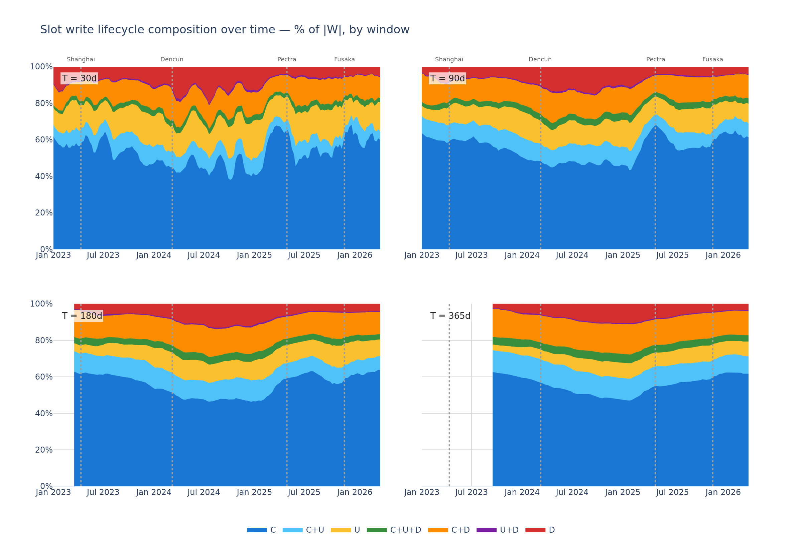

Findings:

- **C dominates at every window, ~55% of |W|.** Most slots are initialized in window and
  never touched again, which is state growth rather than churn. C is also the most volatile
  class. At T=30 it swings between 38% and 68% week to week, dipping through the 2024
  activity surge and recovering after.
- **`C+D` is the largest mixed class, ~12–15% of |W|.** These are ephemeral slots born and
  died inside the window. The share is steady at every window across the timeline.
- **Creation dominates more at longer windows.** The create-bearing classes (C, C+U, C+D,
  C+U+D) are ~76% of |W| at T=30 and ~86% at T=365, while pure in-place updates (U) halve
  from 14% to 7%. A longer window captures more of each slot's birth, so the write set looks
  even more growth-driven the further back it reaches.

### 4.2 Read structure

Reads split by what they return: real data, or zero from an empty-slot probe. As with
writes, two views follow, the all-time totals and the per-window split over time.

#### Read events over the entire chain history

Every read event over all of history.

**Slot read events** (23.69B total, 2.6× the write events):

| returned value | events | share |
|---|---:|---:|
| nonzero | 16,552,716,483 | **69.9%** |
| zero | 7,138,221,664 | 30.1% |

**Account read events:**

| source | metric | events | share |
|---|---|---:|---:|
| balance reads (15.10B) | nonzero | 9,845,422,896 | **65.2%** |
| | zero | 5,251,717,095 | 34.8% |
| nonce reads (13.64B) | nonzero (post-increment, never 0) | 13,637,765,012 | 100% |
| appearances (41.98B) | internal-call target / caller | 15.74B each | 37.5% each |
| | tx sender / fee recipient / tx recipient | 3.39B each | 8.1% each |
| | contract creator / new contract | ~100M each | 0.24% each |
| | selfdestruct caller / refund recipient | ~60M each | 0.14% each |

The fee recipient is the block proposer credited the transaction's priority fee, not a
consensus-layer withdrawal (those are not recorded).

#### What reads return

Each read in R returns `zero` (an empty-slot probe, "is this slot set?") or `nonzero` (real
data). R holds only objects read but not written in the window. As a share of |R|, averaged
over the weekly post-Merge sweep:

| T (days) | zero-only | nonzero-only |
|---:|---:|---:|
| 30  | 82.5% | 17.5% |
| 90  | 87.1% | 12.8% |
| 180 | 89.8% | 10.1% |
| 365 | 92.6% |  7.4% |

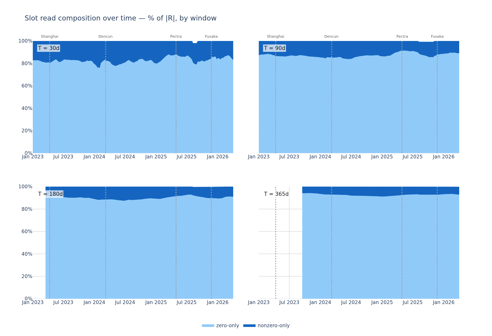

**Most of R is empty-slot probes**. Only ~7–18% of R is real state read (e.g. oracle parameters, config, immutable-style storage), and that share shrinks as the window widens.

## 5. Warmth and concentration

This section checks how much of the state is "warm" (touched in a
window) and how concentrated the accesses are across objects.

### 5.1 Warmth: how much state is active

TODO: this is data extracted from the latest anchor right? We want the average across historical sweep instead.

**Slots** (% of 1.55B live slots):

| T (days) | W | R | R∪W |
|---:|---:|---:|---:|
| 1   |  0.10% |  0.07% |  0.17% |
| 7   |  0.64% |  0.36% |  0.99% |
| 14  |  1.42% |  0.64% |  2.07% |
| 30  |  2.93% |  1.25% |  4.18% |
| 60  |  5.77% |  2.34% |  8.11% |
| 90  |  7.98% |  3.28% | 11.26% |
| 180 | 15.49% |  5.91% | 21.40% |
| 365 | 25.43% | 10.61% | 36.05% |

**Accounts** (% of 380M live accounts):

| T (days) | W | R | R∪W |
|---:|---:|---:|---:|
| 1   |  0.19% |  0.04% |  0.23% |
| 7   |  1.13% |  0.15% |  1.29% |
| 14  |  1.93% |  0.28% |  2.21% |
| 30  |  4.07% |  0.46% |  4.53% |
| 60  |  7.60% |  0.69% |  8.29% |
| 90  | 11.46% |  0.88% | 12.34% |
| 180 | 19.04% |  2.12% | 21.16% |
| 365 | 27.35% |  4.48% | 31.83% |

**Combined**, pooling slots and accounts against the combined denominator (1.93B):

| T (days) | W | R | R∪W |
|---:|---:|---:|---:|
| 1   |  0.12% |  0.06% |  0.18% |
| 7   |  0.74% |  0.32% |  1.05% |
| 14  |  1.52% |  0.57% |  2.10% |
| 30  |  3.16% |  1.10% |  4.25% |
| 60  |  6.13% |  2.01% |  8.15% |
| 90  |  8.66% |  2.81% | 11.47% |
| 180 | 16.19% |  5.17% | 21.35% |
| 365 | 25.81% |  9.41% | 35.22% |

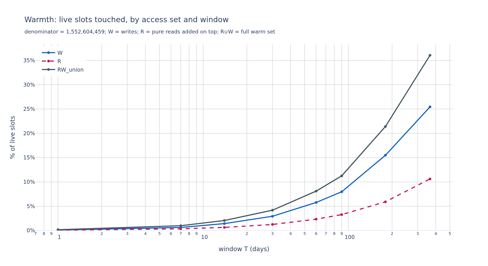
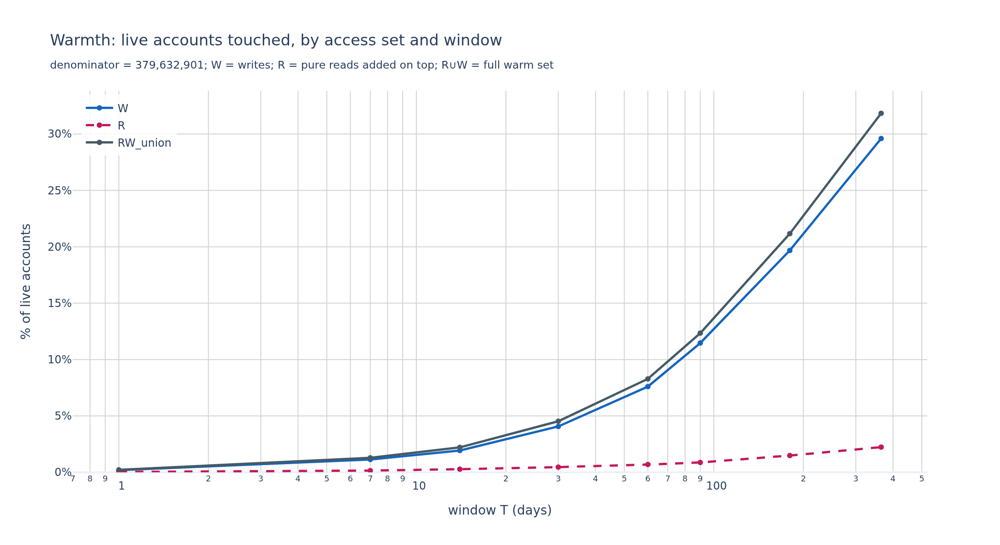
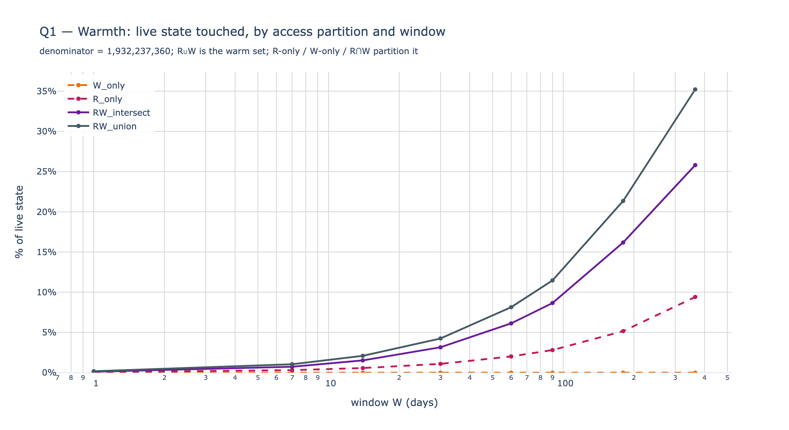

Two observations.

**R for slots is much larger than R for accounts at every window.** At T=365d, R-slots are
10.6% vs R-accounts 4.5%. Slot reads have a deeper unread tail (every contract has view-only
storage), while account reads cluster on a smaller set of popular contracts.

**W grows faster than R as T increases.** For slots, R/W is 0.67× at T=1d and 0.42× at
T=365d. For accounts it is 0.19× and 0.16×. R adds the most relative to W at small T, but
stays above zero throughout, so reads always add something.

#### Warmth over time

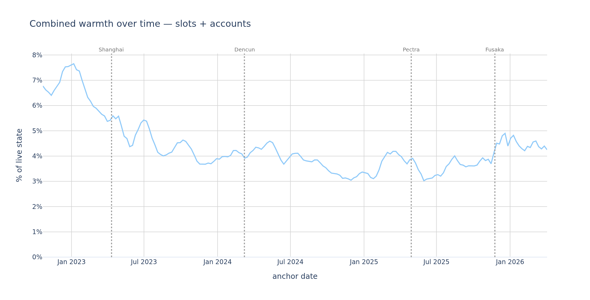
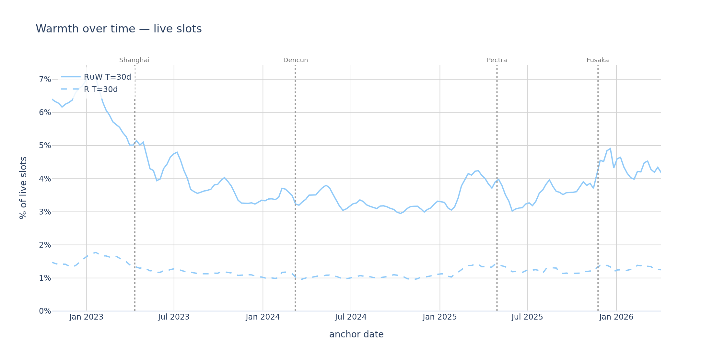
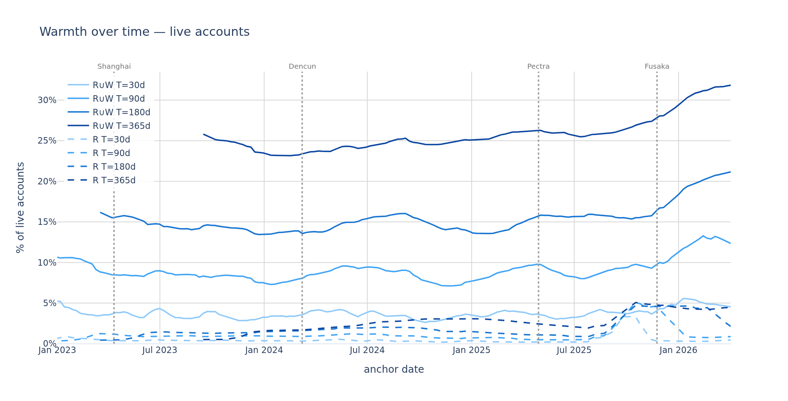

At every window, the warm set falls as a share of live state across the timeline:

| T (days) | earliest anchor | latest anchor (block 24,870,000) |
|---:|---:|---:|
| 30  |  6.8% (2022) | 4.3% |
| 90  | 17.6% (2022) | 11.5% |
| 180 | 29.1% (2023) | 21.4% |
| 365 | 45.2% (2023) | 35.2% |

(The T=30 series peaks slightly higher, ~7.6%, in early 2023.) The objects touched in a
fixed-length window stay roughly constant in absolute terms while live state keeps growing,
so the **active fraction trends down** at every window. Not monotone week to week, but
clearly declining. This is the longitudinal case for tiering: the longer the chain runs,
the larger the share of state that sits cold under any fixed window, so a write-age scheme
marks a growing fraction Inactive over time.

**None of these series step at a fork.** Shanghai, Dencun, Pectra, and Fusaka pass without
visible breaks. Dencun moved calldata economics, not state, and the data shows no break at
March 2024. State-access structure tracks application behaviour, not protocol changes.

#### Reads grow relative to writes

The slot R/W ratio rises over the timeline at every window, from ~0.30 near the Merge to
~0.42–0.43 at the latest anchor (with a T=30 peak near 0.65 in mid-2025). The read-only
slice is not a fixed tax on top of writes. It was smaller in the past and is still growing.

### 5.2 Concentration

For each access set and window, the share of accesses captured by the top 1% and top 10%
of objects. The denominator is the objects in the set, and accesses are per-(tx, object)
units (§3).

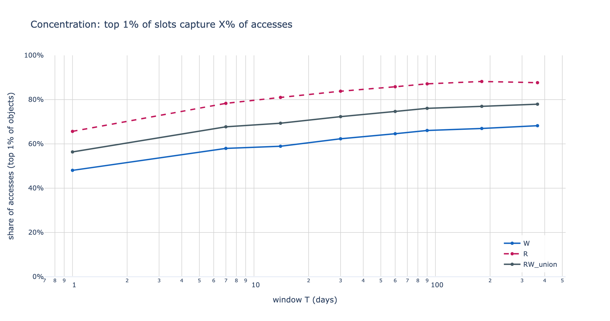
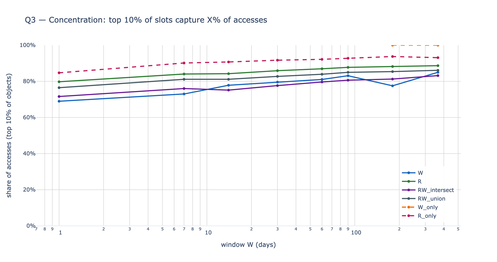
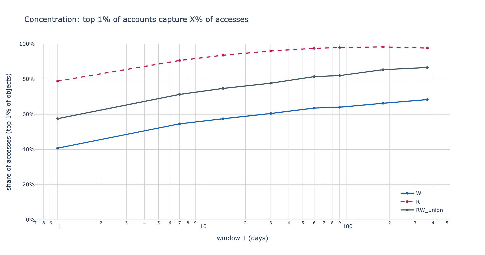
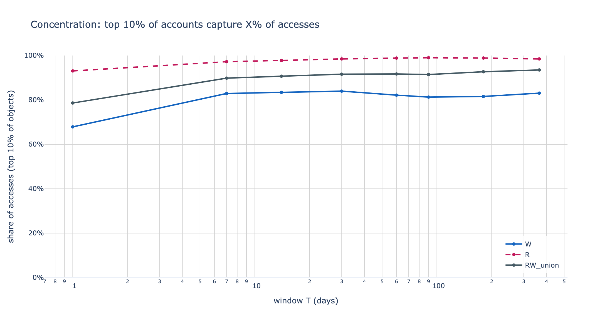

**Slots, top-1% share of accesses:**

| T (days) | W | R | R∪W |
|---:|---:|---:|---:|
| 1   | 48.0% | 65.7% | 56.4% |
| 30  | 62.3% | 83.8% | 72.3% |
| 90  | 66.1% | 87.1% | 76.1% |
| 365 | 68.2% | 87.7% | 77.9% |

**Accounts, top-1% share of accesses:**

| T (days) | W | R | R∪W |
|---:|---:|---:|---:|
| 1   | 40.8% | 78.9% | 57.5% |
| 30  | 60.5% | 96.0% | 77.7% |
| 90  | 64.0% | 98.0% | 82.0% |
| 365 | 68.4% | 97.7% | 86.6% |

Three readings.

**R is more concentrated than W everywhere.** At T=365d the top 1% of R slots sees ~88% of
slot read accesses, and the top 1% of R accounts ~98%. A handful of popular contracts
absorb almost all the read pressure on accounts.

**Concentration grows with T.** Wider windows pull in tail keys that get few accesses, so
the head's relative weight rises. The jump is sharpest from T=1d to T=30d (~18pp for slot R,
~17pp for account R) and flattens after.

**Accounts concentrate far more tightly than slots.** At T=30d the top 1% of R accounts
captures 96% of accesses against 84% for slots. Account reads land on a tiny set of popular
contracts (DEX routers, multicall, WETH, proxy implementations), while slot reads spread
across many contracts' storage.

#### Concentration over time

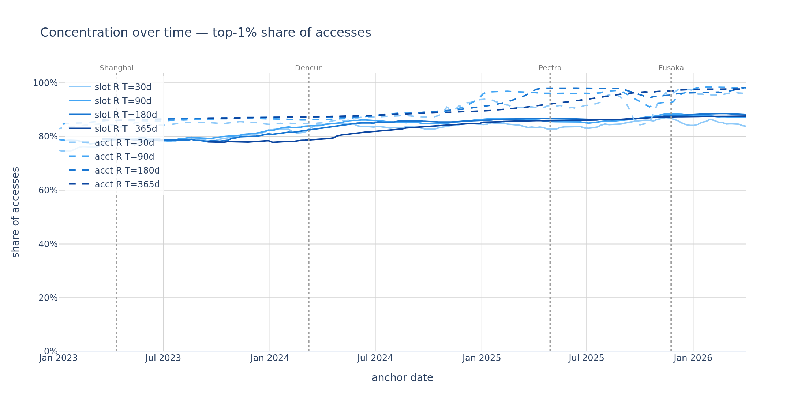

This is the sweep's sharpest result. The top 1% of R **accounts** held ~85% of read
accesses in 2022–2023 and climbed to **96–98% by 2025–2026** at every window. The extreme
account-read concentration is **not a structural constant of Ethereum. It emerged over the
last two years**, as read traffic consolidated onto a shrinking set of heavily-called
contracts. Slot concentration rose far more gently over the same span.

## 6. EIP-8295: a state-tiering counterfactual

The views above describe what state access is. This section asks what a write-age tiering
scheme would do with it.

**EIP-8188** ([ethereum/EIPs#11788](https://github.com/ethereum/EIPs/pull/11788)) adds a
`last_written_block` field to every account and storage slot, consensus-level metadata
recording when each piece of state was last mutated. It changes no gas costs by itself.
**EIP-8295** is the tiering scheme built on that metadata. It would price recently-written
state cheaply (**Active**) and long-dormant state higher (**Inactive**), treating its
activeness threshold as a rolling `T`-day window. The sections below model that layer as a
counterfactual. "Active" and "Inactive" below refer to it.

### 6.1 Warm-update coverage

Set-membership cannot answer the gas question, which is per-event, not per-key: of the
update gas spent in a window, what share would price as Active? Checking each update against
a static past-window set double-counts the cold tier, since a slot written twice in the
window is judged cold both times. The measurement below instead promotes a slot the moment
it is first warmed inside the window.

#### Definition

For each window, classify every update event (one net transition per (tx, slot), §3) as
warm or cold:

- **warm**: the slot was already created or updated earlier in the same window.
- **cold**: the update is the slot's first warming event in the window. Deletions do not
  count as warming.

So a slot's first in-window create-or-update may be cold, and every later update on it is
warm. The exact per-slot rule is in Appendix A.

#### Results

| T (days) | total updates | warm | cold | % warm |
|---:|---:|---:|---:|---:|
| 1   |     3,827,500 |     3,277,106 |     550,394 | **85.62%** |
| 7   |    28,158,628 |    25,937,983 |   2,220,645 | **92.11%** |
| 14  |    55,135,247 |    51,051,775 |   4,083,472 | **92.59%** |
| 30  |   125,684,703 |   117,983,724 |   7,700,979 | **93.87%** |
| 60  |   262,053,193 |   251,043,962 |  11,009,231 | **95.80%** |
| 90  |   402,058,353 |   387,899,906 |  14,158,447 | **96.48%** |
| 180 |   788,431,719 |   765,249,545 |  23,182,174 | **97.06%** |
| 365 | 1,424,321,470 | 1,389,975,882 |  34,345,588 | **97.59%** |

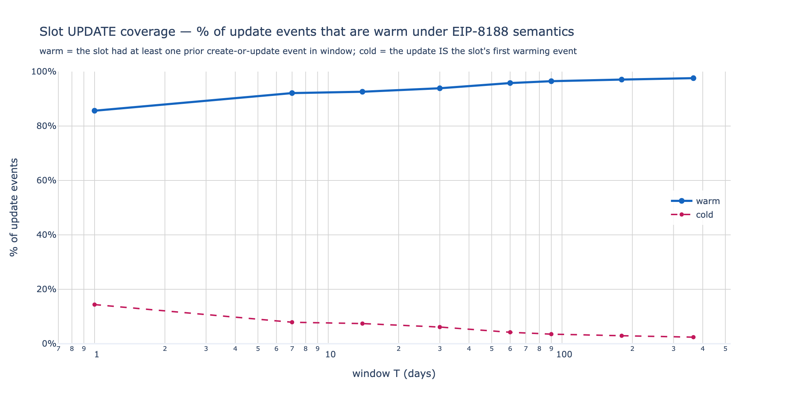

A naive check against a static past-window set gives only **84.8% at T=30d**, a ~9pp
underestimate of the per-event **93.9%**. The gap is intra-window promotion: slots first
written inside the window, then hit again. Three readings.

**The Active tier covers update gas well.** At T=30d, **94%** of update SSTOREs keep the
cheap Active price, 97% at T=90d. The Inactive premium hits only ~3–6% of updates.

**The benefit saturates fast.** T=1d to 30d buys +8pp of coverage, T=30d to 365d only
another +3.7pp. Stretching the window past ~30d does little for update gas.

**Cold updates are first-touch awakenings of dormant state.** 34.3M slots at T=365d, the
tail reactivated after a year cold. A slot has at most one cold update in a window, its
first warming.

#### Coverage over time

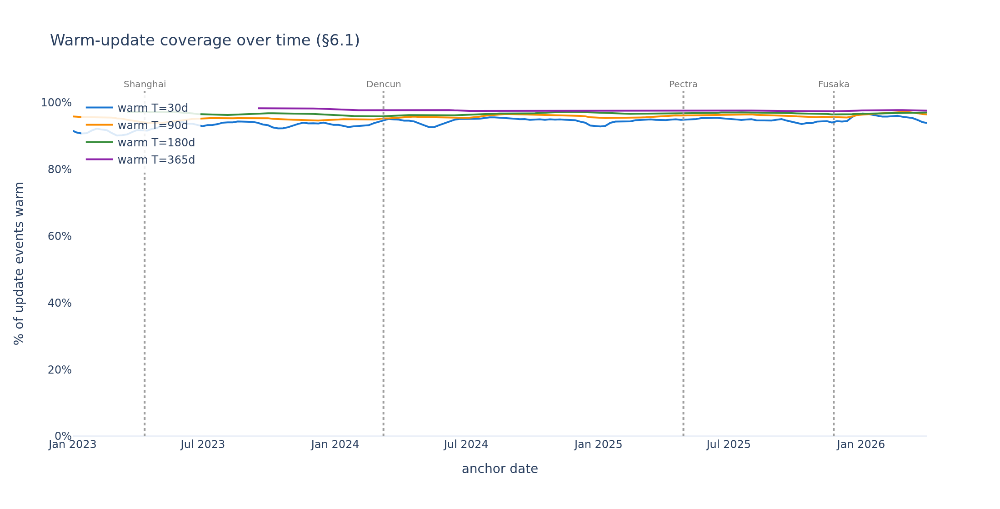

Warm-update coverage is flat and high at every window across the timeline. T=30 stays in a
90–97% band, T=90 ~94–97%, T=180 ~96–97%, T=365 ~97–98%. It rises with window width and
barely moves over 3.5 years. The headline 94% at T=30d is representative of the whole
post-Merge era, not a lucky anchor.

### 6.2 Read-side period bump

A third question is about the **first operation per object** in a window:

> Under a hypothetical extension where the first read of an inactive object also bumps its
> period, making reads write-like for users, which objects pay that cost?

The bad-UX set is **objects whose first in-window event is a nonzero read**. For a slot
that is an SLOAD returning a populated value, for an account a balance or nonce read
returning more than zero. A write or a zero read as the first event costs nothing: writes
already refresh the metadata, and zero reads target objects that do not exist yet.

EIP-8188 updates the write-age on writes only, never on reads. A scheme that bumped the
period on a read would cost as much as a write and break STATICCALL purity, so read-side
bumping is rejected. This section is strictly a counterfactual.

#### Method

Each object is placed by its earliest event in the window, ordered by `(block, transaction
index)`. When a read and a write share a transaction the true order is unknown, so ties
break **writes > nonzero reads > zero reads**. That under-counts the bad-UX set (a read
that truly preceded a write is scored as a write), which is the safe direction.

#### Slots: first-operation classification

For each T, the share of slots in R∪W by what their first event is:

| T (days) | first = write | first = zero read | first = nonzero read |
|---:|---:|---:|---:|
| 1   | 58.26% | 27.97% | **13.77%** |
| 7   | 62.74% | 28.97% |  8.29% |
| 14  | 67.56% | 25.66% |  6.78% |
| 30  | 68.54% | 25.91% |  5.56% |
| 60  | 69.72% | 26.33% |  3.94% |
| 90  | 69.42% | 27.02% |  3.56% |
| 180 | 71.05% | 26.22% |  2.73% |
| 365 | 69.31% | 28.42% |  2.27% |

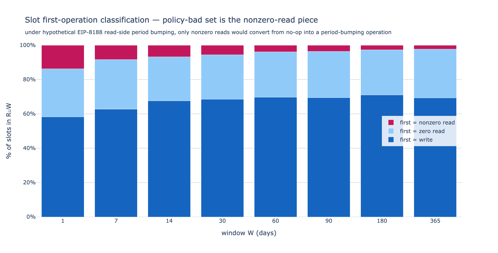

At T=30d, **5.56% of slots in R∪W** (≈3.6M) would be hit by the read-side bump, their first
event a populated SLOAD. This falls to **2.27% at T=365d**, because a wider window is more
likely to contain an earlier write. The 26–28% zero-read band is policy-irrelevant here,
just structural probes on slots that do not exist yet (§4.2).

#### Accounts: first-operation classification

For each T, the share of accounts in R∪W by what their first event is:

| T (days) | first = write | first = nonzero read | first = zero read |
|---:|---:|---:|---:|
| 1   | 83.84% | **15.75%** |  0.41% |
| 7   | 87.36% | 11.98% |  0.67% |
| 14  | 86.79% | 12.51% |  0.71% |
| 30  | 88.96% | 10.36% |  0.68% |
| 60  | 90.78% |  8.48% |  0.75% |
| 90  | 92.24% |  7.07% |  0.69% |
| 180 | 84.85% | 10.65% |  4.51% |
| 365 | 81.05% |  8.43% | 10.52% |

(First = appearance read is identically 0. An appearance always loses the same-transaction
tie-break to a balance or nonce read, because the transaction that emits an appearance also
emits those reads.)

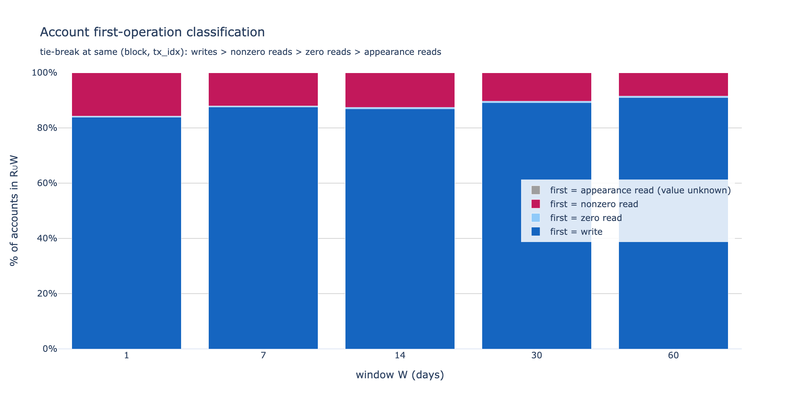

The bad-UX set is more pronounced for accounts at small T: **15.75% of warm accounts at
T=1d** have a nonzero balance or nonce read as their first event. It bottoms out near 7% at
T=90d, then ticks back up as the zero-read band swells at T=180d/365d (4.5% / 10.5%),
reflecting long-dormant accounts probed while empty. Most of the nonzero-read-first
accounts are view-call targets: popular contracts checked read-only before a transaction
decides whether to interact.

#### R-only accounts: empty vs non-empty

An R account is never written in the window, so its balance and nonce are stable and we can
label it once:

- **empty**: every observed balance and nonce read returned zero.
- **non-empty**: some read returned a positive balance or nonce.
- **unknown**: seen only as an appearance, with no balance or nonce read to judge.

| T (days) | R-only total | empty | non-empty | unknown |
|---:|---:|---:|---:|---:|
| 1   |    135,922 | 1.79% | **98.21%** | 0 |
| 7   |    586,826 | 3.71% | **96.29%** | 0 |
| 14  |  1,065,388 | 3.66% | 96.34% | 0 |
| 30  |  1,752,187 | 4.24% | 95.76% | 0 |
| 60  |  2,619,858 | 5.68% | 94.32% | 0 |
| 90  |  3,327,941 | 5.98% | 94.02% | 0 |
| 180 |  8,061,680 | 5.71% | 94.29% | 10 |
| 365 | 17,025,144 | 7.34% | **92.66%** | 11 |

**Almost every R account is non-empty**, 93–98% across all windows, drifting only slightly
toward empty as T grows (7.3% at T=365d). So under read-side bumping, virtually every R
account read would bump a real period, turning a read into a write from the user's side.
The empty-account free pass is tiny. Unknown is negligible, 11 accounts or fewer at any T.
Even setting aside first-event reads, the pure R slice (where any read bumps a period) is
dominated by non-empty objects.

> Caveat: the confirmed-empty count (both balance and nonce read as zero) is ~0 at every T.
> The "empty" bucket is almost entirely call or transfer recipients whose balance was read
> as zero but whose nonce was never read (only the sender's nonce is consulted, and that is
> a write). So "empty" really means "zero-value call target, existence unconfirmed", and
> the bias is conservative: a dormant nonce>0 account misclassified here would be
> non-empty, pushing the policy-bad share up.

#### Stability over time

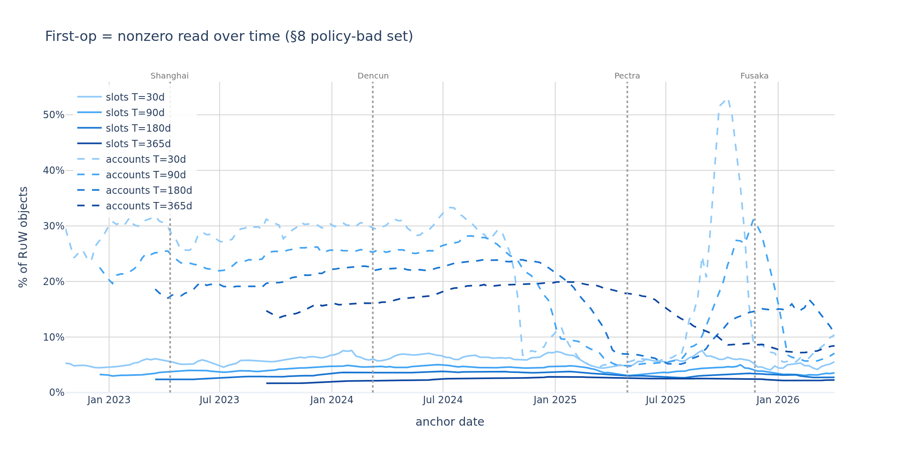
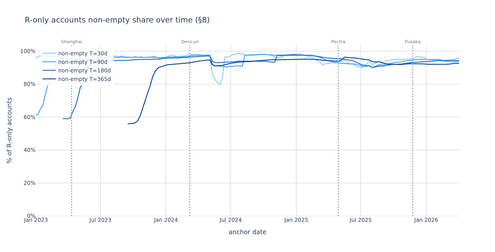

**The first-op bad-UX set stays low.** At T=30 it is mostly ~5–6% (spiking to ~7.5% in
2024–2025), falling to ~2% at T=365. It has always been a small minority of warm objects.

**R accounts grew more non-empty over time**, from the mid-70s in 2023 to ~93–96% in 2026.
The empty-account free pass was always small and has shrunk further.

The descriptive structure drifts slowly with chain age. The policy conclusions are
effectively time-invariant: a tiering scheme tuned on today's anchor would behave the same
at any post-Merge anchor.

## 7. What this opens up

The clearest threads worth pulling next.

**R is the new lens.** The read-but-not-written slice carries the most distinctive
structure: ~30% extra warm-set mass over writes alone, and very heavy concentration (~88%
top 1% for slots, ~98% for accounts). Which contracts dominate it? A contract-class
breakdown of the R head would say.

**Per-transaction all-hot fraction.** What share of transactions touch only warm state under
a given `T`? That reframes these population-level numbers as user impact.

**Created-and-read slots.** How many created slots are later read in a separate transaction,
created once then read afterward? An in-progress thread.

---

## Appendix A: SQL queries

All queries run per `(T, object_type)` over the trailing block range
`bn_lo = anchor − T·7200`, `bn_hi = anchor` (post-Merge cadence 7,200 blocks/day, anchor
`24,870,000`, `T ∈ {1, 7, 14, 30, 60, 90, 180, 365}`). Full builders live in
`state_access/queries_v2.py`.

### Slot histogram (warmth, write/read structure, concentration)

Storage-slot key is `(contract_address, slot)`. Writes come from `storage_diffs`, reads
from `storage_reads`. The inner UNION ALL tags each row with `is_w` / `is_r`, the outer
GROUP BY on `cityHash64(address, slot)` sums them per key, and the final GROUP BY collapses
to `(slice, n_w, n_r, n_keys)`. The slice partition (`w_only` / `r_only` / `rw`) is re-mapped
in Python to the W / R sets: W = `w_only ∪ rw`, R = `r_only`, R∪W = all three.

```sql
WITH per_key AS (
    SELECT
        h,
        sum(is_w) AS n_w,
        sum(is_r) AS n_r
    FROM (
        SELECT cityHash64(address, slot) AS h, 1 AS is_w, 0 AS is_r
        FROM canonical_execution_storage_diffs
        WHERE meta_network_name = 'mainnet'
          AND block_number BETWEEN {bn_lo} AND {bn_hi}
        UNION ALL
        SELECT cityHash64(contract_address, slot) AS h, 0 AS is_w, 1 AS is_r
        FROM canonical_execution_storage_reads
        WHERE meta_network_name = 'mainnet'
          AND block_number BETWEEN {bn_lo} AND {bn_hi}
    )
    GROUP BY h
)
SELECT
    multiIf(n_w > 0 AND n_r > 0, 'rw',
            n_w > 0,             'w_only',
                                 'r_only') AS slice,
    n_w,
    n_r,
    count() AS n_keys
FROM per_key
GROUP BY slice, n_w, n_r
ORDER BY slice, n_w, n_r
```

### Slot typed histogram (§4.1 / §4.2)

Same per-key GROUP BY shape, but with five typed counters in place of two. Each write event
splits into `create` / `update` / `delete` by `(from_value, to_value)` and each read into
`zero` / `nonzero` by the returned `value`. Output: one row per distinct
`(n_w_create, n_w_update, n_w_delete, n_r_zero, n_r_nonzero)` count-tuple, with `n_keys`.

```sql
WITH per_key AS (
    SELECT
        h,
        sum(is_w_create)  AS n_w_create,
        sum(is_w_update)  AS n_w_update,
        sum(is_w_delete)  AS n_w_delete,
        sum(is_r_zero)    AS n_r_zero,
        sum(is_r_nonzero) AS n_r_nonzero
    FROM (
        SELECT
            cityHash64(address, slot) AS h,
            toUInt8(from_value =  '0x000…0' AND to_value != '0x000…0') AS is_w_create,
            toUInt8(from_value != '0x000…0' AND to_value != '0x000…0') AS is_w_update,
            toUInt8(from_value != '0x000…0' AND to_value =  '0x000…0') AS is_w_delete,
            toUInt8(0) AS is_r_zero,
            toUInt8(0) AS is_r_nonzero
        FROM canonical_execution_storage_diffs
        WHERE meta_network_name = 'mainnet'
          AND block_number BETWEEN {bn_lo} AND {bn_hi}
        UNION ALL
        SELECT
            cityHash64(contract_address, slot) AS h,
            toUInt8(0) AS is_w_create,
            toUInt8(0) AS is_w_update,
            toUInt8(0) AS is_w_delete,
            toUInt8(value =  '0x000…0') AS is_r_zero,
            toUInt8(value != '0x000…0') AS is_r_nonzero
        FROM canonical_execution_storage_reads
        WHERE meta_network_name = 'mainnet'
          AND block_number BETWEEN {bn_lo} AND {bn_hi}
    )
    GROUP BY h
)
SELECT
    n_w_create, n_w_update, n_w_delete, n_r_zero, n_r_nonzero,
    count() AS n_keys
FROM per_key
GROUP BY n_w_create, n_w_update, n_w_delete, n_r_zero, n_r_nonzero
ORDER BY n_w_create, n_w_update, n_w_delete, n_r_zero, n_r_nonzero
```

The W_mixed decomposition (§4.1) and R returned-value split (§4.2) are derived in Python from
this histogram, no extra query.

### Account histogram (warmth, concentration)

Account key is `cityHash64(address)`. Writes come from `balance_diffs`, `nonce_diffs`, and
`contracts` (`contract_address` is the newly-materialized account). Reads come from
`balance_reads`, `nonce_reads`, and `address_appearances` filtered to non-ERC*
relationships. Same outer aggregation as the slot query.

```sql
WITH per_key AS (
    SELECT
        h,
        sum(is_w) AS n_w,
        sum(is_r) AS n_r
    FROM (
        SELECT cityHash64(address) AS h, 1 AS is_w, 0 AS is_r
        FROM canonical_execution_balance_diffs
        WHERE meta_network_name = 'mainnet'
          AND block_number BETWEEN {bn_lo} AND {bn_hi}
        UNION ALL
        SELECT cityHash64(address) AS h, 1 AS is_w, 0 AS is_r
        FROM canonical_execution_nonce_diffs
        WHERE meta_network_name = 'mainnet'
          AND block_number BETWEEN {bn_lo} AND {bn_hi}
        UNION ALL
        SELECT cityHash64(contract_address) AS h, 1 AS is_w, 0 AS is_r
        FROM canonical_execution_contracts
        WHERE meta_network_name = 'mainnet'
          AND block_number BETWEEN {bn_lo} AND {bn_hi}
        UNION ALL
        SELECT cityHash64(address) AS h, 0 AS is_w, 1 AS is_r
        FROM canonical_execution_balance_reads
        WHERE meta_network_name = 'mainnet'
          AND block_number BETWEEN {bn_lo} AND {bn_hi}
        UNION ALL
        SELECT cityHash64(address) AS h, 0 AS is_w, 1 AS is_r
        FROM canonical_execution_nonce_reads
        WHERE meta_network_name = 'mainnet'
          AND block_number BETWEEN {bn_lo} AND {bn_hi}
        UNION ALL
        SELECT cityHash64(address) AS h, 0 AS is_w, 1 AS is_r
        FROM canonical_execution_address_appearances
        WHERE meta_network_name = 'mainnet'
          AND block_number BETWEEN {bn_lo} AND {bn_hi}
          AND relationship IN ('call_from', 'call_to', 'tx_from', 'tx_to',
                               'miner_fee', 'factory', 'create',
                               'suicide_refund', 'suicide')
    )
    GROUP BY h
)
SELECT
    multiIf(n_w > 0 AND n_r > 0, 'rw',
            n_w > 0,             'w_only',
                                 'r_only') AS slice,
    n_w,
    n_r,
    count() AS n_keys
FROM per_key
GROUP BY slice, n_w, n_r
ORDER BY slice, n_w, n_r
```

### Live-state totals (denominators)

```sql
SELECT block_number, accounts, storages
FROM execution_state_size
WHERE meta_network_name = 'mainnet' AND block_number <= 24870000
ORDER BY block_number DESC
LIMIT 1
```

At the anchor: 1,552,604,459 slots, 379,632,901 accounts, 1,932,237,360 combined.

### Warm-update coverage (§6.1)

For each T, classify every update SSTORE event in `[anchor − T·7200, anchor]` by whether
the same slot had any earlier create-or-update event in the same window. One GROUP BY on
`cityHash64(address, slot)`, with no JOIN and no window function.

```sql
WITH slot_events AS (
    SELECT
        cityHash64(address, slot) AS h,
        toUInt64(block_number) * 1000000000
            + toUInt64(transaction_index) * 100000
            + toUInt64(internal_index) AS event_order,
        (from_value != '0x000…0' AND to_value != '0x000…0') AS is_update,
        (from_value =  '0x000…0' AND to_value != '0x000…0') AS is_create
    FROM canonical_execution_storage_diffs
    WHERE meta_network_name = 'mainnet'
      AND block_number BETWEEN {bn_lo} AND {bn_hi}
),
per_slot AS (
    SELECT
        h,
        countIf(is_update) AS n_update,
        -- argMinIf returns is_update of the row with the smallest event_order
        -- among rows where (is_create OR is_update). Deletion rows are filtered out.
        argMinIf(is_update, event_order, is_create OR is_update) AS first_cu_is_update
    FROM slot_events
    GROUP BY h
    HAVING n_update > 0
)
SELECT
    sum(n_update) AS total_updates,
    sum(n_update - toUInt64(first_cu_is_update)) AS warm_updates,
    sum(toUInt64(first_cu_is_update)) AS cold_updates,
    round(100.0 * warm_updates / total_updates, 4) AS pct_warm
FROM per_slot
```

`event_order` packs `(block_number, transaction_index, internal_index)` into a single
monotone UInt64 (block numbers fit easily, `25M × 1e9 ≈ 2.5e16`, well below UInt64 max).

### First-operation classification (§6.2)

For each object in R∪W, find its earliest event in window by `(block_number,
transaction_index)` and classify. Slots and accounts both use the UNION-ALL-then-`argMin`
shape, no JOIN: `contracts` is dropped (redundant with `nonce_diffs`) and
`address_appearances` gets an end-of-block sort position (it always loses same-block ties,
matching its lowest priority).

```sql
-- Slots — slot_first_op
WITH slot_events AS (
    SELECT
        cityHash64(address, slot) AS h,
        toUInt64(block_number) * 1000000 + toUInt64(transaction_index) * 10 + 0 AS event_order,
        toUInt8(0) AS is_read,
        toUInt8(0) AS read_is_nonzero
    FROM canonical_execution_storage_diffs
    WHERE meta_network_name='mainnet' AND block_number BETWEEN {bn_lo} AND {bn_hi}
    UNION ALL
    SELECT
        cityHash64(contract_address, slot) AS h,
        toUInt64(block_number) * 1000000 + toUInt64(transaction_index) * 10 + 1 AS event_order,
        toUInt8(1) AS is_read,
        toUInt8(value != '0x000…0') AS read_is_nonzero
    FROM canonical_execution_storage_reads
    WHERE meta_network_name='mainnet' AND block_number BETWEEN {bn_lo} AND {bn_hi}
),
per_slot AS (
    SELECT
        h,
        argMin(is_read,         event_order) AS first_is_read,
        argMin(read_is_nonzero, event_order) AS first_read_is_nonzero
    FROM slot_events
    GROUP BY h
)
SELECT
    count() AS total_slots,
    sum(toUInt8(first_is_read = 0)) AS first_is_write,
    sum(toUInt8(first_is_read = 1 AND first_read_is_nonzero = 0)) AS first_is_zero_read,
    sum(toUInt8(first_is_read = 1 AND first_read_is_nonzero = 1)) AS first_is_nonzero_read
FROM per_slot;

-- Accounts — account_first_op (priority packing into event_order so the tie-break is
-- write > nonzero_read > zero_read > appearance_read at the same (block, tx_idx))
WITH all_events AS (
    SELECT cityHash64(address) AS h,
        toUInt64(block_number) * 10000000 + toUInt64(transaction_index) * 10 + 0 AS event_order,
        'write' AS op
    FROM canonical_execution_balance_diffs
    WHERE meta_network_name='mainnet' AND block_number BETWEEN {bn_lo} AND {bn_hi}
    UNION ALL  -- nonce_diffs (write, +0)
    UNION ALL  -- balance_reads: +1 if balance!=0 else +2, op nonzero_read/zero_read
    UNION ALL  -- nonce_reads:   +1 if nonce!=0   else +2, op nonzero_read/zero_read
    UNION ALL  -- address_appearances: event_order = block*10000000 + 9999999 (end-of-block),
               --   op appearance_read; no tx_index needed, always loses same-block ties
)
SELECT count() AS total_accounts,
       sum(toUInt8(op='write'))           AS first_is_write,
       sum(toUInt8(op='nonzero_read'))    AS first_is_nonzero_read,
       sum(toUInt8(op='zero_read'))       AS first_is_zero_read,
       sum(toUInt8(op='appearance_read')) AS first_is_appearance_read
FROM (SELECT h, argMin(op, event_order) AS op FROM all_events GROUP BY h);
```

Full SQL in `state_access/queries_v2.py` (`slot_first_op`, `account_first_op`).

### R-only empty/non-empty split (§6.2)

Single GROUP BY, no JOINs. Each source row is tagged with `UInt8` flags, and we aggregate
`max(balance != 0)` rather than `max(balance)` so the per-group state is a byte, not a
`UInt256`. That is what lets it run at T=365d (a triple-CTE plus double-LEFT-JOIN form
stalls the cluster).

```sql
WITH per_acct AS (
    SELECT
        h,
        max(is_write)     AS any_write,
        max(bal_nonzero)  AS bal_nonzero,
        max(non_nonzero)  AS non_nonzero,
        max(has_bal_read) AS has_bal_read,
        max(has_non_read) AS has_non_read
    FROM (
        -- writes (is_write=1): balance_diffs, nonce_diffs, contracts(contract_address)
        SELECT cityHash64(address) AS h, toUInt8(1) AS is_write,
               toUInt8(0) AS bal_nonzero, toUInt8(0) AS non_nonzero,
               toUInt8(0) AS has_bal_read, toUInt8(0) AS has_non_read
        FROM canonical_execution_balance_diffs WHERE in_window
        UNION ALL ... -- nonce_diffs, contracts: same write pattern
        -- value reads: balance_reads sets bal_nonzero/has_bal_read, nonce_reads similarly
        UNION ALL
        SELECT cityHash64(address), toUInt8(0),
               toUInt8(balance != 0), toUInt8(0), toUInt8(1), toUInt8(0)
        FROM canonical_execution_balance_reads WHERE in_window
        UNION ALL ... -- nonce_reads: toUInt8(nonce != 0) into non_nonzero, has_non_read=1
        -- value-less reads: address_appearances (all flags 0 except it's a read presence)
        UNION ALL
        SELECT cityHash64(address), toUInt8(0),
               toUInt8(0), toUInt8(0), toUInt8(0), toUInt8(0)
        FROM canonical_execution_address_appearances
        WHERE in_window AND relationship IN (...)
    )
    GROUP BY h
)
SELECT
    countIf(any_write = 0) AS total_r,
    countIf(any_write = 0 AND bal_nonzero = 0 AND non_nonzero = 0
            AND (has_bal_read = 1 OR has_non_read = 1)) AS empty_accounts,
    countIf(any_write = 0 AND (bal_nonzero = 1 OR non_nonzero = 1)) AS nonempty_accounts,
    countIf(any_write = 0 AND has_bal_read = 0 AND has_non_read = 0) AS unknown_accounts
FROM per_acct;
```

`contracts` is kept in the write set here (unlike `account_first_op`): ~1% of
contract-creation accounts lack a `nonce_diff`/`balance_diff` in window, and dropping
contracts would wrongly admit those written accounts into R.

### Full-history event totals (§4.1/§4.2 history subsections)

Eight builders in `queries_v2.py` (`slot_write_event_totals`, `slot_read_event_totals`,
`account_{balance,nonce}_{write,read}_totals`, `account_contract_create_totals`,
`account_appearance_read_totals`), each a plain `countIf` aggregate over an inclusive
block range, no per-key GROUP BY, no JOIN. Counts are additive, so
`collect_v2_history.py` tiles `[0, 24,870,000]` into 1M-block chunks split at the merge
block (15,537,394), runs read kinds on ethpandaops below it and on the local node above
(write tables are full-history local), and persists per-chunk counts to
`history_event_totals.parquet` (resumable per `(kind, chunk)`, and a failed chunk is split
in half and retried so counts lose nothing). Every builder also returns `n_total` so the
metric partition can be verified against the row count.

```sql
-- representative shape (slot writes; the others differ only in table and predicates)
SELECT
    countIf(from_value =  '0x000…0' AND to_value != '0x000…0') AS n_create,
    countIf(from_value != '0x000…0' AND to_value != '0x000…0') AS n_update,
    countIf(from_value != '0x000…0' AND to_value =  '0x000…0') AS n_delete,
    count() AS n_total
FROM canonical_execution_storage_diffs
WHERE meta_network_name = 'mainnet' AND block_number BETWEEN {bn_lo} AND {bn_hi}
```

## Appendix B: outputs

```
state_access/data/v2/
  slot_histogram.parquet         # raw (slice, n_w, n_r, n_keys) per T (input)
  account_histogram.parquet
  slot_typed_histogram.parquet   # typed slot histogram for §4.1 / §4.2
  slot_update_coverage.parquet   # per-T warm/cold update split for §6.1
  slot_first_op.parquet          # §6.2 first-op classification (slots)
  account_first_op.parquet       # §6.2 first-op classification (accounts)
  account_r_empty_split.parquet  # §6.2 empty/non-empty R-only accounts
  q1_warmth_{slot,account,combined}.parquet         # set sizes + pct of live state
  q1_warmth_slot_typed.parquet                       # typed slot W/R breakdown
  q1_warmth_slot_mixed_decomp.parquet                # W_mixed sub-categories
  q3_concentration_{slot,account}.parquet
  q1_warmth_{slot,account,combined}.png
  q1_warmth_slot_{W,R}_typed.png                     # typed slot stacked areas
  q1_warmth_slot_mixed_decomp.png                    # W_mixed 6-way decomposition
  slot_update_coverage.png                           # §6.1 warm/cold update line chart
  slot_first_op.png                                  # §6.2 slot first-op stacked bar
  account_first_op.png                               # §6.2 account first-op stacked bar
  account_r_empty_split.png                          # §6.2 R-only empty vs non-empty
  q3_concentration_{top1,top10}_{slot,account}.png
  history_event_totals.parquet                       # full-history per-chunk event counts
  history_event_totals_summary.parquet               # per-(kind, metric) totals + era split
  history_event_totals_{writes,reads}.png            # full-history event-mix stacked bars
  sweep_w{30,90,180,365}.parquet                     # Part III: one wide row per anchor
  sweep_summary.parquet                              # Part III: all windows pooled (long)
  sweep_warmth_{slot,acct,combined}.png              # §5.1 warmth over time
  sweep_write_composition.png                        # §4.1 write lifecycle composition over time
  sweep_read_composition.png                         # §4.2 read composition over time
  sweep_concentration.png                            # §5.2 concentration over time
  sweep_update_coverage.png  sweep_first_op.png  sweep_empty_split.png  # §6 policy over time
```

### Historical sweep: the over-time views

Two scalar-summary SQL builders (`slot_sweep_summary`, `account_sweep_summary` in
`queries_v2.py`) reuse the per-key CTEs of the warmth and structure histograms but push the classification
into the outer `SELECT`, so each `(anchor, T)` cell returns one row of ~20 counts instead of
a 100k-row histogram. Concentration (§5.2) is reduced in-process by a tie-aware exact top-N
band reduction (`sweep_concentration.py`). §6.1 and §6.2 reuse the existing scalar builders.
The
driver `collect_v2_sweep.py` walks weekly anchors newest-first (so the latest anchor lands
first and self-verifies), checkpoints one wide row per anchor with atomic temp+rename, and
retries `DatabaseError` with backoff to ride out the node's OOM restarts. `anchors_v2(T)` in
`config_v2.py` generates the floored weekly grid.

Reproduce: `uv run python -m state_access.collect_v2 && uv run python -m state_access.collect_v2_history
&& uv run python -m state_access.collect_v2_sweep && uv run python -m state_access.analysis_v2
&& uv run python -m state_access.analysis_v2_sweep`.
`collect_v2` resumes per `(T, object_type)` cell, `collect_v2_history` per `(kind, chunk)`,
and `collect_v2_sweep` per `(T, anchor)`. Delete a parquet to force a re-pull.
Verification checks (additivity `|R∪W|=|W|+|R|`, partition sums, monotonicity, chunk tiling,
and per-window equality with the latest-anchor numbers) live in `analysis_v2` /
`analysis_v2_sweep`.
