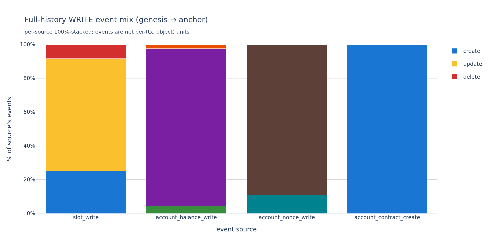
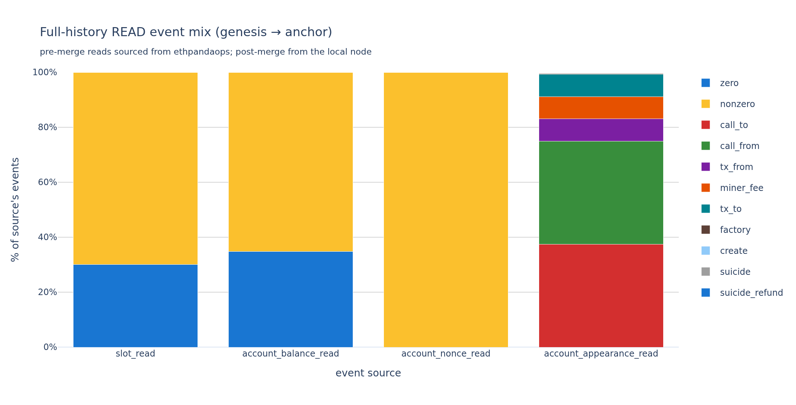

# Ethereum state access: reads, writes, and the active set

## 1. Introduction

Every Ethereum transaction reads and writes pieces of the chain's **state** — account
balances and nonces, and the storage slots inside contracts. As the chain grows, an
ever-larger share of that state is rarely touched, which is why several proposals look at
separating "active" state from dormant state. This report measures what state access
actually looks like — how much of the state is touched over a given period, whether writes
mostly create new state or modify existing state, whether reads fetch real data or just
probe for existence, and how concentrated that activity is — then asks what an
**EIP-8188-style state-tiering** scheme would do with the result.

It measures access over trailing time windows, separating **writes** from **reads**. For
each window it reports the set of objects **written** (`W`), the set **read but not
written** (`R`), and their union `R∪W` — all state touched in the window, the "warm" or
active set. `T` is the trailing window length in days (always written `T`, never `W`, to
avoid colliding with the writes set).

**EIP-8188** ([ethereum/EIPs#11788](https://github.com/ethereum/EIPs/pull/11788)) adds a
`last_written_block` field to every account and storage slot — consensus-level metadata
recording when each piece of state was last mutated. It changes no gas costs itself; a
write-age **tiering** scheme built on it would price recently-written state cheaply
(**Active**) and long-dormant state higher (**Inactive**). The policy sections (§6.1–§6.2)
model that tiering layer, idealizing its activeness threshold as a rolling `T`-day window;
"under EIP-8188" below is shorthand for "under a write-age tiering scheme built on
EIP-8188's metadata".

The windowed tables throughout end at mainnet block **24,870,000**; §5.1 and §6 also replay
them weekly across post-Merge history. Windows: `T ∈ {1, 7, 14, 30, 60, 90, 180, 365}` days.
Object types: **storage slots** `(contract, slot)` and **accounts** `(address)`.

## 2. Summary

- **Writes are a small slice of live state.** `|W|` at T=30d is **2.93% of live slots**
  and **4.07% of live accounts**; at T=365d, 25.4% / 27.4%.
- **R is the reads dimension the `_diffs` tables can't see.** At T=30d, **1.25% of slots
  and 0.46% of accounts** are read-but-not-written in window. At T=365d these grow to
  **10.6% / 4.5%**. By construction R never overlaps W.
- **The full warm set R∪W is 32–52% larger than W alone.** The relative gap is largest
  at small T (+52% at T=1d, +43% at T=7d) and settles to **+32–37% for T ≥ 30d**. At
  T=30d the combined-state warm set is **4.25%** (vs 3.16% for writes alone); at T=365d
  it's **35.2%** (vs 25.8%). The mass you'd miss with a writes-only definition is roughly
  **a third**.
- **R is much more concentrated than W.** At T=30d the top 1% of objects captures **84%
  of read events** (slots) or **96%** (accounts), versus **62% / 61%** for writes. R-only
  objects are a long tail dominated by one-shot view-call targets — but the head of that
  tail is extremely heavy.
- **Slot W is dominated by creations, not updates.** At T=365d, **88% of W slots have any
  creation event** and only **21% have any update**; on a disjoint partition, **62% of W
  slots are create-only** (write was a `0→nonzero` initialization, nothing else in
  window). Most "warm slots" by W's definition are warm because they're being **born**,
  not modified — state growth, not state churn. Write-age tiering only reprices updates,
  so the policy-relevant write set is **5.4% of state** at T=365d (update-touching
  slots), not 25%.
- **Slot R is dominated by empty-slot probes.** At T=365d, **93% of R slots had at least
  one read returning `value=0`** ("does this slot exist?" checks). Only **7% of R slots**
  had any read return populated data. The `R_mixed` partition (slots with both zero and
  nonzero reads) is **near-zero** — 1–2 slots up to T=90d, 0.02% of |R| at T=180d, 0.2%
  at T=365d. It is not exactly zero because `_diffs` rows are net-per-transaction and
  exclude rolled-back writes, so a slot whose writes all cancel or revert within their
  transactions shows no write while its reads expose the intermediate values (§3).
- **Write-age tiering covers update gas very well at the policy-relevant window.** Under per-event
  semantics (intra-window promotion accounted for), **94% of update SSTORE events at
  T=30d would keep the Active price**; 97% at T=90d. The Inactive premium only affects
  ~3–6% of updates at policy-relevant T.
- **Over the post-Merge timeline, the active fraction of state is shrinking.** As the
  chain ages, a fixed-length window touches a steadily smaller share of total state (the
  365-day warm set falls from ~45% in 2023 to ~35% by 2026) — the case for tiering grows
  stronger over time.
- **The heavy concentration of account reads is recent.** The top 1% of read-only
  accounts captured ~85% of read accesses in 2022–2023 and ~96–98% by 2025–2026 — not a
  structural constant of Ethereum.
- **The policy conclusions are stable across 3.5 years and every fork.** Warm-update
  coverage stays flat and high at each window, and no state-access series steps at
  Shanghai, Dencun, Pectra, or Fusaka — state access tracks application behaviour, not
  protocol changes.

## 3. Data and method

### Source tables

| set | source |
|---|---|
| writes (accounts) | `canonical_execution_balance_diffs`, `canonical_execution_nonce_diffs`, `canonical_execution_contracts` (account creation, keyed on `contract_address`) |
| writes (slots) | `canonical_execution_storage_diffs` |
| reads (slots) | `canonical_execution_storage_reads` |
| reads (accounts, direct) | `canonical_execution_balance_reads`, `canonical_execution_nonce_reads` |
| reads (accounts, derived) | `canonical_execution_address_appearances`, filtered to relationships `{call_from, call_to, tx_from, tx_to, miner_fee, factory, create, suicide_refund, suicide}` |

All source tables are the `canonical_execution_*` tables from
[Xatu](https://github.com/ethpandaops/xatu), ethPandaOps' Ethereum data pipeline.
`address_appearances` relationships `erc20_*` and `erc721_*` are excluded — they're token
log-emission artifacts, not state-access events.

### Set definitions

For each `(T, object_type)`:

- **W** — objects that appear in the writes-source tables in window (raw, no dedup).
- **R** — objects that appear in the reads-source tables AND not in the writes sources
  in the same window. Deduped against W by construction, so R ∩ W = ∅.
- **R∪W = W + R** — their union, the full warm (active) set.

In practice almost every written object is also read in the same window — a slot's
`SSTORE` is preceded by an `SLOAD` (`x = f(x)` codegen), and a sender's nonce is read to
validate the transaction that writes it — so R is reported as the reads that add something
*beyond* W, and R∪W is just the two added together.

### Granularity and known gaps

Verified empirically against the source tables (2026-06-12):

- **One row per (transaction, object).** Both `_diffs` and `_reads` are deduplicated per
  transaction: a `_diffs` row is the **net per-tx transition** of a slot (`from_value` →
  `to_value` across the whole tx — intra-tx rewrites collapse, and an exact
  write-then-restore cycle emits no row), and a `_reads` row records one observed value
  per (tx, slot). "Events" in this report are therefore per-(tx, object) units, not raw
  opcode executions. For tier-pricing questions this is the natural unit anyway: under
  EIP-2929, repeat touches within a tx are warm regardless of tier.
- **Reverted writes are excluded; reverted reads are included.** Failed transactions emit
  no `_diffs` rows but their `SLOAD`s are recorded in `_reads` (verified on failed txs
  near the anchor). R counts reads from reverted executions; W reflects only state
  changes that stuck. This asymmetry (plus net-per-tx diffs) is what makes `R_mixed` (§4.2)
  slightly nonzero.
- **System-call writes are invisible to `_diffs`.** The per-block protocol writes to the
  EIP-4788 beacon-roots, EIP-2935 history, and EIP-7002/7251 request-queue contracts do
  not appear in `storage_diffs` (verified: 0 diff rows for the 4788/2935 contracts over
  101 blocks, while reads of those slots do appear). W misses these slots — tens of
  thousands, <0.01% of live state; reads of them surface in R (the single R_mixed slot at
  T=1d is the EIP-7251 contract's slot 0).
- **Consensus-layer withdrawals are not in `balance_diffs`.** A withdrawal recipient
  credited at the anchor block has no `balance_diffs` row there (verified). Unique
  withdrawal addresses are ~8.5k / 33k / 69k at T=1/30/365d — at most ~1.2% / 0.2% /
  0.07% of |W| accounts — so withdrawal-only accounts are missing from W, with negligible
  effect on the account-level results. Fee-recipient credits **are** captured (per-tx
  rows verified at the anchor block).

### Denominators

Set sizes are reported as a share of live state. Live-state denominators come from
`execution_state_size` at the anchor: **1,552,604,459 slots**, **379,632,901 accounts**,
**1,932,237,360 combined**. All SQL is in Appendix A. Code:
`state_access/queries_v2.py`, `collect_v2.py`, `analysis_v2.py`.

### Looking across time

Most topics below are examined three ways, presented together in one place:

1. **Windowed** — the breakdown across the eight trailing windows `T`, measured at block
   24,870,000.
2. **Full history** — event totals over the entire chain (genesis → block 24,870,000),
   summed in 1M-block chunks.
3. **Over time** — the windowed measurement **replayed at weekly anchors** from the Merge
   onward, at `T ∈ {30, 90, 180, 365}` days (648 anchor-window cells), with per-anchor
   live-state denominators. The over-time charts annotate the Shanghai, Dencun, Pectra,
   and Fusaka forks.

## 4. What state access and creation looks like

Every transaction reads and writes pieces of state. This section asks what those reads
and writes actually *are* — whether writes mostly create new state or modify existing
state, and whether reads fetch real data or just check whether something exists.
(`SSTORE` and `SLOAD` are the storage write and read opcodes; a *slot* is one storage
cell inside a contract, an *account* is one address.)

### 4.1 Write structure

For storage slots, the writes carry a value transition that's tiering-relevant:
`create` (0→nonzero, ~20k gas — a brand-new slot has no prior write age, so tiering
can't discount it), `update` (X→Y nonzero→nonzero, ~5k gas, what write-age tiering
actually reprices), `delete` (nonzero→0, refund). Write types are net per-tx transitions
(§3). A single slot can have multiple write types in window (created early, updated
later); the disjoint partition below picks slots whose writes are ALL of one type
("create-only" etc.) and lumps the rest into "mixed".

#### Write events over the entire chain history

This section counts *events* over the whole chain — every write event from the first
state activity (block ~46k, July 2015) to the anchor; the windowed breakdowns that
follow instead classify *objects*. Event counts are additive, so the sweep runs in 1M-block chunks (writes entirely
on the local node — the `_diffs` tables are full-history there) and sums. Events are net
per-(tx, object) units (§3).

**Slot write events** (9.20B total):

| transition | events | share | pre-merge share | post-merge share |
|---|---:|---:|---:|---:|
| update (x→y) | 6,109,404,842 | **66.4%** | 62.4% | 69.4% |
| create (0→x) | 2,323,710,153 | 25.3% | 29.0% | 22.5% |
| delete (x→0) |   765,554,231 |  8.3% |  8.6% |  8.1% |

**Account write events:**

| source | metric | events | share | pre / post share |
|---|---|---:|---:|---|
| balance_diffs (8.55B) | adjust (x→y) | 7,965,568,085 | **93.1%** | 92.5% / 93.7% |
| | fund (0→x) | 385,657,967 | 4.5% | 4.7% / 4.3% |
| | drain (x→0) | 203,518,204 | 2.4% | 2.7% / 2.0% |
| nonce_diffs (3.42B) | subsequent | 3,043,409,094 | **89.0%** | 89.0% / 88.9% |
| | first use (from 0) | 376,865,812 | 11.0% | 11.0% / 11.1% |
| contracts | creations | 100,078,703 | — | 51.3M pre / 48.8M post |

(`balance_diffs` also contains 87.5M `0→0` rows — zero-value touches, 1.0% of the table —
excluded from the shares above.)



Three things stand out:

1. **Write traffic is update-dominated — the inverse of the object view.** 66% of all
   slot write events ever are updates, yet 62% of slots written in a 365d window are
   create-only (the windowed partition below). Both are true at once: updates concentrate on a small hot set
   of slots hit over and over, while creations contribute exactly one event each across an
   enormous population. Which framing matters depends on the question — gas spent in
   blocks tracks the event mix; state growth and tier-population tracks the object mix.
2. **The mix is stable across eras.** Pre-merge vs post-merge moves the update
   share by only ~7pp (62.4% → 69.4%) over seven years of regime change; the balance and
   nonce mixes barely move at all. The structure of write traffic is a property of how
   contracts use storage, not of any fee regime.
3. **A third of all slots ever created have been deleted.** 766M deletes against 2.32B
   creates — and the accounting closes: creates − deletes = 1.558B vs 1.553B live slots at
   the anchor (**100.4%**, the 0.4% residual being net-per-tx granularity and the missing
   system-call writes of §3). State that "dies" is a large recurring flow, consistent with
   the `C+D` ephemeral class in the lifecycle composition below.

#### Write structure — the lifecycle of a written slot

Every slot in the write set falls into exactly one **lifecycle class**, named by which
transition types it saw in the window: `create-only` (born, untouched after), `C+U` (born
then modified), `update-only` (pre-existing, modified in place), `C+U+D` (born, modified,
died), `C+D` (born and died — ephemeral), `U+D` (modified then died), `delete-only` (died).
The seven classes partition |W| and sum to 100% of it. (`C+D` and `C+U+D` fold together
their single- and multi-cycle variants; slots that churn through repeated birth/death
within one window are a stable ~2–3% minority.)

At the latest anchor, as a share of |W|:

| T (days) | create-only | C+U | update-only | C+U+D | C+D | U+D | delete-only |
|---:|---:|---:|---:|---:|---:|---:|---:|
| 30  | 59.6% | 4.6% | 16.1% | 2.4% | 11.4% | 0.4% | 5.5% |
| 90  | 61.1% | 7.6% | 10.8% | 2.9% | 12.9% | 0.3% | 4.3% |
| 180 | 63.7% | 7.6% |  9.1% | 2.9% | 12.2% | 0.3% | 4.2% |
| 365 | 61.6% | 9.4% |  8.2% | 3.4% | 13.3% | 0.4% | 3.7% |


Reading the composition and how it moves across the post-Merge timeline:

1. **Create-only is the floor — ~60% of |W| at every window, and steady over time.** Most
   slots are in the write set because they were *initialized* in window and never touched
   again. State growth, not churn.
2. **`C+D` ephemeral state is the largest mixed class** — 11–13% of |W| — slots born and
   died inside the window (temporary mappings, intermediate compute, "pending" markers
   cleaned up after use). Steady at every window across the timeline.
3. **The in-place-modify share tracks activity.** At T=30, `update-only` climbed from 8%
   (2022) to 16% (2026) while `C+U` fell from 9% to 5%; through the high-throughput 2024
   surge the update-bearing classes swell and create-only dips (to ~38% at T=30 in late
   2024) before reverting. The wider windows smooth the excursion — create-dominance never
   inverts.

The slots a write-age tiering scheme actually reprices are those carrying an **update** —
`update-only ∪ C+U ∪ U+D ∪ C+U+D`, about **21% of |W|** at every window from 14d up, flat
across the whole timeline. At T=365d that is 21% × 25.4% = **~5.4% of live state**; at
T=30d, ~0.7%. The other ~80% of |W| is pure creation or deletion, which write-age tiering
cannot discount — a brand-new slot has no prior write age.

### 4.2 Read structure

Slot reads split by the returned `value`: `zero` (the slot was empty when read — an
"is this slot set?" probe) vs `nonzero` (a populated read returning real data). For R the
partition is almost clean: an R-only slot has no surviving net writes in window, so its
value is stable and nearly all of its reads return one value. `R_mixed` is 1–2 slots up
to T=90d, then 0.02% of |R| at T=180d and 0.2% at T=365d — the leak comes from
net-per-tx diffs and reverted writes exposing intermediate values to reads (§3); its
T=180d head is dominated by busy token-balance slots (USDT, USDC) whose writes cancel
within transactions.

#### Read events over the entire chain history

The same full-history event sweep, read side. Pre-merge reads come from the ethpandaops
cluster (local `_reads` coverage starts at the merge); post-merge from the local node.
Cross-cluster counts agree to ~0.1% (ReplacingMergeTree dedup state), which bounds the
noise here.

**Slot read events** (23.69B total — 2.6× the slot write events):

| returned value | events | share | pre-merge share | post-merge share |
|---|---:|---:|---:|---:|
| nonzero | 16,552,716,483 | **69.9%** | 70.2% | 69.7% |
| zero | 7,138,221,664 | 30.1% | 29.8% | 30.3% |

**Account read events:**

| source | metric | events | share |
|---|---|---:|---:|
| balance_reads (15.10B) | nonzero | 9,845,422,896 | **65.2%** |
| | zero | 5,251,717,095 | 34.8% |
| nonce_reads (13.64B) | nonzero | 13,637,765,012 | 100% (see caveat) |
| address_appearances (41.98B) | call_to / call_from | 15.74B each | 37.5% each |
| | tx_from / miner_fee / tx_to | 3.39B each | 8.1% each |
| | factory / create | ~100M each | 0.24% each |
| | suicide / suicide_refund | ~60M each | 0.14% each |

> Caveat: `nonce_reads.nonce` is **never zero** anywhere in the data (min = 1 across all
> history; 53% of reads in a recent sample return exactly 1) — the recorded value is
> evidently the sender's post-increment nonce. The zero/nonzero split is therefore
> uninformative for nonce reads. This does not contaminate §6.2's empty-account split:
> R-only accounts have no nonce reads at all (their nonce is never consulted), which that
> section already documents.



Reading the table:

1. **Read traffic is populated-read-dominated — again the inverse of the object view.**
   70% of all SLOADs ever return data, yet 93% of R-only slots at T=365d are zero-only
   probes (§4.2 above). Empty probes touch many distinct slots roughly once each; populated
   reads hammer a small set of config/oracle/balance slots over and over. Same
   events-vs-objects inversion as the write side, same mechanism.
2. **The read mix is essentially era-invariant** — 70.2% vs 69.7% nonzero across the
   merge. Reads outnumber writes ~2.6:1 for slots and ~6:1 for accounts (70.7B account
   read events vs 12.1B account write events), quantifying the EIP-8188 rationale that
   read repricing would touch far more operations than write repricing.
3. **SELFDESTRUCT activity collapsed post-merge.** `suicide` appearances are 0.34% of
   pre-merge appearance events but 0.02% post-merge — the visible footprint of EIP-3529
   (refund removal) and EIP-6780 (same-tx-only SELFDESTRUCT).

#### Read structure — what reads return

Each slot in R returns either `zero` (an empty-slot probe — "is this slot set?") or
`nonzero` (a populated read). The two classes partition |R| (`R_mixed ≈ 0`). At the latest
anchor, as a share of |R|:

| T (days) | zero-only | nonzero-only |
|---:|---:|---:|
| 30  | 83.0% | 17.0% |
| 90  | 88.9% | 11.1% |
| 180 | 90.9% |  9.1% |
| 365 | 92.7% |  7.1% |


- **Most of R is empty-slot probes** — `SLOAD` returning 0 against slots not set in (or
  before) the window: mapping-existence checks (`mapping[key]` is 0 if unset),
  `if (slot == 0)` guards, default reads. Only ~7–17% of R is genuine populated state
  inspection (oracle parameters, config, immutable-style storage), and that nonzero share
  shrinks as the window widens — empty probes scale with calldata-driven access, populated
  reads with the small set of legitimately read-only state.
- **Over time the probe share drifts up at short windows** — T=30 from 79% (2022) to 83%
  (2026), T=90 from 86% to 89% — while the long windows stay flat-to-high (T=180 ~91%
  throughout; T=365 hovers 91–94%, ending 93%). The empty-probe dominance holds across the
  whole post-Merge range and, at short windows, was understated by the latest anchor alone.

## 5. Warmth and concentration

This section sizes the activity from §4: how much of the state is "warm" (touched in a
window) and how concentrated the accesses are across objects.

### 5.1 Warmth — how much state is active

**Slots** (% of 1.55B live slots):

| T (days) | W | R | R∪W |
|---:|---:|---:|---:|
| 1   |  0.10% |  0.07% |  0.17% |
| 7   |  0.64% |  0.36% |  0.99% |
| 14  |  1.42% |  0.64% |  2.07% |
| 30  |  2.93% |  1.25% |  4.18% |
| 60  |  5.77% |  2.34% |  8.11% |
| 90  |  7.98% |  3.28% | 11.26% |
| 180 | 15.49% |  5.91% | 21.40% |
| 365 | 25.43% | 10.61% | 36.05% |

**Accounts** (% of 380M live accounts):

| T (days) | W | R | R∪W |
|---:|---:|---:|---:|
| 1   |  0.19% |  0.04% |  0.23% |
| 7   |  1.13% |  0.15% |  1.29% |
| 14  |  1.93% |  0.28% |  2.21% |
| 30  |  4.07% |  0.46% |  4.53% |
| 60  |  7.60% |  0.69% |  8.29% |
| 90  | 11.46% |  0.88% | 12.34% |
| 180 | 19.04% |  2.12% | 21.16% |
| 365 | 27.35% |  4.48% | 31.83% |

**Combined** — pooling slots + accounts against the combined denominator (1.93B):

| T (days) | W | R | R∪W |
|---:|---:|---:|---:|
| 1   |  0.12% |  0.06% |  0.18% |
| 7   |  0.74% |  0.32% |  1.05% |
| 14  |  1.52% |  0.57% |  2.10% |
| 30  |  3.16% |  1.10% |  4.25% |
| 60  |  6.13% |  2.01% |  8.15% |
| 90  |  8.66% |  2.81% | 11.47% |
| 180 | 16.19% |  5.17% | 21.35% |
| 365 | 25.81% |  9.41% | 35.22% |


Two observations:

1. **R for slots is much larger than R for accounts at all windows.** At T=365d,
   R-slots = 10.6% vs R-accounts = 4.5%. Slot-level reads have a deeper unread tail
   (every contract storage has view-only parameters); account-level reads cluster on a
   smaller universe of popular contracts.
2. **W grows faster than R as T increases.** For slots, R/W is 0.67× at T=1d but 0.42×
   at T=365d — R adds the most relative to W at small T. For accounts, R/W is 0.19× at T=1d
   and 0.16× at T=365d — the read-only account tail grows much slower than writes. Both
   ratios are bounded above zero, so reads always add something.

#### Warmth over time


At every window, the warm set falls as a share of live state across the timeline:

| T (days) | earliest anchor | latest anchor (block 24,870,000) |
|---:|---:|---:|
| 30  |  6.8% (2022) | 4.3% |
| 90  | 17.6% (2022) | 11.5% |
| 180 | 29.1% (2023) | 21.4% |
| 365 | 45.2% (2023) | 35.2% |

(The T=30 series peaks slightly higher, ~7.6%, in early 2023 before the decline.) The
numerator (objects touched in a fixed-length window) is roughly stationary in absolute
terms while the denominator (total live state) grows steadily, so the **active fraction of
state trends down** across the timeline — not strictly monotone week to week, but clearly
declining at every window. This is the longitudinal case for tiering stated directly: the
longer the chain runs, the larger the share of state that sits cold under any fixed
activeness window. A scheme that prices or stores by write-age captures a *growing* fraction
of state as Inactive over time.

The throughline: **none of these series step at a fork.** Shanghai, Dencun (blobs),
Pectra, and Fusaka pass without visible discontinuities — state-access structure tracks
application behaviour, not protocol changes. Dencun in particular moved calldata economics,
not state, and the data shows it: no break in any series at March 2024. What changes is
slow and secular.

#### Reads grow relative to writes

The slot R/W ratio rises over the timeline at every window — from ~0.30 near the Merge to
~0.42–0.43 at the latest anchor for T=30 and T=365 (with a T=30 peak near 0.65 in mid-2025).
The pure-read slice the `_diffs` tables can't see is not a fixed tax on top of writes; it
is a **growing** one. Whatever fraction of warm-set mass reads contribute today, the trend
says it was smaller in the past and is still rising.

### 5.2 Concentration

For each `(access_set, T, object_type)`, the share of access events captured by the top-1%
and top-10% of objects (denominator: objects in the access set; access events are
per-(tx, object) units — §3).


**Slots, top-1% share of accesses:**

| T (days) | W | R | R∪W |
|---:|---:|---:|---:|
| 1   | 48.0% | 65.7% | 56.4% |
| 30  | 62.3% | 83.8% | 72.3% |
| 90  | 66.1% | 87.1% | 76.1% |
| 365 | 68.2% | 87.7% | 77.9% |

**Accounts, top-1% share of accesses:**

| T (days) | W | R | R∪W |
|---:|---:|---:|---:|
| 1   | 40.8% | 78.9% | 57.5% |
| 30  | 60.5% | 96.0% | 77.7% |
| 90  | 64.0% | 98.0% | 82.0% |
| 365 | 68.4% | 97.7% | 86.6% |

Three readings:

1. **R is more concentrated than W at every T and every object type.** R-only sees ~88%
   of slot accesses on the top 1% at T=365d; for accounts the figure is ~98%. A handful of
   popular contracts absorb essentially all the read pressure on accounts.
2. **Concentration grows with T.** Wider windows pull in more tail keys that themselves get
   few accesses, so the head's relative weight rises with T (R-only ticks down slightly
   between T=180d and 365d). The effect is sharpest going from T=1d to T=30d (~18pp for
   slot R; ~17pp for account R); past T=30d the gain flattens.
3. **Accounts concentrate far more tightly than slots.** Account R-only at T=30d: top-1%
   captures 96% of accesses. Slot R-only at T=30d: 84%. Read traffic on accounts is
   dominated by an extraordinarily small set of popular contracts (likely DEX routers,
   multicall, weth9, common implementation contracts behind proxies); slot reads are spread
   more broadly because they're reads against many contracts' storage.

#### Concentration over time


This is the sweep's sharpest result. The top-1% of R-only **accounts** captured mid-80s
shares (~83–87%, ~85% typical) of read accesses in 2022–2023 and climbed to **96–98% by
2025–2026** — at every window. The
extreme account-read concentration noted in §5.2 is **not a structural constant of Ethereum;
it emerged over the last two years**, as read traffic consolidated onto a shrinking set of
heavily-called contracts (routers, multicall, popular implementations behind proxies). Slot
concentration rose far more gently over the same span. The §7 open question — "is the
R-only-account concentration spike recent?" — is answered: yes, decisively.

## 6. EIP-8188: a state-tiering counterfactual

The views above describe what state access *is*; this section asks what an EIP-8188-style
write-age tiering scheme would do with it. (Recall from §1 that EIP-8188 itself only
records the metadata — the Active/Inactive pricing is a separate, anticipated proposal,
modelled here as a counterfactual.)

### 6.1 Warm-update coverage

The set-membership views above can't directly answer **"of the update gas spent in window,
what fraction would be priced as Active under EIP-8188?"** — that question is per-event,
not per-key. A naive measurement checks each update against a *static* past-window warm
set, which double-counts the cold tier: a slot that gets its first write inside the window
and then a second update later is checked against the past-only set both times, so both
come out cold even though EIP-8188 would only price the first as Inactive. The per-event
measurement below promotes the slot intra-window.

#### Definition

For each window `[anchor − T·7200, anchor]`, classify every update event
(`from_value ≠ 0 ∧ to_value ≠ 0`; one net transition per (tx, slot) — §3) as **warm** or
**cold**:

- **warm** — at least one `create` (`0 → nonzero`) or `update` event happened earlier on
  the same slot at an earlier event-order within the window.
- **cold** — the update IS the slot's first warming event in window (no preceding
  create-or-update for this slot in window). Deletions don't count as warming events.

Algorithm — one GROUP BY on `cityHash64(address, slot)`:

1. For each slot in window, count update events (`n_update`).
2. Among the slot's create-or-update events, take the one with the smallest
   `(block_number, transaction_index, internal_index)` order. If that earliest warming
   event is itself an update, the slot contributes one cold update; otherwise all of its
   updates are warm.

That is: `warm_per_slot = n_update − first_cu_is_update`. Sum across slots.

#### Results

| T (days) | total updates | warm | cold | % warm |
|---:|---:|---:|---:|---:|
| 1   |     3,827,500 |     3,277,106 |     550,394 | **85.62%** |
| 7   |    28,158,628 |    25,937,983 |   2,220,645 | **92.11%** |
| 14  |    55,135,247 |    51,051,775 |   4,083,472 | **92.59%** |
| 30  |   125,684,703 |   117,983,724 |   7,700,979 | **93.87%** |
| 60  |   262,053,193 |   251,043,962 |  11,009,231 | **95.80%** |
| 90  |   402,058,353 |   387,899,906 |  14,158,447 | **96.48%** |
| 180 |   788,431,719 |   765,249,545 |  23,182,174 | **97.06%** |
| 365 | 1,424,321,470 | 1,389,975,882 |  34,345,588 | **97.59%** |


A static past-window check yields only **84.8% at T=30d** — a ~9 pp underestimate against
the per-event **93.9%**. The gap is exactly the intra-window promotion: slots that get
their first write inside the window and then get hit again. Three readings:

1. **EIP-8188's Active tier covers update gas extremely well.** At T=30d, **94%** of update
   SSTOREs would keep the cheap Active price. At T=90d, 97%. The Inactive premium only
   affects ~3–6% of update events at policy-relevant T.
2. **The benefit saturates fast.** Going from T=1d → 30d buys +8 pp of coverage; T=30d →
   365d buys only another +3.7 pp. The marginal benefit of stretching T beyond ~30d is
   small for update gas.
3. **Cold updates correspond exactly to first-touch awakenings of cold state.** The raw
   count of cold updates at T=365d is **34.3M slots over a year** — the long tail of state
   reactivated after a year of dormancy. (Per-slot, not per-event; a slot has at most one
   cold-update event in window, the first warming.)

#### Coverage over time


The policy counterfactuals are the most stable series in the sweep:

- **Warm-update coverage (§6.1) is flat and high at every window across the entire timeline.**
  T=30 stays in a 90–97% band, T=90 ~94–97%, T=180 ~96–97%, T=365 ~97–98%. Coverage is
  monotonic in window width and barely moves over 3.5 years. The headline —
  94% of update SSTOREs stay Active at T=30d — is representative of the whole post-Merge
  era, not a lucky anchor. EIP-8188-style write-age tiering would have covered update gas
  this well at any point since the Merge.

### 6.2 Read-side period bump

The §5.1 view treats W and R as set-membership; §6.1 treats updates as events. A third
question is about the **first operation per object** in window:

> Under a hypothetical extension of EIP-8188 where the first read of an inactive object
> also bumps its period — making reads write-like for users — which objects pay that cost?

The bad-UX set is **objects whose first in-window event is a nonzero read**:

- For a slot, "nonzero read" means SLOAD returning a populated value (zero reads don't bump
  anything because the slot has no period at value=0).
- For an account, "nonzero read" means `balance_reads` returning balance > 0 or
  `nonce_reads` returning nonce > 0 (empty accounts don't have a period either).

A write or a zero read as the first event has no policy cost: writes already refresh the
write-age metadata under base EIP-8188, and zero reads target objects that don't exist
yet. (Current EIP-8188 explicitly rejects read-side bumping — a read that rewrote the
trie leaf would carry write-equivalent cost and break STATICCALL purity — so this section
is strictly a counterfactual.)

#### Method

Per object, pick the event with the smallest `(block_number, transaction_index)` in window
and classify it. `internal_index` is a per-table index (per `_diffs` or per-`_reads`), not
a cross-table opcode order, so we can't use it to break ties between a read and a write in
the same transaction — we adopt a deterministic convention: at the same `(block, tx_idx)`,
**writes > nonzero reads > zero reads > appearance reads**. This under-counts the policy-bad
set (a read that actually preceded a write in the same tx gets classified as
"first = write"), but it's the safer error to make.

The account query needs no JOIN against `canonical_execution_transaction`:
`canonical_execution_contracts` is dropped (every contract creation also emits a
`nonce_diff` on the same address at the same real tx_index, so the account is already
captured as a write with correct ordering), and `address_appearances` (which lacks a
`transaction_index`) is given an end-of-block sort position — the block number dominates
`event_order`, so cross-block ordering is exact and the appearance correctly loses every
same-block tie.

#### Slots — first-operation classification

For each T, the share of slots in R∪W by what their first event is:

| T (days) | first = write | first = zero read | first = nonzero read |
|---:|---:|---:|---:|
| 1   | 58.26% | 27.97% | **13.77%** |
| 7   | 62.74% | 28.97% |  8.29% |
| 14  | 67.56% | 25.66% |  6.78% |
| 30  | 68.54% | 25.91% |  5.56% |
| 60  | 69.72% | 26.33% |  3.94% |
| 90  | 69.42% | 27.02% |  3.56% |
| 180 | 71.05% | 26.22% |  2.73% |
| 365 | 69.31% | 28.42% |  2.27% |


**Reading.** At T=30d, **5.56% of slots in R∪W** (≈ 3.6M slots) would be hit by the
hypothetical read-side period bump — their first in-window event is an SLOAD returning a
populated value. This falls monotonically to **2.27% at T=365d** because as T grows, the
chance that an object has *some* write earlier in the same window grows too.

The 26–28% **zero-read** band is large but policy-irrelevant under this framing — those are
first-time SLOADs on slots that have no period to bump. They're just structural "slot
didn't exist" probes (§4.2).

#### Accounts — first-operation classification

For each T, the share of accounts in R∪W by what their first event is:

| T (days) | first = write | first = nonzero read | first = zero read |
|---:|---:|---:|---:|
| 1   | 83.84% | **15.75%** |  0.41% |
| 7   | 87.36% | 11.98% |  0.67% |
| 14  | 86.79% | 12.51% |  0.71% |
| 30  | 88.96% | 10.36% |  0.68% |
| 60  | 90.78% |  8.48% |  0.75% |
| 90  | 92.24% |  7.07% |  0.69% |
| 180 | 84.85% | 10.65% |  4.51% |
| 365 | 81.05% |  8.43% | 10.52% |

(`first = appearance read` is identically 0 — appearance reads always lose the tie-break to
balance/nonce reads when present at the same `(block, tx_idx)`, because the same tx that
emits an appearance also emits balance and nonce reads on the same account.)


**Reading.** The policy-bad set is even more pronounced for accounts at small T:
**15.75% of warm accounts at T=1d** have a nonzero balance/nonce read as their first event.
It bottoms out around 7% at T=90d, then ticks back up — at T=180d/365d the zero-read band
swells (4.5% / 10.5%) as the universe of long-dormant accounts probed-while-empty grows.
Most of the nonzero-read-first accounts are "view-call targets" — popular contracts called
read-only via balance/nonce checks before a tx decides whether to interact.

#### R-only accounts — empty vs non-empty

Within the R set (accounts in `_reads` with NO write in window), balance and nonce are
stable through window (no writes ⇒ no value changes). So we can classify each R-only
account once:

- **empty**: `max(balance) = 0 AND max(nonce) = 0` from `balance_reads` and `nonce_reads`
  in window.
- **non-empty**: `max(balance) > 0 OR max(nonce) > 0`.
- **unknown**: no `balance_reads` or `nonce_reads` in window — only observed via
  `address_appearances`. No value-level data to classify.

| T (days) | R-only total | empty | non-empty | unknown |
|---:|---:|---:|---:|---:|
| 1   |    135,922 | 1.79% | **98.21%** | 0 |
| 7   |    586,826 | 3.71% | **96.29%** | 0 |
| 14  |  1,065,388 | 3.66% | 96.34% | 0 |
| 30  |  1,752,187 | 4.24% | 95.76% | 0 |
| 60  |  2,619,858 | 5.68% | 94.32% | 0 |
| 90  |  3,327,941 | 5.98% | 94.02% | 0 |
| 180 |  8,061,680 | 5.71% | 94.29% | 10 |
| 365 | 17,025,144 | 7.34% | **92.66%** | 11 |

**Almost every R-only account is non-empty** — 93–98% across all windows, drifting only
slightly toward empty as T grows (7.3% empty at T=365d). So under read-side EIP-8188,
virtually all R-only account reads would bump a real period, converting reads into writes
from the user's perspective. The empty-account "free pass" is structurally tiny. `unknown`
is negligible (≤11 accounts at any T) — almost every R-only account that appears via
`address_appearances` also has at least one balance or nonce read in window.

This is the policy-relevant complement to the first-op analysis: even for accounts that
aren't first-event reads, the *pure* R-only slice (where any read at all bumps a period) is
dominated by non-empty objects.

> Caveat: at every T, the **confirmed**-empty count (both balance and nonce read, both 0)
> is ~0 — the "empty" bucket is entirely accounts whose balance was read as 0 with the
> nonce never read. These are overwhelmingly `call_to` / `tx_to` recipients: a CALL or
> transfer reads the target's balance but never its nonce (only the sender's nonce is
> consulted, and that's an increment = write). So "empty" reads as "zero-value call target,
> existence unconfirmed" — and the bias is conservative for the policy conclusion (any
> dormant nonce>0 EOA misclassified here would be non-empty, pushing the policy-bad share
> *up*).

#### Stability over time


- **First-op = nonzero read (§6.2 policy-bad set) stays low throughout** — T=30 mostly ~5–6%
  (spiking to ~7.5% in 2024–2025), falling to ~2% at T=365. The hypothetical read-side
  period-bump's bad-UX set has always been a small minority of warm objects.
- **R-only accounts grew *more* non-empty over time** — the non-empty share rose from the
  mid-70s in 2023 to ~93–96% in 2026 (~93% at T=365). The "empty accounts are free" escape
  hatch was always small and has shrunk further: almost every R-only account now carries
  real balance or nonce.

The descriptive structure (Parts I) drifts slowly with chain age; the policy conclusions
(Part II) are effectively time-invariant. A tiering scheme tuned on today's anchor would
have behaved the same way at any post-Merge anchor.

## 7. What this opens up

The clearest threads worth pulling next:

- **W ⊂ R operationally, even though sets are disjoint by construction.** Almost every W
  object also appears in `_reads`. The structural reason (SLOAD-then-SSTORE codegen,
  tx_from nonce reads) is interesting on its own. A `_reads` signal is informative for
  near-term tiering decisions — it captures both views and writes.
- **R-only is the new lens.** The asymmetric slice — read but not written — is where the
  most distinctive structure lives: 30% extra warm-set mass over writes alone, and very
  heavy concentration (~88% top-1% for slots, ~98% for accounts). Worth a dedicated
  drill-down: which contracts dominate R-only? What's the contract-class breakdown of the
  R-only head?
- **Per-tx all-hot fraction.** A natural follow-on: what share of transactions touch *only*
  warm state (under chosen `T`)? Per-tx framing gives a user-impact answer rather than a
  population-level one.

---

## Appendix A — SQL queries

All queries run per `(T, object_type)` over the trailing block range
`bn_lo = anchor − T·7200`, `bn_hi = anchor` (post-Merge cadence 7,200 blocks/day; anchor
`24,870,000`; `T ∈ {1, 7, 14, 30, 60, 90, 180, 365}`). Full builders live in
`state_access/queries_v2.py`.

### Slot histogram (warmth, write/read structure, concentration)

Storage-slot key is `(contract_address, slot)`. Writes come from `storage_diffs`; reads
from `storage_reads`. The inner UNION ALL tags each row with `is_w` / `is_r`; the outer
GROUP BY on `cityHash64(address, slot)` sums them per key; the final GROUP BY collapses to
`(slice, n_w, n_r, n_keys)`. The slice partition (`w_only` / `r_only` / `rw`) is re-mapped
in Python to the W / R sets: W = `w_only ∪ rw`, R = `r_only`, R∪W = all three.

```sql
WITH per_key AS (
    SELECT
        h,
        sum(is_w) AS n_w,
        sum(is_r) AS n_r
    FROM (
        SELECT cityHash64(address, slot) AS h, 1 AS is_w, 0 AS is_r
        FROM canonical_execution_storage_diffs
        WHERE meta_network_name = 'mainnet'
          AND block_number BETWEEN {bn_lo} AND {bn_hi}
        UNION ALL
        SELECT cityHash64(contract_address, slot) AS h, 0 AS is_w, 1 AS is_r
        FROM canonical_execution_storage_reads
        WHERE meta_network_name = 'mainnet'
          AND block_number BETWEEN {bn_lo} AND {bn_hi}
    )
    GROUP BY h
)
SELECT
    multiIf(n_w > 0 AND n_r > 0, 'rw',
            n_w > 0,             'w_only',
                                 'r_only') AS slice,
    n_w,
    n_r,
    count() AS n_keys
FROM per_key
GROUP BY slice, n_w, n_r
ORDER BY slice, n_w, n_r
```

### Slot typed histogram (§4.1 / §4.2)

Same per-key GROUP BY shape, but with five typed counters in place of two. Each write event
splits into `create` / `update` / `delete` by `(from_value, to_value)` and each read into
`zero` / `nonzero` by the returned `value`. Output: one row per distinct
`(n_w_create, n_w_update, n_w_delete, n_r_zero, n_r_nonzero)` count-tuple, with `n_keys`.

```sql
WITH per_key AS (
    SELECT
        h,
        sum(is_w_create)  AS n_w_create,
        sum(is_w_update)  AS n_w_update,
        sum(is_w_delete)  AS n_w_delete,
        sum(is_r_zero)    AS n_r_zero,
        sum(is_r_nonzero) AS n_r_nonzero
    FROM (
        SELECT
            cityHash64(address, slot) AS h,
            toUInt8(from_value =  '0x000…0' AND to_value != '0x000…0') AS is_w_create,
            toUInt8(from_value != '0x000…0' AND to_value != '0x000…0') AS is_w_update,
            toUInt8(from_value != '0x000…0' AND to_value =  '0x000…0') AS is_w_delete,
            toUInt8(0) AS is_r_zero,
            toUInt8(0) AS is_r_nonzero
        FROM canonical_execution_storage_diffs
        WHERE meta_network_name = 'mainnet'
          AND block_number BETWEEN {bn_lo} AND {bn_hi}
        UNION ALL
        SELECT
            cityHash64(contract_address, slot) AS h,
            toUInt8(0) AS is_w_create,
            toUInt8(0) AS is_w_update,
            toUInt8(0) AS is_w_delete,
            toUInt8(value =  '0x000…0') AS is_r_zero,
            toUInt8(value != '0x000…0') AS is_r_nonzero
        FROM canonical_execution_storage_reads
        WHERE meta_network_name = 'mainnet'
          AND block_number BETWEEN {bn_lo} AND {bn_hi}
    )
    GROUP BY h
)
SELECT
    n_w_create, n_w_update, n_w_delete, n_r_zero, n_r_nonzero,
    count() AS n_keys
FROM per_key
GROUP BY n_w_create, n_w_update, n_w_delete, n_r_zero, n_r_nonzero
ORDER BY n_w_create, n_w_update, n_w_delete, n_r_zero, n_r_nonzero
```

The W_mixed decomposition (§4.1) and R returned-value split (§4.2) are derived in Python from
this histogram — no extra query.

### Account histogram (warmth, concentration)

Account key is `cityHash64(address)`. Writes come from `balance_diffs`, `nonce_diffs`, and
`contracts` (`contract_address` is the newly-materialized account). Reads come from
`balance_reads`, `nonce_reads`, and `address_appearances` filtered to non-ERC*
relationships. Same outer aggregation as the slot query.

```sql
WITH per_key AS (
    SELECT
        h,
        sum(is_w) AS n_w,
        sum(is_r) AS n_r
    FROM (
        SELECT cityHash64(address) AS h, 1 AS is_w, 0 AS is_r
        FROM canonical_execution_balance_diffs
        WHERE meta_network_name = 'mainnet'
          AND block_number BETWEEN {bn_lo} AND {bn_hi}
        UNION ALL
        SELECT cityHash64(address) AS h, 1 AS is_w, 0 AS is_r
        FROM canonical_execution_nonce_diffs
        WHERE meta_network_name = 'mainnet'
          AND block_number BETWEEN {bn_lo} AND {bn_hi}
        UNION ALL
        SELECT cityHash64(contract_address) AS h, 1 AS is_w, 0 AS is_r
        FROM canonical_execution_contracts
        WHERE meta_network_name = 'mainnet'
          AND block_number BETWEEN {bn_lo} AND {bn_hi}
        UNION ALL
        SELECT cityHash64(address) AS h, 0 AS is_w, 1 AS is_r
        FROM canonical_execution_balance_reads
        WHERE meta_network_name = 'mainnet'
          AND block_number BETWEEN {bn_lo} AND {bn_hi}
        UNION ALL
        SELECT cityHash64(address) AS h, 0 AS is_w, 1 AS is_r
        FROM canonical_execution_nonce_reads
        WHERE meta_network_name = 'mainnet'
          AND block_number BETWEEN {bn_lo} AND {bn_hi}
        UNION ALL
        SELECT cityHash64(address) AS h, 0 AS is_w, 1 AS is_r
        FROM canonical_execution_address_appearances
        WHERE meta_network_name = 'mainnet'
          AND block_number BETWEEN {bn_lo} AND {bn_hi}
          AND relationship IN ('call_from', 'call_to', 'tx_from', 'tx_to',
                               'miner_fee', 'factory', 'create',
                               'suicide_refund', 'suicide')
    )
    GROUP BY h
)
SELECT
    multiIf(n_w > 0 AND n_r > 0, 'rw',
            n_w > 0,             'w_only',
                                 'r_only') AS slice,
    n_w,
    n_r,
    count() AS n_keys
FROM per_key
GROUP BY slice, n_w, n_r
ORDER BY slice, n_w, n_r
```

### Live-state totals (denominators)

```sql
SELECT block_number, accounts, storages
FROM execution_state_size
WHERE meta_network_name = 'mainnet' AND block_number <= 24870000
ORDER BY block_number DESC
LIMIT 1
```

At the anchor: 1,552,604,459 slots, 379,632,901 accounts, 1,932,237,360 combined
(queried via the ethpandaops profile; the local cluster's copy of this table has since
been populated and returns identical values at the anchor).

### Warm-update coverage (§6.1)

For each T, classify every update SSTORE event in `[anchor − T·7200, anchor]` by whether
the same slot had any earlier create-or-update event in the same window. One GROUP BY on
`cityHash64(address, slot)`; no JOIN, no window function.

```sql
WITH slot_events AS (
    SELECT
        cityHash64(address, slot) AS h,
        toUInt64(block_number) * 1000000000
            + toUInt64(transaction_index) * 100000
            + toUInt64(internal_index) AS event_order,
        (from_value != '0x000…0' AND to_value != '0x000…0') AS is_update,
        (from_value =  '0x000…0' AND to_value != '0x000…0') AS is_create
    FROM canonical_execution_storage_diffs
    WHERE meta_network_name = 'mainnet'
      AND block_number BETWEEN {bn_lo} AND {bn_hi}
),
per_slot AS (
    SELECT
        h,
        countIf(is_update) AS n_update,
        -- argMinIf returns is_update of the row with the smallest event_order
        -- among rows where (is_create OR is_update). Deletion rows are filtered out.
        argMinIf(is_update, event_order, is_create OR is_update) AS first_cu_is_update
    FROM slot_events
    GROUP BY h
    HAVING n_update > 0
)
SELECT
    sum(n_update) AS total_updates,
    sum(n_update - toUInt64(first_cu_is_update)) AS warm_updates,
    sum(toUInt64(first_cu_is_update)) AS cold_updates,
    round(100.0 * warm_updates / total_updates, 4) AS pct_warm
FROM per_slot
```

`event_order` packs `(block_number, transaction_index, internal_index)` into a single
monotone UInt64 (block numbers fit easily — `25M × 1e9 ≈ 2.5e16`, well below UInt64 max).

### First-operation classification (§6.2)

For each object in R∪W, find its earliest event in window by `(block_number,
transaction_index)` and classify. Slots and accounts both use the UNION-ALL-then-`argMin`
shape, no JOIN: `contracts` is dropped (redundant with `nonce_diffs`) and
`address_appearances` gets an end-of-block sort position (it always loses same-block ties,
matching its lowest priority).

```sql
-- Slots — slot_first_op
WITH slot_events AS (
    SELECT
        cityHash64(address, slot) AS h,
        toUInt64(block_number) * 1000000 + toUInt64(transaction_index) * 10 + 0 AS event_order,
        toUInt8(0) AS is_read,
        toUInt8(0) AS read_is_nonzero
    FROM canonical_execution_storage_diffs
    WHERE meta_network_name='mainnet' AND block_number BETWEEN {bn_lo} AND {bn_hi}
    UNION ALL
    SELECT
        cityHash64(contract_address, slot) AS h,
        toUInt64(block_number) * 1000000 + toUInt64(transaction_index) * 10 + 1 AS event_order,
        toUInt8(1) AS is_read,
        toUInt8(value != '0x000…0') AS read_is_nonzero
    FROM canonical_execution_storage_reads
    WHERE meta_network_name='mainnet' AND block_number BETWEEN {bn_lo} AND {bn_hi}
),
per_slot AS (
    SELECT
        h,
        argMin(is_read,         event_order) AS first_is_read,
        argMin(read_is_nonzero, event_order) AS first_read_is_nonzero
    FROM slot_events
    GROUP BY h
)
SELECT
    count() AS total_slots,
    sum(toUInt8(first_is_read = 0)) AS first_is_write,
    sum(toUInt8(first_is_read = 1 AND first_read_is_nonzero = 0)) AS first_is_zero_read,
    sum(toUInt8(first_is_read = 1 AND first_read_is_nonzero = 1)) AS first_is_nonzero_read
FROM per_slot;

-- Accounts — account_first_op (priority packing into event_order so the tie-break is
-- write > nonzero_read > zero_read > appearance_read at the same (block, tx_idx))
WITH all_events AS (
    SELECT cityHash64(address) AS h,
        toUInt64(block_number) * 10000000 + toUInt64(transaction_index) * 10 + 0 AS event_order,
        'write' AS op
    FROM canonical_execution_balance_diffs
    WHERE meta_network_name='mainnet' AND block_number BETWEEN {bn_lo} AND {bn_hi}
    UNION ALL  -- nonce_diffs (write, +0)
    UNION ALL  -- balance_reads: +1 if balance!=0 else +2, op nonzero_read/zero_read
    UNION ALL  -- nonce_reads:   +1 if nonce!=0   else +2, op nonzero_read/zero_read
    UNION ALL  -- address_appearances: event_order = block*10000000 + 9999999 (end-of-block),
               --   op appearance_read; no tx_index needed, always loses same-block ties
)
SELECT count() AS total_accounts,
       sum(toUInt8(op='write'))           AS first_is_write,
       sum(toUInt8(op='nonzero_read'))    AS first_is_nonzero_read,
       sum(toUInt8(op='zero_read'))       AS first_is_zero_read,
       sum(toUInt8(op='appearance_read')) AS first_is_appearance_read
FROM (SELECT h, argMin(op, event_order) AS op FROM all_events GROUP BY h);
```

Full SQL in `state_access/queries_v2.py` (`slot_first_op`, `account_first_op`).

### R-only empty/non-empty split (§6.2)

Single GROUP BY, no JOINs. Each source row is tagged with `UInt8` flags; we aggregate
`max(balance != 0)` rather than `max(balance)` so the per-group state is a byte, not a
`UInt256`. This is what lets it run at T=365d (a triple-CTE + double-LEFT-JOIN form stalls
the cluster).

```sql
WITH per_acct AS (
    SELECT
        h,
        max(is_write)     AS any_write,
        max(bal_nonzero)  AS bal_nonzero,
        max(non_nonzero)  AS non_nonzero,
        max(has_bal_read) AS has_bal_read,
        max(has_non_read) AS has_non_read
    FROM (
        -- writes (is_write=1): balance_diffs, nonce_diffs, contracts(contract_address)
        SELECT cityHash64(address) AS h, toUInt8(1) AS is_write,
               toUInt8(0) AS bal_nonzero, toUInt8(0) AS non_nonzero,
               toUInt8(0) AS has_bal_read, toUInt8(0) AS has_non_read
        FROM canonical_execution_balance_diffs WHERE in_window
        UNION ALL ... -- nonce_diffs, contracts: same write pattern
        -- value reads: balance_reads sets bal_nonzero/has_bal_read, nonce_reads similarly
        UNION ALL
        SELECT cityHash64(address), toUInt8(0),
               toUInt8(balance != 0), toUInt8(0), toUInt8(1), toUInt8(0)
        FROM canonical_execution_balance_reads WHERE in_window
        UNION ALL ... -- nonce_reads: toUInt8(nonce != 0) into non_nonzero, has_non_read=1
        -- value-less reads: address_appearances (all flags 0 except it's a read presence)
        UNION ALL
        SELECT cityHash64(address), toUInt8(0),
               toUInt8(0), toUInt8(0), toUInt8(0), toUInt8(0)
        FROM canonical_execution_address_appearances
        WHERE in_window AND relationship IN (...)
    )
    GROUP BY h
)
SELECT
    countIf(any_write = 0) AS total_r,
    countIf(any_write = 0 AND bal_nonzero = 0 AND non_nonzero = 0
            AND (has_bal_read = 1 OR has_non_read = 1)) AS empty_accounts,
    countIf(any_write = 0 AND (bal_nonzero = 1 OR non_nonzero = 1)) AS nonempty_accounts,
    countIf(any_write = 0 AND has_bal_read = 0 AND has_non_read = 0) AS unknown_accounts
FROM per_acct;
```

`contracts` is kept in the write set here (unlike `account_first_op`): ~1% of
contract-creation accounts lack a `nonce_diff`/`balance_diff` in window, and dropping
contracts would wrongly admit those written accounts into R.

### Full-history event totals (§4.1/§4.2 history subsections)

Eight builders in `queries_v2.py` (`slot_write_event_totals`, `slot_read_event_totals`,
`account_{balance,nonce}_{write,read}_totals`, `account_contract_create_totals`,
`account_appearance_read_totals`), each a plain `countIf` aggregate over an inclusive
block range — no per-key GROUP BY, no JOIN. Counts are additive, so
`collect_v2_history.py` tiles `[0, 24,870,000]` into 1M-block chunks split at the merge
block (15,537,394), runs read kinds on ethpandaops below it and on the local node above
(write tables are full-history local), and persists per-chunk counts to
`history_event_totals.parquet` (resumable per `(kind, chunk)`; a failed chunk is split in
half and retried — counts lose nothing). Every builder also returns `n_total` so the
metric partition can be verified against the row count.

```sql
-- representative shape (slot writes; the others differ only in table and predicates)
SELECT
    countIf(from_value =  '0x000…0' AND to_value != '0x000…0') AS n_create,
    countIf(from_value != '0x000…0' AND to_value != '0x000…0') AS n_update,
    countIf(from_value != '0x000…0' AND to_value =  '0x000…0') AS n_delete,
    count() AS n_total
FROM canonical_execution_storage_diffs
WHERE meta_network_name = 'mainnet' AND block_number BETWEEN {bn_lo} AND {bn_hi}
```

## Appendix B — outputs

```
state_access/data/v2/
  slot_histogram.parquet         # raw (slice, n_w, n_r, n_keys) per T (input)
  account_histogram.parquet
  slot_typed_histogram.parquet   # typed slot histogram for §4.1 / §4.2
  slot_update_coverage.parquet   # per-T warm/cold update split for §6.1
  slot_first_op.parquet          # §6.2 first-op classification (slots)
  account_first_op.parquet       # §6.2 first-op classification (accounts)
  account_r_empty_split.parquet  # §6.2 empty/non-empty R-only accounts
  q1_warmth_{slot,account,combined}.parquet         # set sizes + pct of live state
  q1_warmth_slot_typed.parquet                       # typed slot W/R breakdown
  q1_warmth_slot_mixed_decomp.parquet                # W_mixed sub-categories
  q3_concentration_{slot,account}.parquet
  q1_warmth_{slot,account,combined}.png
  q1_warmth_slot_{W,R}_typed.png                     # typed slot stacked areas
  q1_warmth_slot_mixed_decomp.png                    # W_mixed 6-way decomposition
  slot_update_coverage.png                           # §6.1 warm/cold update line chart
  slot_first_op.png                                  # §6.2 slot first-op stacked bar
  account_first_op.png                               # §6.2 account first-op stacked bar
  account_r_empty_split.png                          # §6.2 R-only empty vs non-empty
  q3_concentration_{top1,top10}_{slot,account}.png
  history_event_totals.parquet                       # full-history per-chunk event counts
  history_event_totals_summary.parquet               # per-(kind, metric) totals + era split
  history_event_totals_{writes,reads}.png            # full-history event-mix stacked bars
  sweep_w{30,90,180,365}.parquet                     # Part III: one wide row per anchor
  sweep_summary.parquet                              # Part III: all windows pooled (long)
  sweep_warmth_{slot,acct,combined}.png              # §5.1 warmth over time
  sweep_write_composition.png                        # §4.1 write lifecycle composition over time
  sweep_read_composition.png                         # §4.2 read composition over time
  sweep_concentration.png                            # §5.2 concentration over time
  sweep_update_coverage.png  sweep_first_op.png  sweep_empty_split.png  # §6 policy over time
```

### Historical sweep — the over-time views

Two scalar-summary SQL builders (`slot_sweep_summary`, `account_sweep_summary` in
`queries_v2.py`) reuse the per-key CTEs of the warmth and structure histograms but push the classification
into the outer `SELECT`, so each `(anchor, T)` cell returns one row of ~20 counts instead of
a 100k-row histogram. Concentration (§5.2) is reduced in-process by a tie-aware exact top-N
band reduction (`sweep_concentration.py`); §6.1/§6.2 reuse the existing scalar builders. The
driver `collect_v2_sweep.py` walks weekly anchors newest-first (so the latest anchor lands
first and self-verifies), checkpoints one wide row per anchor with atomic temp+rename, and
retries `DatabaseError` with backoff to ride out the node's OOM restarts. `anchors_v2(T)` in
`config_v2.py` generates the floored weekly grid.

Reproduce: `uv run python -m state_access.collect_v2 && uv run python -m state_access.collect_v2_history
&& uv run python -m state_access.collect_v2_sweep && uv run python -m state_access.analysis_v2
&& uv run python -m state_access.analysis_v2_sweep`.
`collect_v2` is resumable per `(T, object_type)` cell; `collect_v2_history` per
`(kind, chunk)`; `collect_v2_sweep` per `(T, anchor)` — delete a parquet to force a re-pull.
Verification checks (additivity `|R∪W|=|W|+|R|`, partition sums, monotonicity, chunk tiling,
and per-window equality with the latest-anchor numbers) live in `analysis_v2` /
`analysis_v2_sweep`.
