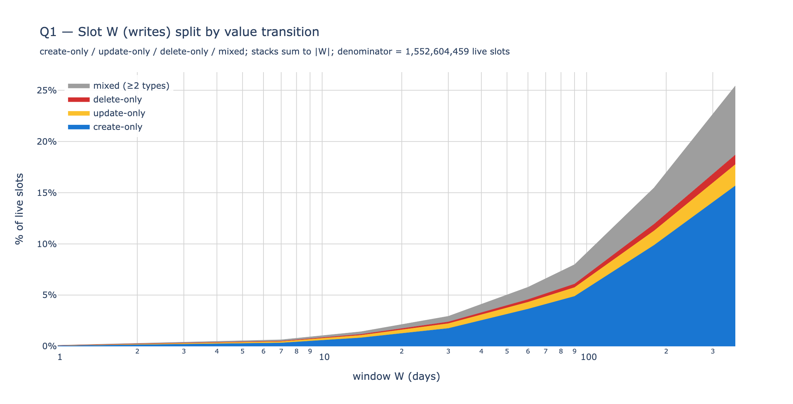
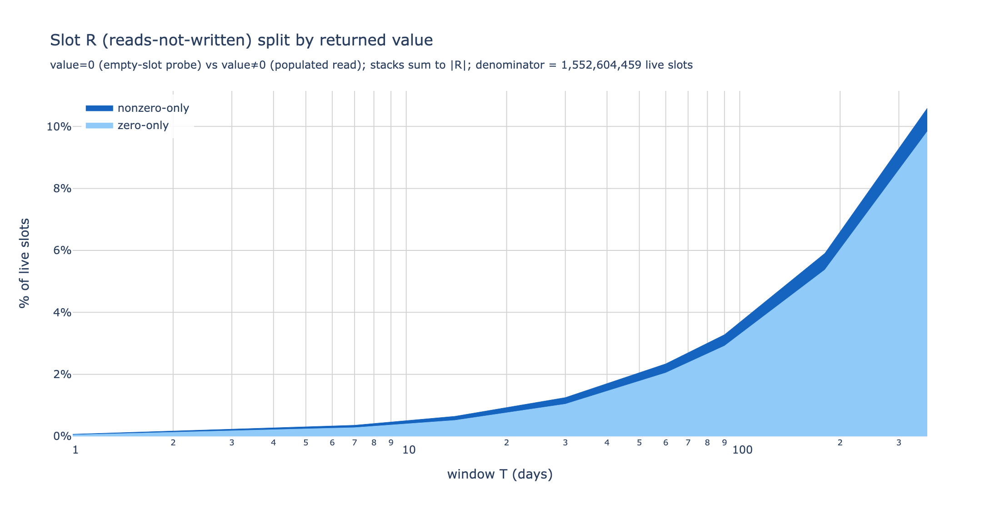
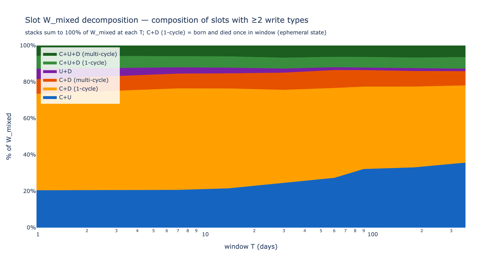

# Hot vs cold state, with reads — additive W / R / R∪W view

A reads-aware companion to the original `state_access` analysis. The existing report
classifies state by **writes alone** (the `_diffs` tables); this one adds the **reads**
dimension (the `_reads` tables and `address_appearances`) and reports two disjoint sets
per window — **W (writes)** and **R (pure reads, deduped against W)** — plus their union
**R∪W = W + R** (the full warm set). Two questions: how big each set is (warmth), and how
much access volume lands on a small head (concentration).

Static snapshot, anchored at block **24,870,000** (mainnet) — the largest round block
where all four source families (writes, slot reads, account reads, `address_appearances`)
overlap on the local cluster. Windows: `W ∈ {1, 7, 14, 30, 60, 90, 180, 365}` days. Object
types: **storage slots** `(contract, slot)` and **accounts** `(address)`.

## 1. Summary

- **W matches the original analysis exactly.** `|W|` at W=30d is 2.93% of live slots and
  4.07% of live accounts — within HLL tolerance of the original's "2.96% / 4.10%".
- **R is the genuinely new dimension.** At W=30d, **1.25% of slots and 0.46% of accounts**
  are read-but-not-written in window. At W=365d these grow to **10.6% / 4.5%**. By
  construction R never overlaps W.
- **The full warm set R∪W is 30–40% larger than W alone** at every W. At W=30d the
  combined-state warm set is **4.25%** (vs 3.16% for writes alone); at W=365d it's
  **35.2%** (vs 25.8%). The fraction of the warm set you'd miss with a writes-only
  definition is consistently **~30%**.
- **R is much more concentrated than W.** At W=30d the top 1% of objects captures **84%
  of read events** (slots) or **96%** (accounts), versus **62% / 61%** for writes. R-only
  objects are a long tail dominated by one-shot view-call targets — but the head of that
  tail is extremely heavy.
- **Slot W is dominated by creations, not updates.** At W=365d, **88% of W slots have any
  creation event** and only **21% have any update**; on a disjoint partition, **62% of W
  slots are create-only** (write was a `0→nonzero` initialization, nothing else in
  window). Most "warm slots" by W's definition are warm because they're being **born**,
  not modified — state growth, not state churn. EIP-8188 only reprices updates, so the
  policy-relevant W is closer to 4% of state at W=365d (update-touching slots), not 25%.
- **Slot R is dominated by empty-slot probes.** At W=365d, **93% of R slots had at least
  one read returning `value=0`** ("does this slot exist?" checks). Only **7% of R slots**
  had any read return populated data. The `R_mixed` partition (slots with both zero and
  nonzero reads) is identically **zero** by structure: an R-only slot has no writes in
  window, so its value is stable through the window, so all reads return the same value.
- **EIP-8188 covers update gas very well at the policy-relevant W.** Under the corrected
  per-event semantics (intra-window promotion accounted for), **94% of update SSTORE
  events at W=30d would keep the Active price**; 97% at W=90d. The original analysis's
  static-set check reported 84.8% at W=30d — a ~9 pp underestimate that came from
  treating the past-W warm set as frozen across "today". The Inactive premium only
  affects ~3–6% of updates at policy-relevant W.

## 2. What changed vs the original analysis

| | original | v2 |
|---|---|---|
| sources | `_diffs` only | `_diffs` + `_reads` + `address_appearances` |
| access sets | W only | **W**, **R** (reads-not-written), **R∪W** (additive) |
| object types | accounts, slots | accounts, slots, combined |
| windows | 1–180d | 1–365d |
| denominator | absolute counts + state-size shares | state-size shares (the tier framing) |
| cardinality | `uniq` (HLL ~1%) | exact, from per-key GROUP BY |

The reads data unlocks the **R** slice — objects that are read but never written in the
same window. This is the part of the warm set an existing-implementation snapshot from
`_diffs` alone can't see. The window list widens to 365d because per-key GROUP BY scales
better than HLL did over `_diffs` alone: even a 365d slot window over 560M unique keys
and 7.7B accesses runs in ~5 min.

### Why the additive 2-set view rather than a 3-way partition

An earlier version of this analysis used a `(W-only, R-only, R∩W)` partition. Empirically
**W-only ≈ 0** at every window — every written object is also read in the same window.
Two reasons:

- **Slots:** Solidity codegen for `x = f(x)` emits `SLOAD; ...; SSTORE`. The pre-SSTORE
  `SLOAD` lands in `storage_reads`. So almost every modified slot is also read in window.
- **Accounts:** every transaction's `tx_from` appears in `address_appearances` (the
  sender's nonce is read for validation), and the same transaction emits balance / nonce
  diffs. So every written EOA / contract is also read in window.

With W-only essentially empty, the partition collapses to a 2-set additive view:
**W ∪ (R \ W) = R∪W**. That's what this report uses throughout.

## 3. Data and method

### Source tables

| set | source |
|---|---|
| writes (accounts) | `canonical_execution_balance_diffs`, `canonical_execution_nonce_diffs`, `canonical_execution_contracts` (account creation, keyed on `contract_address`) |
| writes (slots) | `canonical_execution_storage_diffs` |
| reads (slots) | `canonical_execution_storage_reads` |
| reads (accounts, direct) | `canonical_execution_balance_reads`, `canonical_execution_nonce_reads` |
| reads (accounts, derived) | `canonical_execution_address_appearances`, filtered to relationships `{call_from, call_to, tx_from, tx_to, miner_fee, factory, create, suicide_refund, suicide}` |

`address_appearances` relationships `erc20_*` and `erc721_*` are excluded — they're token
log-emission artifacts, not state-access events.

### Set definitions

For each `(window_days, object_type)`:

- **W** — objects that appear in the writes-source tables in window (raw, no dedup).
  This is the same definition as the original analysis's "warm".
- **R** — objects that appear in the reads-source tables AND not in the writes sources
  in the same window. Deduped against W by construction, so R ∩ W = ∅.
- **R∪W = W + R** — additive union, the full warm set.

### Query mechanism

One ClickHouse query per `(W, object_type)` returns a histogram with rows
`(slice, n_w, n_r, n_keys)` where the inner slices are
`{w_only, r_only, rw}` (`n_w` / `n_r` are write / read event counts per key, summed
within window). The new W / R / R∪W view is derived in Python by combining slices:

- W = `w_only ∪ rw`; per-key access count = `n_w` (writes only)
- R = `r_only`; per-key access count = `n_r` (reads only)
- R∪W = all three slices

Live-state denominators come from `execution_state_size` at the anchor
(1,552,604,459 slots, 379,632,901 accounts, 1,932,237,360 combined).

Code: `state_access/queries_v2.py`, `collect_v2.py`, `analysis_v2.py`.

## 4. Q1 — Warmth (set sizes as % of live state)

**Slots** (% of 1.55B live slots):

| W (days) | W | R | R∪W |
|---:|---:|---:|---:|
| 1   |  0.10% |  0.07% |  0.17% |
| 7   |  0.64% |  0.36% |  0.99% |
| 14  |  1.42% |  0.64% |  2.07% |
| 30  |  2.93% |  1.25% |  4.18% |
| 60  |  5.77% |  2.34% |  8.11% |
| 90  |  7.98% |  3.28% | 11.26% |
| 180 | 15.49% |  5.91% | 21.40% |
| 365 | 25.43% | 10.61% | 36.05% |

**Accounts** (% of 380M live accounts):

| W (days) | W | R | R∪W |
|---:|---:|---:|---:|
| 1   |  0.19% |  0.04% |  0.23% |
| 7   |  1.13% |  0.15% |  1.29% |
| 14  |  1.93% |  0.28% |  2.21% |
| 30  |  4.07% |  0.46% |  4.53% |
| 60  |  7.60% |  0.69% |  8.29% |
| 90  | 11.46% |  0.88% | 12.34% |
| 180 | 19.04% |  2.12% | 21.16% |
| 365 | 27.35% |  4.49% | 31.84% |

**Combined** — pooling slots + accounts against the combined denominator (1.93B):

| W (days) | W | R | R∪W |
|---:|---:|---:|---:|
| 1   |  0.12% |  0.06% |  0.18% |
| 7   |  0.74% |  0.32% |  1.05% |
| 14  |  1.52% |  0.57% |  2.10% |
| 30  |  3.16% |  1.10% |  4.25% |
| 60  |  6.13% |  2.02% |  8.15% |
| 90  |  8.66% |  2.81% | 11.47% |
| 180 | 16.19% |  5.17% | 21.35% |
| 365 | 25.81% |  9.41% | 35.22% |


Three observations:

1. **The W line matches the original report's "warm slots / accounts" curve.**
   At W=30d slots: original 2.96%, v2 2.93%. Within HLL tolerance plus a small
   methodological shift (v2 excludes `storage_diffs.address` from the account-write set,
   which the original conflated; EIP-8188 treats SSTORE as a slot write, not an account
   write).
2. **R for slots is much larger than R for accounts at all windows.** At W=365d,
   R-slots = 10.6% vs R-accounts = 4.5%. Slot-level reads have a deeper unread tail
   (every contract storage has view-only parameters); account-level reads cluster on a
   smaller universe of popular contracts.
3. **R grows faster than W as W increases.** For slots, R/W is 0.67× at W=1d but 0.42×
   at W=365d — R adds more relative to W at small W. For accounts, R/W is 0.19× at W=1d
   and 0.16× at W=365d — the read-only account tail grows much slower than writes.
   Both ratios are bounded above zero, so reads always add something.

## 4b. Q1 typed — Slot W and R split by value transition

For storage slots, both the writes and the reads carry a value transition that's
EIP-8188-relevant:

- **W splits by `(from_value, to_value)` transition**: `create` (0→nonzero, ~20k gas,
  always Inactive-priced under EIP-8188), `update` (X→Y nonzero→nonzero, ~5k gas,
  what the policy actually reprices), `delete` (nonzero→0, refund).
- **R splits by the returned `value`**: `zero` (the slot was empty when read — an
  "is this slot set?" probe) vs `nonzero` (a populated read returning real data).

A single slot can have multiple write types in window (e.g. created early, updated
later); the disjoint partition below picks slots whose writes are ALL of one type
("create-only" etc.) and lumps the rest into "mixed". For R, the partition is trivially
clean: an R-only slot has no writes in window, so its value is stable, so all reads
return the same value — `R_mixed = 0` everywhere.

### Slot W — partitioned by transition type (% of live state)

Stacked total = W. Verification: the four columns sum exactly to W_pct from §4.

| W (days) | create-only | update-only | delete-only | mixed (≥2 types) | W |
|---:|---:|---:|---:|---:|---:|
| 1   |  0.045% | 0.034% | 0.005% | 0.016% |  0.10% |
| 7   |  0.327% | 0.135% | 0.043% | 0.133% |  0.64% |
| 14  |  0.827% | 0.248% | 0.091% | 0.257% |  1.42% |
| 30  |  1.748% | 0.472% | 0.162% | 0.552% |  2.93% |
| 60  |  3.635% | 0.672% | 0.258% | 1.206% |  5.77% |
| 90  |  4.876% | 0.862% | 0.344% | 1.893% |  7.98% |
| 180 |  9.874% | 1.407% | 0.650% | 3.559% | 15.49% |
| 365 | 15.675% | 2.078% | 0.939% | 6.743% | 25.43% |

### Slot W — subtype touch rates (overlap allowed, % of |W|)

A slot can have multiple write types in window. These are the share of |W| with at
least one event of each type — the rows do not sum to 100%.

| W (days) | any create | any update | any delete |
|---:|---:|---:|---:|
| 1   | 59.6% | 40.3% | 17.7% |
| 7   | 71.4% | 28.7% | 23.3% |
| 30  | 78.0% | 23.5% | 19.7% |
| 90  | 84.6% | 21.6% | 20.4% |
| 365 | 87.8% | 21.4% | 20.8% |

**Read this carefully.** Of the 25.4% of live slots in |W| at W=365d:
- **88% have at least one creation event** (76% are pure create-only); the slot is in W
  primarily because it was *initialized* in window.
- **21% have at least one update**; the EIP-8188-relevant subset of W.
- **21% have at least one deletion**.

The update fraction of |W| **stays remarkably stable around 21–24%** across windows from
7d to 365d. So **|W ∩ updates| ≈ 21% × |W|** at every W of interest. At W=30d that's
21% × 2.93% = **0.7% of live state**; at W=365d, 21% × 25.43% = **5.3% of live state**.
These are the slots EIP-8188 would actually reprice.

The create-only fraction *grows* with W (60% → 76% over 1d → 365d) because the longer
the window, the more newly-created slots accumulate without subsequent activity. Slot
creation is a one-shot event by nature.



### Slot R — partitioned by returned value (% of live state)

R_mixed is omitted (always zero — see above). Stacked total = R.

| W (days) | zero-only | nonzero-only | R |
|---:|---:|---:|---:|
| 1   |  0.045% | 0.022% |  0.07% |
| 7   |  0.279% | 0.077% |  0.36% |
| 14  |  0.513% | 0.131% |  0.64% |
| 30  |  1.037% | 0.213% |  1.25% |
| 60  |  2.046% | 0.293% |  2.34% |
| 90  |  2.916% | 0.364% |  3.28% |
| 180 |  5.373% | 0.535% |  5.91% |
| 365 |  9.838% | 0.754% | 10.61% |

### Slot R — share of |R| by returned value

| W (days) | zero | nonzero |
|---:|---:|---:|
| 1   | 67.8% | 32.2% |
| 7   | 78.4% | 21.6% |
| 30  | 83.0% | 17.0% |
| 90  | 88.9% | 11.1% |
| 365 | 92.9% |  7.3% |

**The zero-share grows monotonically with W**, reaching 93% at W=365d. So:

- **Most of slot R is empty-slot probes** — `SLOAD` returning 0 against slots that
  haven't been written in (or before) the window. Typical cases: a contract checking
  whether a mapping entry exists (`mapping[key]` returns 0 if unset), state-existence
  guards (`if (slot == 0) revert()`), default-value reads.
- **Only ~7% of R at W=365d is genuine populated state inspection** — `SLOAD`
  returning meaningful data from slots that hold real state but happen not to be
  modified in this window (oracle parameters, contract config, immutable-style storage
  variables filled at deploy then never changed).
- The nonzero-only share *shrinks* with W because the universe of "ever-set slots that
  weren't touched in 365 days" grows much slower than the universe of "slots probed
  with `SLOAD` and found empty" — empty-slot probes scale with calldata-driven access,
  populated reads scale with the small set of legitimately read-only state.



### Decomposing W_mixed — what's actually in the "≥2 types" bucket?

W_mixed at W=365d is **6.74% of state** (~27% of |W|), so it earns its own decomposition.
Structurally, slots in W_mixed must carry ≥2 of `{create, update, delete}`. Combining
these into the 6 possible patterns and sub-binning the multi-cycle-capable ones by
create-count:

| combo | structural rule | count constraint |
|---|---|---|
| `C+U` | no delete | `n_C = 1` always (multiple creates need deletes between them) |
| `C+D (1-cycle)` | no update; `n_C = 1` | born once, died once — single ephemeral lifecycle |
| `C+D (multi-cycle)` | no update; `n_C ≥ 2` | repeated birth/death cycles, no modification |
| `U+D` | no create; `n_D = 1` always | k updates then one terminal delete (existed pre-window) |
| `C+U+D (1-cycle)` | all three; `n_C = 1` | full single lifecycle (born, modified, died) |
| `C+U+D (multi-cycle)` | all three; `n_C ≥ 2` | full lifecycle, repeated |

Composition of W_mixed at each W (% of W_mixed; rows sum to 100%):

| W (days) | C+U | C+D (1-cycle) | C+D (multi) | U+D | C+U+D (1-cycle) | C+U+D (multi) |
|---:|---:|---:|---:|---:|---:|---:|
| 1   | 20.45% | 52.98% | 8.04% | 5.71% | 7.18% | 5.64% |
| 7   | 20.64% | 55.74% | 8.10% | 3.47% | 6.16% | 5.88% |
| 14  | 21.50% | 54.85% | 8.30% | 3.13% | 6.20% | 6.03% |
| 30  | 24.59% | 51.02% | 9.41% | 2.29% | 5.98% | 6.71% |
| 60  | 27.26% | 49.35% | 9.86% | 1.55% | 5.72% | 6.26% |
| 90  | 32.11% | 45.26% | 9.08% | 1.36% | 5.87% | 6.31% |
| 180 | 33.02% | 44.37% | 8.56% | 1.49% | 5.90% | 6.66% |
| 365 | 35.62% | 42.42% | 7.84% | 1.35% | 6.36% | 6.42% |

Absolute share of live state (W_mixed sub-categories, % of state):

| W (days) | C+U | C+D (1-cycle) | C+D (multi) | U+D | C+U+D (1-cycle) | C+U+D (multi) |
|---:|---:|---:|---:|---:|---:|---:|
| 1   | 0.0032% | 0.0082% | 0.0013% | 0.0009% | 0.0011% | 0.0009% |
| 30  | 0.1357% | 0.2816% | 0.0520% | 0.0126% | 0.0330% | 0.0370% |
| 90  | 0.6078% | 0.8568% | 0.1719% | 0.0258% | 0.1112% | 0.1194% |
| 365 | 2.4016% | 2.8603% | 0.5287% | 0.0908% | 0.4285% | 0.4326% |



Three things worth reading off:

1. **C+D (1-cycle) is the largest mixed category at almost every W** — 42–56%. These
   are slots **born and died in the same window with exactly one create and one delete**.
   Ephemeral state — probably temporary mapping entries, intermediate compute slots, or
   "pending" markers that get cleaned up after consumption. At W=365d this single
   category accounts for **2.86% of live state**, the largest piece of W_mixed.
2. **C+U grows steadily with W** (20% at W=1d → 35.6% at W=365d). These are slots
   created in window then modified at least once but not deleted — the "fresh hot
   storage" pattern. Their share rises with W because they accumulate updates over time
   without dying.
3. **U+D shrinks as W grows** (5.7% at W=1d → 1.4% at W=365d). At small W the
   "modified-then-died" pattern is more visible because long lifecycle histories haven't
   completed yet; at large W most pre-existing slots that die also get recreated
   somewhere along the way (moving them to C+U+D), and many that don't die stay in
   W_only_update.

**Multi-cycle is a stable minority.** C+D multi-cycle and C+U+D multi-cycle each sit
around 6–10% of W_mixed at every W. Combined ~14%. So the "slot churns through multiple
birth-death cycles in window" pattern is real but small — most mixed slots have a single
lifecycle within window.

## 4c. Warm-update coverage under EIP-8188 semantics (per-event)

The set-membership view in §4 / §4b is informative but it can't directly answer **"of the
update gas spent in window, what fraction would be priced as Active under EIP-8188?"** —
the gas-coverage question. That question is per-event, not per-key.

The original analysis's `pct_update_gas_warm` tried to answer it by checking each of
today's update events against a *static* past-W warm set. But ClickHouse's `GLOBAL IN`
evaluates the subquery once and broadcasts a frozen hash set, so a slot that gets its
first write today and then a second update later today is checked against the past-only
set both times — both events come out cold even though EIP-8188 would only price the
first one as Inactive. The static-set approach systematically **underestimates** warm
coverage.

### Definition

For each window `[anchor - W·7200, anchor]`, classify every update SSTORE event
(`from_value ≠ 0 ∧ to_value ≠ 0`) as **warm** or **cold**:

- **warm** — at least one `create` (`0 → nonzero`) or `update` event happened earlier
  on the same slot at an earlier event-order within the window.
- **cold** — the update IS the slot's first warming event in window (no preceding
  create-or-update for this slot in window). Deletions don't count as warming events.

Algorithm — one GROUP BY on `cityHash64(address, slot)`:

1. For each slot in window, count update events (`n_update`).
2. Among the slot's create-or-update events, take the one with the smallest
   `(block_number, transaction_index, internal_index)` order. If that earliest warming
   event is itself an update, the slot contributes one cold update to the count;
   otherwise, all of its updates are warm.

That is: `warm_per_slot = n_update − first_cu_is_update`. Sum across slots.

### Results

| W (days) | total updates | warm | cold | % warm |
|---:|---:|---:|---:|---:|
| 1   |     3,827,500 |     3,277,106 |     550,394 | **85.62%** |
| 7   |    28,158,628 |    25,937,983 |   2,220,645 | **92.11%** |
| 14  |    55,135,247 |    51,051,775 |   4,083,472 | **92.59%** |
| 30  |   125,684,703 |   117,983,724 |   7,700,979 | **93.87%** |
| 60  |   262,053,193 |   251,043,962 |  11,009,231 | **95.80%** |
| 90  |   402,058,353 |   387,899,906 |  14,158,447 | **96.48%** |
| 180 |   788,431,719 |   765,249,545 |  23,182,174 | **97.06%** |
| 365 | 1,424,321,470 | 1,389,975,882 |  34,345,588 | **97.59%** |


### How this changes the story vs the original

The original analysis reported `pct_update_gas_warm = 84.8%` at W=30d using the static
past-W set. The corrected per-event measurement says **93.9% at W=30d**, climbing to
**97.6% at W=365d**.

The ~9 percentage-point gap at W=30d is the intra-window promotion the original
couldn't see — slots that get their first write inside the W window and then get
hit again. Under real EIP-8188 only the first hit would be Inactive-priced; under the
static-set check both come out cold.

Three readings:

1. **EIP-8188's Active tier covers update gas extremely well.** At W=30d, **94%** of
   update SSTOREs would keep the cheap Active price. At W=90d, 97%. The Inactive
   premium only affects ~3–6% of update events at policy-relevant W.
2. **The benefit saturates fast.** Going from W=1d → 30d buys +8 pp of coverage; going
   from W=30d → 365d buys only another +3.7 pp. The marginal benefit of stretching W
   beyond ~30d is small for update gas.
3. **Cold updates correspond exactly to first-touch awakenings of cold state.** The
   raw count of cold updates at W=365d is **34.3M slots over a year** — that's the
   long-tail of state being reactivated after a year of dormancy. Note: this is
   per-slot, not per-event; a slot has at most one cold-update event in window
   (the first warming).

## 5. Q3 — Concentration (top-N share of accesses)

For each `(access_set, W, object_type)`, the share of access events captured by the
top-1% and top-10% of objects (denominator: objects in the access set).


**Slots, top-1% share of accesses:**

| W (days) | W | R | R∪W |
|---:|---:|---:|---:|
| 1   | 48.0% | 65.7% | 56.4% |
| 30  | 62.3% | 83.8% | 72.3% |
| 90  | 66.1% | 87.1% | 76.1% |
| 365 | 68.2% | 87.7% | 77.9% |

**Accounts, top-1% share of accesses:**

| W (days) | W | R | R∪W |
|---:|---:|---:|---:|
| 1   | 40.8% | 78.9% | 57.5% |
| 30  | 60.5% | 96.0% | 77.7% |
| 90  | 64.0% | 98.0% | 82.0% |
| 365 | 68.4% | 97.7% | 86.6% |

Three readings:

1. **R is more concentrated than W at every W and every object type.** R-only sees
   ~88% of slot accesses on the top 1% at W=365d; for accounts the figure is ~98%. A
   handful of popular contracts absorb essentially all the read pressure on accounts.
2. **Concentration grows with W.** Wider windows pull in more tail keys that themselves
   get few accesses, so the head's relative weight rises monotonically. The effect is
   sharpest going from W=1d to W=30d (~14pp for slot R; ~17pp for account R); past
   W=30d the gain flattens.
3. **Accounts concentrate far more tightly than slots.** Account R-only at W=30d:
   top-1% captures 96% of accesses. Slot R-only at W=30d: 84%. Read traffic on accounts
   is dominated by an extraordinarily small set of popular contracts (likely DEX routers,
   multicall, weth9, common implementation contracts behind proxies); slot reads are
   spread more broadly because they're reads against many contracts' storage.

## 6. What this opens up

The clearest threads worth pulling next:

- **W ⊂ R operationally, even though sets are disjoint by construction.** Almost every
  W object also appears in `_reads`. The structural reason (SLOAD-then-SSTORE codegen,
  tx_from nonce reads) is interesting on its own. A `_reads` signal is informative for
  near-term tiering decisions — it captures both views and writes.
- **R-only is the new lens.** The asymmetric slice — read but not written — is where
  the most distinctive structure lives: 30% extra warm-set mass over writes alone, and
  very heavy concentration (~88% top-1% for slots, ~98% for accounts). Worth a dedicated
  drill-down: which contracts dominate R-only? What's the contract-class breakdown of the
  R-only head?
- **Historical sweep.** Snapshot is one anchor (24,870,000, late-Apr 2026). Sweeping
  weekly over the post-Merge range would tell us whether the R/W ratio is stable,
  whether R's share grew after Dencun (blob / calldata changes), and whether the
  R-only-account concentration spike is recent.
- **Per-tx all-hot fraction.** A natural follow-on: what share of transactions touch
  *only* warm state (under chosen `W`)? Per-tx framing gives a user-impact answer rather
  than a population-level one.

## Appendix A — SQL queries

The full SQL builders live in `state_access/queries_v2.py`. One query per
`(W, object_type)` runs the per-key GROUP BY on a `cityHash64` key, then collapses to a
`(slice, n_w, n_r, n_keys)` histogram. The slice partition (`w_only` / `r_only` / `rw`)
is what gets re-mapped in Python to the W / R sets used throughout this report.

### Slot histogram

Storage-slot key is `(contract_address, slot)`. Writes come from `storage_diffs`; reads
from `storage_reads`. The inner UNION ALL tags each row with `is_w` / `is_r`; the outer
GROUP BY on `cityHash64(address, slot)` sums them per key; the final GROUP BY collapses
to `(slice, n_w, n_r, n_keys)`.

```sql
WITH per_key AS (
    SELECT
        h,
        sum(is_w) AS n_w,
        sum(is_r) AS n_r
    FROM (
        SELECT cityHash64(address, slot) AS h, 1 AS is_w, 0 AS is_r
        FROM canonical_execution_storage_diffs
        WHERE meta_network_name = 'mainnet'
          AND block_number BETWEEN {bn_lo} AND {bn_hi}
        UNION ALL
        SELECT cityHash64(contract_address, slot) AS h, 0 AS is_w, 1 AS is_r
        FROM canonical_execution_storage_reads
        WHERE meta_network_name = 'mainnet'
          AND block_number BETWEEN {bn_lo} AND {bn_hi}
    )
    GROUP BY h
)
SELECT
    multiIf(n_w > 0 AND n_r > 0, 'rw',
            n_w > 0,             'w_only',
                                 'r_only') AS slice,
    n_w,
    n_r,
    count() AS n_keys
FROM per_key
GROUP BY slice, n_w, n_r
ORDER BY slice, n_w, n_r
```

### Slot typed histogram (Q1 typed views in §4b)

Same per-key GROUP BY shape as `slot_histogram`, but with five typed counters in place
of two. The query splits each write event into `create` / `update` / `delete` by
`(from_value, to_value)` and each read event into `zero` / `nonzero` by the returned
`value`. Output: one row per distinct `(n_w_create, n_w_update, n_w_delete, n_r_zero,
n_r_nonzero)` count-tuple, with `n_keys` per row.

```sql
WITH per_key AS (
    SELECT
        h,
        sum(is_w_create)  AS n_w_create,
        sum(is_w_update)  AS n_w_update,
        sum(is_w_delete)  AS n_w_delete,
        sum(is_r_zero)    AS n_r_zero,
        sum(is_r_nonzero) AS n_r_nonzero
    FROM (
        SELECT
            cityHash64(address, slot) AS h,
            toUInt8(from_value =  '0x000…0' AND to_value != '0x000…0') AS is_w_create,
            toUInt8(from_value != '0x000…0' AND to_value != '0x000…0') AS is_w_update,
            toUInt8(from_value != '0x000…0' AND to_value =  '0x000…0') AS is_w_delete,
            toUInt8(0) AS is_r_zero,
            toUInt8(0) AS is_r_nonzero
        FROM canonical_execution_storage_diffs
        WHERE meta_network_name = 'mainnet'
          AND block_number BETWEEN {bn_lo} AND {bn_hi}
        UNION ALL
        SELECT
            cityHash64(contract_address, slot) AS h,
            toUInt8(0) AS is_w_create,
            toUInt8(0) AS is_w_update,
            toUInt8(0) AS is_w_delete,
            toUInt8(value =  '0x000…0') AS is_r_zero,
            toUInt8(value != '0x000…0') AS is_r_nonzero
        FROM canonical_execution_storage_reads
        WHERE meta_network_name = 'mainnet'
          AND block_number BETWEEN {bn_lo} AND {bn_hi}
    )
    GROUP BY h
)
SELECT
    n_w_create, n_w_update, n_w_delete, n_r_zero, n_r_nonzero,
    count() AS n_keys
FROM per_key
GROUP BY n_w_create, n_w_update, n_w_delete, n_r_zero, n_r_nonzero
ORDER BY n_w_create, n_w_update, n_w_delete, n_r_zero, n_r_nonzero
```

### Account histogram

Account key is `cityHash64(address)`. Writes come from `balance_diffs`, `nonce_diffs`,
and `contracts` (`contract_address` is the newly-materialized account). Reads come from
`balance_reads`, `nonce_reads`, and `address_appearances` filtered to non-ERC*
relationships. Same outer aggregation as the slot query.

```sql
WITH per_key AS (
    SELECT
        h,
        sum(is_w) AS n_w,
        sum(is_r) AS n_r
    FROM (
        SELECT cityHash64(address) AS h, 1 AS is_w, 0 AS is_r
        FROM canonical_execution_balance_diffs
        WHERE meta_network_name = 'mainnet'
          AND block_number BETWEEN {bn_lo} AND {bn_hi}
        UNION ALL
        SELECT cityHash64(address) AS h, 1 AS is_w, 0 AS is_r
        FROM canonical_execution_nonce_diffs
        WHERE meta_network_name = 'mainnet'
          AND block_number BETWEEN {bn_lo} AND {bn_hi}
        UNION ALL
        SELECT cityHash64(contract_address) AS h, 1 AS is_w, 0 AS is_r
        FROM canonical_execution_contracts
        WHERE meta_network_name = 'mainnet'
          AND block_number BETWEEN {bn_lo} AND {bn_hi}
        UNION ALL
        SELECT cityHash64(address) AS h, 0 AS is_w, 1 AS is_r
        FROM canonical_execution_balance_reads
        WHERE meta_network_name = 'mainnet'
          AND block_number BETWEEN {bn_lo} AND {bn_hi}
        UNION ALL
        SELECT cityHash64(address) AS h, 0 AS is_w, 1 AS is_r
        FROM canonical_execution_nonce_reads
        WHERE meta_network_name = 'mainnet'
          AND block_number BETWEEN {bn_lo} AND {bn_hi}
        UNION ALL
        SELECT cityHash64(address) AS h, 0 AS is_w, 1 AS is_r
        FROM canonical_execution_address_appearances
        WHERE meta_network_name = 'mainnet'
          AND block_number BETWEEN {bn_lo} AND {bn_hi}
          AND relationship IN ('call_from', 'call_to', 'tx_from', 'tx_to',
                               'miner_fee', 'factory', 'create',
                               'suicide_refund', 'suicide')
    )
    GROUP BY h
)
SELECT
    multiIf(n_w > 0 AND n_r > 0, 'rw',
            n_w > 0,             'w_only',
                                 'r_only') AS slice,
    n_w,
    n_r,
    count() AS n_keys
FROM per_key
GROUP BY slice, n_w, n_r
ORDER BY slice, n_w, n_r
```

### Window block range

For each `window_days = W`, the trailing block range is
`bn_lo = anchor − W·7200`, `bn_hi = anchor`, using the post-Merge 7,200-blocks-per-day
cadence. Anchor is `24,870,000`. The eight window values are
`W ∈ {1, 7, 14, 30, 60, 90, 180, 365}`.

### Live-state totals

Live-state denominators for the % framing come from `execution_state_size` at the anchor
(ethpandaops profile — the local cluster's snapshot of this table is empty):

```sql
SELECT block_number, accounts, storages
FROM execution_state_size
WHERE meta_network_name = 'mainnet' AND block_number <= 24870000
ORDER BY block_number DESC
LIMIT 1
```

At the anchor: 1,552,604,459 slots, 379,632,901 accounts, 1,932,237,360 combined.

### Warm-update coverage (§4c)

For each W, classify every update SSTORE event in `[anchor − W·7200, anchor]` by whether
the same slot had any earlier create-or-update event in the same window. One GROUP BY
on `cityHash64(address, slot)`; no JOIN, no window function.

```sql
WITH slot_events AS (
    SELECT
        cityHash64(address, slot) AS h,
        toUInt64(block_number) * 1000000000
            + toUInt64(transaction_index) * 100000
            + toUInt64(internal_index) AS event_order,
        (from_value != '0x000…0' AND to_value != '0x000…0') AS is_update,
        (from_value =  '0x000…0' AND to_value != '0x000…0') AS is_create
    FROM canonical_execution_storage_diffs
    WHERE meta_network_name = 'mainnet'
      AND block_number BETWEEN {bn_lo} AND {bn_hi}
),
per_slot AS (
    SELECT
        h,
        countIf(is_update) AS n_update,
        -- argMinIf returns is_update of the row with the smallest event_order
        -- among rows where (is_create OR is_update). Deletion rows are filtered out.
        argMinIf(is_update, event_order, is_create OR is_update) AS first_cu_is_update
    FROM slot_events
    GROUP BY h
    HAVING n_update > 0
)
SELECT
    sum(n_update) AS total_updates,
    sum(n_update - toUInt64(first_cu_is_update)) AS warm_updates,
    sum(toUInt64(first_cu_is_update)) AS cold_updates,
    round(100.0 * warm_updates / total_updates, 4) AS pct_warm
FROM per_slot
```

`event_order` packs `(block_number, transaction_index, internal_index)` into a single
monotone UInt64. Block numbers fit easily — `25M × 1e9 ≈ 2.5e16`, well below UInt64
max.

### Cross-validation against the original analysis

To confirm v2's W matches the original's "warm" definition at W=30d:

```sql
-- v2's |W| for slots reduces to this (count distinct slots written in window):
SELECT uniqExact(cityHash64(address, slot)) AS w_slots
FROM canonical_execution_storage_diffs
WHERE meta_network_name='mainnet' AND block_number BETWEEN {bn_lo} AND {bn_hi}
```

Result at the W=30d anchor matches the original analysis's `unique_storage_slots` within
HLL tolerance (45.5M vs 45.9M, ~0.7% — the original used `uniq` HLL, v2 uses exact
GROUP BY).

## Appendix B — outputs

```
state_access/data/v2/
  slot_histogram.parquet         # raw (slice, n_w, n_r, n_keys) per W (input)
  account_histogram.parquet
  slot_typed_histogram.parquet   # typed slot histogram for §4b
  slot_update_coverage.parquet   # per-W warm/cold update split for §4c
  q1_warmth_{slot,account,combined}.parquet         # set sizes + pct of live state
  q1_warmth_slot_typed.parquet                       # typed slot W/R breakdown
  q1_warmth_slot_mixed_decomp.parquet                # W_mixed sub-categories
  q3_concentration_{slot,account}.parquet
  q1_warmth_{slot,account,combined}.png
  q1_warmth_slot_{W,R}_typed.png                     # typed slot stacked areas
  q1_warmth_slot_mixed_decomp.png                    # W_mixed 6-way decomposition
  slot_update_coverage.png                           # §4c warm/cold update line chart
  q3_concentration_{top1,top10}_{slot,account}.png
```

Reproduce: `uv run python -m state_access.collect_v2 && uv run python -m state_access.analysis_v2`.
`collect_v2` is resumable per `(W, object_type)` cell; delete a histogram parquet to
force a re-pull. Verification checks (additivity `|R∪W|=|W|+|R|`, partition sum,
monotonicity) live in `analysis_v2.run_one`.
