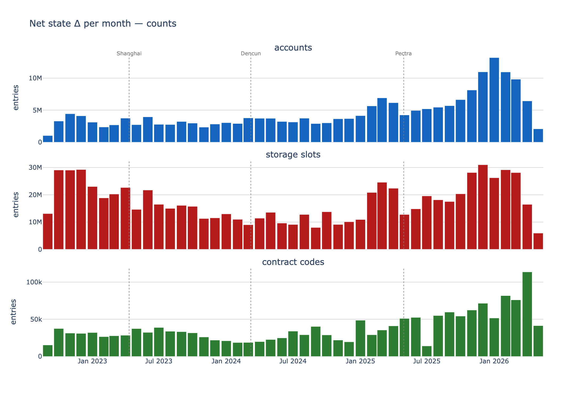
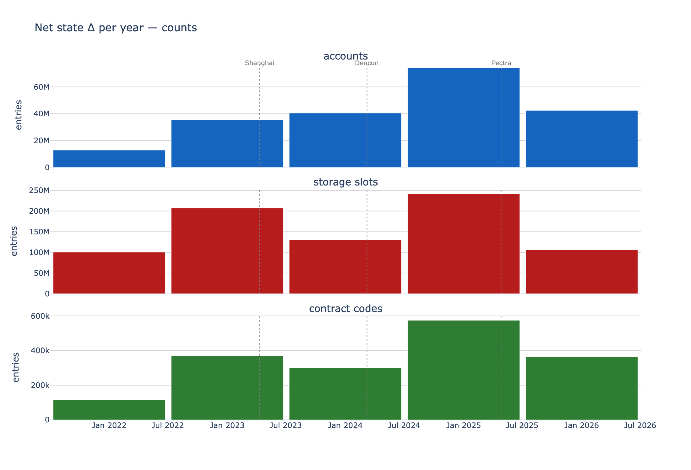
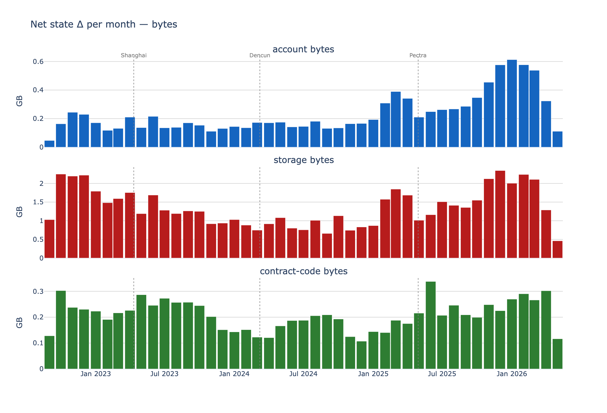
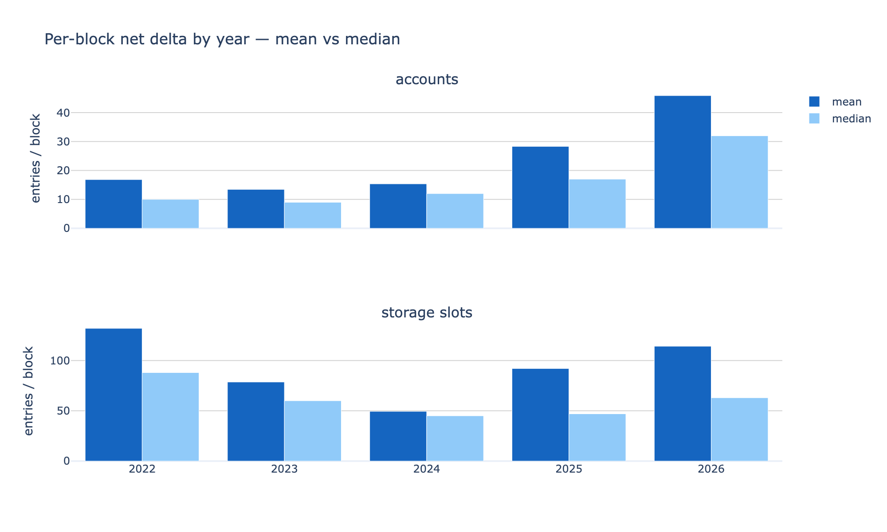

# Ethereum state growth: net state delta, post-Merge

How fast does Ethereum's live state grow, and where does the growth land? This measures the
**net change in live-state size** per period from `execution_state_size` — the per-block
snapshot of how many accounts, storage slots, and contract codes exist and how many bytes
they occupy. Post-Merge range (block 15,537,394 → 25,123,625, 2022-09-16 → 2026-05-08).

## 1. Summary

- Live state grows steadily and is dominated by **storage slots**: ~785M slots were added
  post-Merge versus ~205M accounts and ~1.7M contract codes. On disk, **storage bytes**
  dominate — ~61 GB of the ~81 GB added.
- A typical block nets roughly **+13 accounts and +53 storage slots** (medians). The *mean*
  is far higher (+21 / +82) because a heavy right tail — single blocks adding thousands of
  entries (max 8,705 accounts, 29,779 slots) — drives a disproportionate share of growth.
- Growth is **not flat over time**: storage-slot growth was highest right after the Merge,
  dipped through 2024, then re-accelerated; account growth has climbed sharply since 2025
  (median +12/block in 2024 → +32/block in 2026).
- This is *net* delta. A cumulative live-state count shows what survived (creations minus
  deletions), not gross writes; separating the two needs the diff tables, not this one.

## 2. Background

`execution_state_size` records, per block, the size of the live state Merkle-Patricia trie:
entry counts (`accounts`, `storages`, `contract_codes`) and byte sizes (`account_bytes`,
`storage_bytes`, `contract_code_bytes`). Differencing consecutive snapshots gives the net
change — positive when entries are created, negative when storage slots are cleared to zero
or accounts are removed. Because the figures are cumulative live-state totals, they capture
net survival, not the gross volume of SSTOREs (a slot created and cleared in the same window
nets to zero here).

## 3. Data and method

- **Source.** `execution_state_size`, backfilled from the ethPandaOps Xatu cluster into the
  primary node so the heavy per-block pass runs locally (`scripts/backfill_state_size.py`).
- **Client stitching.** No single client spans the post-Merge range, so the series is
  stitched from two: `manual-backfill` below block 23,000,000 and a `tysm` live node at/above
  it. They agree in the overlap (accounts exact, storages within ~2e-6, byte metrics match)
  apart from a ~1.7% step in `contract_codes`, left as a one-day seam artifact.
- **Daily levels.** End-of-day level per metric (`argMax(metric, block_number)` per
  `day_idx`); weekly/monthly/yearly are resampled from the daily levels.
- **Per-block deltas.** `lagInFrame` over consecutive blocks, cast to signed Int64 so net
  deletions don't underflow.
- **Cross-check.** At block 24,870,000 the levels match the `state_access` static snapshot
  exactly: 379,632,901 accounts / 1,552,604,459 storage slots.

## 4. Net growth per period

Total post-Merge growth and average rate per metric:

| metric | total | per day | per year |
| --- | ---: | ---: | ---: |
| accounts | 205,409,092 | 154,327 | 56,329,315 |
| storage slots | 784,934,376 | 589,733 | 215,252,477 |
| contract codes | 1,724,715 | 1,296 | 472,968 |

| metric | total | per day | per year |
| --- | ---: | ---: | ---: |
| account bytes | 10.4 GB | 7.8 MB | 2.85 GB |
| storage bytes | 61.2 GB | 46.0 MB | 16.78 GB |
| contract-code bytes | 9.4 GB | 7.0 MB | 2.57 GB |

The monthly view shows the time structure: a busy post-Merge stretch, a calmer 2023–2024,
and a clear acceleration through 2025–2026. The hard forks (Shanghai, Dencun, Pectra) are
marked; none produces a sharp discontinuity in net growth, though the 2025–2026 ramp follows
Pectra.

On disk, storage bytes are the bulk of the growth:

Daily and weekly versions of both charts are in `data/` (`delta_counts_daily.png`,
`delta_counts_weekly.png`, `delta_bytes_{daily,weekly,yearly}.png`).

## 5. Per-block distribution

Per-block net delta, overall and per year (entries per block):

| metric | scope | mean | median | p10 | p90 | max |
| --- | --- | ---: | ---: | ---: | ---: | ---: |
| accounts | overall | 21.4 | 13 | 5 | 38 | 8,705 |
| storage slots | overall | 82.0 | 53 | 13 | 141 | 29,779 |
| contract codes | overall | 0.2 | 0 | 0 | 1 | 295 |

Mean exceeds median for every metric: the per-block distribution is right-skewed, so a
minority of heavy blocks (DEX activity, airdrops, deployments) account for an outsized share
of state growth. The yearly breakdown shows the trend — account growth per block accelerating
(median +10 → +32 from 2022 to 2026), storage-slot growth dipping in 2024 (median +45) before
recovering:

| metric | 2022 | 2023 | 2024 | 2025 | 2026 |
| --- | ---: | ---: | ---: | ---: | ---: |
| accounts mean / median | 16.8 / 10 | 13.5 / 9 | 15.4 / 12 | 28.3 / 17 | 45.9 / 32 |
| storage slots mean / median | 132.0 / 88 | 78.6 / 60 | 49.4 / 45 | 92.1 / 47 | 114.2 / 63 |

## 6. Caveats

- **Net, not gross.** Creations minus deletions; this table cannot show gross SSTORE volume.
- **Client stitch.** The `contract_codes` series steps ~1.7% at the block-23,000,000 seam
  where the two source clients hand off; the count metrics (accounts, storages) and all byte
  metrics are continuous there.
- **Deterministic block → date.** 12 s/block from the Merge; missed slots add small drift,
  immaterial at monthly/yearly resolution.
- **End-of-day sampling.** Daily levels take the last block of each day; intra-day extremes
  are not represented in the period view (the per-block view covers the full distribution).

## 7. Appendix

Query builders (`state_delta/queries.py`):

- `daily_levels(client, lo, hi)` — `argMax(metric, block_number)` grouped by
  `intDiv(block - MERGE_BLOCK, 7200)`; one call per client range, stitched at the seam.
- `perblock_delta_stats(hi)` — stitched one-row-per-block series (`argMax` dedup), per-block
  `toInt64(metric) - lagInFrame(toInt64(metric))` deltas, aggregated to
  `avg` / `quantiles(0.1,0.25,0.5,0.75,0.9)` / `max` / `min`, grouped by year `WITH ROLLUP`.

Data files (`state_delta/data/`):

| file | contents |
|------|----------|
| `state_delta_daily.parquet` | per-day end-of-day levels + daily net deltas |
| `state_delta_perblock_stats.parquet` | per-block delta distribution, tidy by (scope, metric) |
| `delta_counts_*.png`, `delta_bytes_*.png` | net Δ per period (4 granularities each) |
| `perblock_by_year.png` | per-block mean vs median Δ by year |
